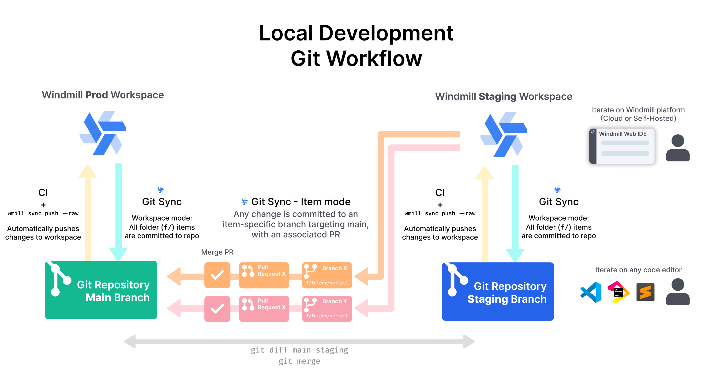

import DocCard from '@site/src/components/DocCard';

# Local Development

Windmill has [its own integrated development environment](../../code_editor/index.mdx), but you can also develop and run scripts locally, both with [self-hosted](../1_self_host/index.mdx) and cloud instances.

## Local Development Recommended Setup

Local development involves two components:

1. Being able to create and edit Windmill scripts and flow from your favorite IDE
2. Deploy them to Windmill and at the same time version them in a Git repository

In addition to the core functionalities just mentioned, some might want to add the concept of deployment. This encompass having a staging and production Windmill environment, and being able to deploy from Staging to Production.

The diagram below illustrate the full process. We're going to explain it quickly, and in the following sections we will decompose it.



It works as follows:

- 2 different workspaces exist in Windmill: one for Staging, and one for Prod and a Git repository as we been set to sync the Windmill Staging workspace.
- Some developers work form their favorite IDE. They can create new Windmill scripts and flows, edit existing ones, and push them to the Staging repository. Some developers can work directly in Windmill's web IDE. All of this happen in the Staging workspace
- Every time a script or a flow is deployed in the Staging workspace, Windmill will automatically commit the change to the Git repository. It can either commit directly to a specific (i.e. `staging`) branch, or open PRs to this branch (one PR per script/flow)
- Within the Git repository, every time the `staging` branch is merged to the production branch (i.e. `main`), all the changes are pushed at once the the Windmill Production workspace.

To summarize, developers operates only in Windmill Staging workspace. Windmill Production workspace is updated only by the CI when the Git staging branch is merged to the production branch.

Now let's deep dive into the first part. We will first explain how developers can setup their local environment to be able to create and edit Windmill script from their IDE, then we will see how to sync Windmill workspaces to a Git repository.

The second part is well covered in:

<div class="grid grid-cols-2 gap-6 mb-4">
	<DocCard
		title="Deploy to Prod using a Git Workflow"
		description="Windmill integration with Git repositories makes it possible to adopt a robust development process for your Windmill scripts, flows and apps."
		href="/docs/advanced/deploy_gh_gl"
	/>
</div>

## Develop locally

#### Setting up the workspace folder

Developing Windmill scripts and flows from your favorite IDE is made easy by using Windmill CLI. Here we will go through the full process of cloning a Windmill workspace locally, creating and editing new scripts and flows, and pushing them back the Windmill workspace.

:::tip
Not familiar with Windmill CLI? Get started with it [here](/docs/advanced/cli/installation)
:::

The first step is to clone an existing Windmill workspace into a local folder.

Create an empty folder:

```bash
mkdir myworkspace
cd myworkspace
```

Add the workspace and pull its the content using the [CLI `pull` command](/docs/advanced/cli/sync#raw-syncing):

```bash
wmill workspace add myworkspace [workspace_id] [remote]
wmill sync pull --raw
```

:::info

We recommend using `--raw` here, which will soon be the default for the CLI `sync` command. Stateful sync is not needed here.

:::

This will download the content of the workspace into your local folder. You will see an `f/` and a `u/` folder appearing, replicating the folder structure of the workspace.

:::caution

`wmill sync pull` will pull everything from the Windmill workspace, including resources and variables, even secrets. If you're planning to use Git as explained below, we recommend only pulling scripts, flows and apps, skipping the rest. It can be done with:

```bash
wmill sync pull --raw --skip-variables --skip-secrets --skip-resources
```

:::

Each script will be represented by a content file (`.py`, `.ts`, `.go` depending on the language) plus a metadata file (ending with `.script.yaml`). This file contains various metadata about the script, like a summary and description, but also the content of the lock file and the schema of the script (i.e. the signature of its `main` method). We will come back to this later.
For flows, one flow will be represented by a folder, containing a `flow.yaml` file being the definition of the flow, and additional files for inline scripts.

:::tip

The metadata file schema is available [here](../../core_concepts/13_json_schema_and_parsing/index.md).

:::

#### Making edits

Once the workspace folder is pulled, edits can be made using any IDE.

Editing a script is as simple as editing its content. The code can be edited freely in your IDE, and there as possibilities to even run it locally if you have the correct development environment setup for the script language.

Some fields of the metadata file can also be edited by hand, like the summary of the description fields. If you update the dependencies of your script, or the signature of the `main` method, the lockfile and/or the script schema will need to be updated in the metadata file. We do not recommend doing it by hand. Windmill CLI comes with a `generate-metadata` command that will read the updated code of the script and update the lockfile and schema inplace. Be re-assured, any manual update to other files like summary and description will be kept.

But what if you want to create a new script from scratch? It's also easy, just create a file with the correct extension, and simply run `generate-metadata` command to generate the metadata file. The name of the file and its location in the folder will become the script path in Windmill

<details>
  <summary>File extension per script language</summary>

| **Script language** | **Expected file extension** |
| ------------------- | --------------------------- |
| TypeScript (deno)   | `.ts`                       |
| Python              | `.py`                       |
| TypeScript (bun)    | `.bun.ts`                   |
| Bash                | `.sh`                       |
| Go                  | `.go`                       |
| REST                | `.fetch.ts`                 |
| PostgreSQL          | `.pg.sql`                   |
| MySQL               | `.my.sql`                   |
| BigQuery            | `.bq.sql`                   |
| Snowflake           | `.sf.sql`                   |
| MS SQL Server       | `.ms.sql`                   |
| GraphQL             | `.gql`                      |
| PowerShell          | `.ps1`                      |

</details>

Similar for flow, you can manually create a folder ending with `.flow` and containing a `flow.yaml` file.

<details>
  <summary>`flow.yaml` initial content</summary>

```yaml
summary: ''
description: ''
value:
  modules: []
schema:
  $schema: 'https://json-schema.org/draft/2020-12/schema'
  type: object
  order: []
  properties: {}
  required: []
ws_error_handler_muted: false
```

More info [here](../../core_concepts/13_json_schema_and_parsing/index.md).

</details>

:::tip

Flows can be more difficult to edit at the beginning because ones need to be familiar with the OpenFlow definitions to be able to write the YAML file. To help you with that, you can use our [VS Code Extension](../../cli_local_dev/1_vscode-extension/index.mdx).

:::

:::tip

Windmill CLI also has a `bootstrap` command (both for `wmill script` and `wmill flow`) which can be used to create a new script in the desired language or flow. All files will be automatically created and the script content will be a simply "Hello world" in the desired language, which can then be updated.

:::

To summarize, here are the canonical process for scripts:

```bash
# optional - create a new script using the CLI (can be done manually)
wmill script bootstrap f/my_space/flashy_script python3

# edit the script content manually, writing your python code within your IDE

# edit the script metadata (required if you made edits to the dependencies or the main signature method)
wmill script generate-metadata f/my_space/flashy_script.py

# push your changes to the Windmill workspace
wmill sync push --raw
```

... and for flows:

```bash
# optional - create a new script using the CLI (can be done manually)
wmill flow bootstrap f/my_space/groundbreaking_flow

# edit the flow definition manually, or using the VSCode extension

# push your changes to the Windmill workspace
wmill sync push --raw
```

Lastly, it is possible to execute scripts locally and even plug them to any unit testing framework. More info on the [Run locally documentation page](/docs/advanced/local_development/run_locally)

## Deploy from Github/Gitlab with Staging/Prod

Syncing directly from the CLI is great, but instead of using the CLI directly, you should combine it with your CI/CD and setup a full productive Git workflow with a Staging and Prod workspaces. See more details here:

<div class="grid grid-cols-2 gap-6 mb-4">
	<DocCard
		title="Deploy to Prod using a Git Workflow"
		description="Windmill integration with Git repositories makes it possible to adopt a robust development process for your Windmill scripts, flows and apps."
		href="/docs/advanced/deploy_gh_gl"
	/>
</div>
