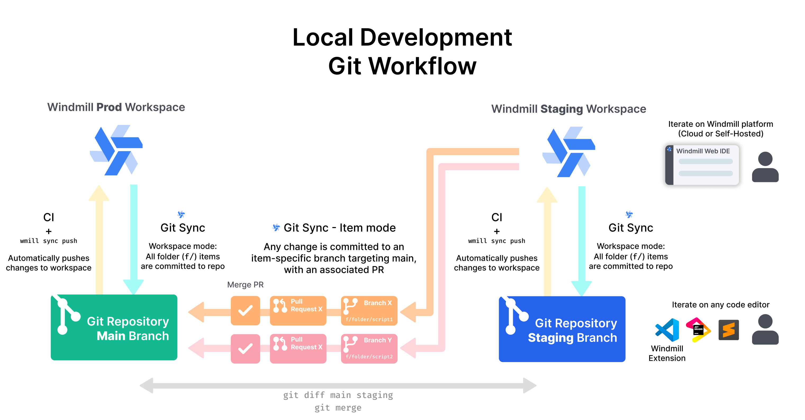

import DocCard from '@site/src/components/DocCard';

# Local development

Windmill has [its own integrated development environment](../../code_editor/index.mdx), but you can also develop and run scripts locally, both with [self-hosted](../1_self_host/index.mdx) and cloud instances.

To simply create and edit scripts and flows locally, you can directly go to the [Develop Locally](#develop-locally) section.

For a more complex setup involving Git, you can go to the [Local development Recommended Setup](#local-development-recommended-setup).

<iframe
	style={{ aspectRatio: '16/9' }}
	src="https://www.youtube.com/embed/sxNW_6J4RG8"
	title="Local development quickstart"
	frameBorder="0"
	allow="accelerometer; autoplay; clipboard-write; encrypted-media; gyroscope; picture-in-picture; web-share"
	allowFullScreen
	className="border-2 rounded-lg object-cover w-full dark:border-gray-800"
></iframe>

## Local development recommended setup

Local development involves two components:

1. Being able to create and edit Windmill scripts and flow from your favorite IDE.
2. Deploy them to Windmill and at the same time [version](../13_version_control/index.mdx) them in a Git repository.

In addition to the core functionalities just mentioned, some might want to add the concept of [deployment](../12_deploy_to_prod/index.mdx). This encompasses having a staging and production Windmill environment, and being able to deploy from Staging to Production.

The diagram below illustrates the full process. We're going to explain it quickly, and in the following sections we will decompose it.



It works as follows:

- 2 different workspaces exist in Windmill: one for Staging and one for Prod, and a Git repository that has been set to sync the Windmill Staging workspace.
- Some developers work from their favorite IDE. They can create new Windmill scripts and flows, edit existing ones, and push them to the Staging repository. Some developers can work directly in Windmill's web IDE. All of this happens in the Staging workspace.
- Every time a script or a flow is deployed in the Staging workspace, Windmill will automatically commit the change to the Git repository using [Git sync](../11_git_sync/index.mdx). It can either commit directly to a specific (i.e. `staging`) branch, or open PRs to this branch (one PR per script/flow).
- Within the Git repository, every time the `staging` branch is merged into the production branch (i.e. `main`), all the changes are pushed at once the Windmill Production workspace.

To summarize, developers operate only in Windmill Staging workspace. Windmill Production workspace is updated only by the CI when the Git staging branch is merged into the production branch.

Now let's deep dive into the first part. We will first explain how developers can set up their local environment to be able to create and edit Windmill script from their IDE, then we will see how to sync Windmill workspaces to a Git repository.

The second part is well covered in:

<div className="grid grid-cols-2 gap-6 mb-4">
	<DocCard
		title="Deploy to prod using a git workflow"
		description="Windmill integration with Git repositories makes it possible to adopt a robust development process for your Windmill scripts, flows and apps."
		href="/docs/advanced/deploy_gh_gl"
	/>
</div>

## Develop locally

You can develop locally by using [Windmill CLI](../3_cli/index.mdx) to clone a workspace and edit scripts and flows in your favorite IDE.

Here is a quickstart video:

<video
	className="border-2 rounded-lg object-cover w-full h-full dark:border-gray-800"
	controls
	id="Local development quickstart"
	src="/videos/local_dev_quickstart.mp4"
/>

<br />

All details and commands are available [below](#editing-and-creating-scripts-locally).

### Setting up the workspace folder

Developing Windmill scripts and flows from your favorite IDE is made easy by using Windmill CLI. Here we will go through the full process of cloning a Windmill workspace locally, creating and editing new scripts and flows, and pushing them back the Windmill workspace.

<div className="grid grid-cols-2 gap-6 mb-4">
	<DocCard
		title="Command-line interface (CLI)"
		description="The Windmill CLI, `wmill` allows you to interact with Windmill instances right from your terminal."
		href="/docs/advanced/cli"
	/>
</div>

The first step is to clone an existing Windmill workspace into a local folder.

Create an empty folder:

```bash
mkdir myworkspace
cd myworkspace
```

Add the workspace and pull its the content using the [CLI `pull` command](../3_cli/sync.mdx#raw-syncing):

```bash
wmill workspace add myworkspace [workspace_id] [remote]
wmill sync pull
```

This will download the content of the workspace into your local folder. You will see an `f/` and a `u/` folder appearing, replicating the folder structure of the workspace.

:::caution

[`wmill sync pull`](../3_cli/sync.mdx) will pull everything from the Windmill workspace, including resources and variables, even secrets. If you're planning to use Git as explained below, we recommend only pulling scripts, flows and apps, skipping the rest. It can be done with:

```bash
wmill sync pull --skip-variables --skip-secrets --skip-resources
```

:::

Each script will be represented by a content file (`.py`, `.ts`, `.go` depending on the language) plus a metadata file (ending with `.script.yaml`). This file contains various metadata about the script, like a summary and description, but also the content of the lockfile and the schema of the script (i.e. the signature of its `main` method). We will come back to this later.
For flows, one flow will be represented by a folder, containing a `flow.yaml` file being the definition of the flow, and additional files for inline scripts.

:::tip

The metadata file schema is available [here](../../core_concepts/13_json_schema_and_parsing/index.mdx).

:::

### Editing and creating scripts locally

To summarize, here are the canonical process to edit and create scripts locally using [Windmill CLI](../3_cli/index.mdx) (details below):

```bash
# optional - create a new script using the CLI (can be done manually)
wmill script bootstrap f/my_space/example_script python3

# edit the script content manually, writing your python code within your IDE

# edit the script metadata (required if you made edits to the dependencies or the main signature method)
wmill script generate-metadata

# optional - specify the path to the script adding f/my_space/example_script.py
wmill script generate-metadata f/my_space/example_script.py

# push your changes to the Windmill workspace
wmill sync push
```

... and for flows:

```bash
# optional - create a new script using the CLI (can be done manually)
wmill flow bootstrap f/my_space/groundbreaking_flow

# edit the flow definition manually, or using the VSCode extension

# push your changes to the Windmill workspace
wmill sync push
```

Once the workspace folder is pulled, edits can be made using any IDE (including the [VS Code extension](../../cli_local_dev/1_vscode-extension/index.mdx)).

When created and edited through the UI (Windmill App), the lockfile is automatically generated. On local development, each script gets:
- a content file (`script_path.py`, `script_path.ts`, `script_path.go`, etc.) that contains the code of the script,
- a metadata file (`script_path.yaml`) that contains the metadata of the script,
- a lockfile (`script_path.lock`) that contains the dependencies of the script.

You can get those 3 files for each script by pulling your workspace with command [`wmill sync pull`](../3_cli/sync.mdx).

Editing a script is as simple as editing its content. The code can be edited freely in your IDE, and there are possibilities to even run it locally if you have the correct development environment setup for the script language.

#### Metadata file and lockfile

Some fields of the metadata file can also be edited by hand, like the summary of the description fields. If you update the dependencies of your script, or the signature of the `main` method, the lockfile and/or the script schema will need to be updated. We do not recommend doing it by hand.

[Windmill CLI](../3_cli/index.mdx) comes with a [`wmill script generate-metadata`](../3_cli/script.md#re-generating-a-script-metadata-file) command that will read all the files that have been edited and gracefully update the metadata file and lockfile accordingly.
This command is mainly used update the lockfile and schema inplace. Be re-assured, any manual update to other files like summary and description will be kept:

_Generate metadata command:_


_And the modified files:_


Note that you can explicitly exclude (or include) specific files or folders to be taken into account by this command, with a [`wmill.yaml` file](https://github.com/windmill-labs/windmill-sync-example/blob/main/wmill.yaml).

You can also generate metadata for a single script with `wmill script generate-metadata <path>`.

The lockfile is not meant to be edited manually. It is generated by Windmill when the script is created or edited through the UI and updated locally with the `wmill script generate-metadata` command. However, it is useful to check [versions](../6_imports/index.mdx) changes.

For each language, there is a way to [pin the version directly within script](../14_dependencies_in_typescript/index.mdx#lockfile-per-script-inferred-from-imports-standard). This is the recommended way of managing dependencies.
Locally, the lockfile is respected. It "wins" over the dependencies pinned via the script. Hence the need of the `generate-metadata` command to update the lockfile and metadata files.

Locally, flows and apps are stored in a folder ending with `.flow` and `.app` respectively. They include a `flow.yaml` and `app.yaml` file respectively, and the 3 files mentioned [above](#editing-and-creating-scripts-locally) for each inline script they contain.

### Package.json & requirements.txt

If you have a `package.json` or `requirements.txt` file in the same or parent directory as your script, the `wmill script generate-metadata` command will automatically include the dependencies in the metadata file.

The lockfile for a file generated with generated-metadata will be overriden by the closest package.json from a parent or current folder if there is one.


But what if you want to create a new script from scratch? It's also easy, just create a file with the correct extension (or run `wmill script bootstrap <path> <language>`), and simply run `generate-metadata` command to generate the metadata file. The name of the file and its location in the folder will become the script path in Windmill.

<details>
  <summary>File extension per script language</summary>

| **Script language** | **Expected file extension** |
| ------------------- | --------------------------- |
| TypeScript (deno)   | `.ts`                       |
| Python              | `.py`                       |
| TypeScript (bun)    | `.bun.ts`                   |
| Bash                | `.sh`                       |
| Go                  | `.go`                       |
| REST                | `.fetch.ts`                 |
| PostgreSQL          | `.pg.sql`                   |
| MySQL               | `.my.sql`                   |
| BigQuery            | `.bq.sql`                   |
| Snowflake           | `.sf.sql`                   |
| MS SQL Server       | `.ms.sql`                   |
| GraphQL             | `.gql`                      |
| PowerShell          | `.ps1`                      |
| Nu                  | `.nu`                       |

</details>

Similar for flow, you can manually create a folder ending with `.flow` and containing a `flow.yaml` file.

<details>
  <summary>`flow.yaml` initial content</summary>

```yaml
summary: ''
description: ''
value:
  modules: []
schema:
  $schema: 'https://json-schema.org/draft/2020-12/schema'
  type: object
  order: []
  properties: {}
  required: []
ws_error_handler_muted: false
```

More info [here](../../core_concepts/13_json_schema_and_parsing/index.mdx).

</details>

Flows can be more difficult to edit at the beginning because ones need to be familiar with the OpenFlow definitions to be able to write the YAML file. To help you with that, you can use our [VS Code extension](../../cli_local_dev/1_vscode-extension/index.mdx).

:::tip CLI Bootstrap

Windmill CLI also has a `bootstrap` command (both for `wmill script` and `wmill flow`) which can be used to create a new script in the desired language or flow. All files will be automatically created and the script content will be a simply "Hello world" in the desired language, which can then be updated.

:::

Lastly, it is possible to execute scripts locally and even plug them to any unit testing framework. More info on the [Run locally documentation page](../4_local_development/run_locally.mdx).

### VS Code extension

The Windmill VS Code extension allows you to build scripts and flows in the comfort of your VS Code editor, while leveraging Windmill UIs for test & flows edition.

<div className="grid grid-cols-2 gap-6 mb-4">
	<DocCard
		title="VS Code extension"
		description="Build scripts and flows in the comfort of your VS Code editor, while leveraging Windmill UIs for test & flows edition."
		href="/docs/cli_local_dev/vscode-extension"
	/>
</div>


## Mocked API files

Simulate API interactions locally by using a JSON file to store and retrieve variables and resources.

The file should conform to the following interface:

```typescript
interface MockedApi {
  variables: Record<string, string>;
  resources: Record<string, any>;
}
```

Use the file by setting the `WM_MOCKED_API_FILE` [environment variable](../../core_concepts/47_environment_variables/index.mdx) to the path of your JSON file. For example:

```ts
import * as wmill from "windmill-client@1.450.0-beta.2"

export async function main(x: string) {
  await Bun.write("./foo.json", '{}')
  process.env["WM_MOCKED_API_FILE"] = "./foo.json"
  await wmill.setVariable("foo", "foobar")
  await wmill.setResource({ "we": 42}, "foo")
  console.log(await wmill.getResource("foo"))
  return x
}
```

If WM_MOCKED_API_FILE is present, [`getVariable`](../../core_concepts/2_variables_and_secrets/index.mdx#accessing-a-variable-from-a-script) / [`getResource`](../../core_concepts/3_resources_and_types/index.mdx#fetching-them-from-within-a-script-by-using-the-wmill-client-in-the-respective-language) will look up first in that object if the value exists. `setVariable` / `setResource` will set it there. If the environment variable is set but no file exists, it is set to an empty mocked API.

## Deploy from GitHub/GitLab with Staging/Prod

Syncing directly from the CLI is great, but instead of using the CLI directly, you should combine it with your CI/CD and set up a full productive Git workflow with a Staging and Prod workspaces and [Git sync](../11_git_sync/index.mdx). See more details here:

<div className="grid grid-cols-2 gap-6 mb-4">
	<DocCard
		title="Deploy to prod using a git workflow"
		description="Windmill integration with Git repositories makes it possible to adopt a robust development process for your Windmill scripts, flows and apps."
		href="/docs/advanced/deploy_gh_gl"
	/>
</div>

## LLMs rules for local development

The `wmill init` command will create cursor rules and CLAUDE.md files to enhance your AI experience when working with scripts and flows. These files provide context and guidelines for AI assistants to better assist you in creating scripts and flows that match Windmill's guidelines. You can safely delete them if you do not use LLMs on your local development.

## Run locally

Windmill has its [own integrated development environment](../../code_editor/index.mdx). But for iteration, integration with CI/CD and testing purposes you may need to run a script locally that also interacts with Windmill (for example, to retrieve resources). It will allow you to integrate Windmill with any testing framework.

To setup a local development environment for Windmill, see the dedicated Local development page (above).

To [run scripts locally](../4_local_development/run_locally.mdx), you will need to fill out the context variables that would otherwise be filled out by the Windmill runtime for you.

<div className="grid grid-cols-2 gap-6 mb-4">
	<DocCard
		title="Run locally"
		description="Run scripts locally that interact with a Windmill instance."
		href="/docs/advanced/local_development/run_locally"
	/>
</div>
