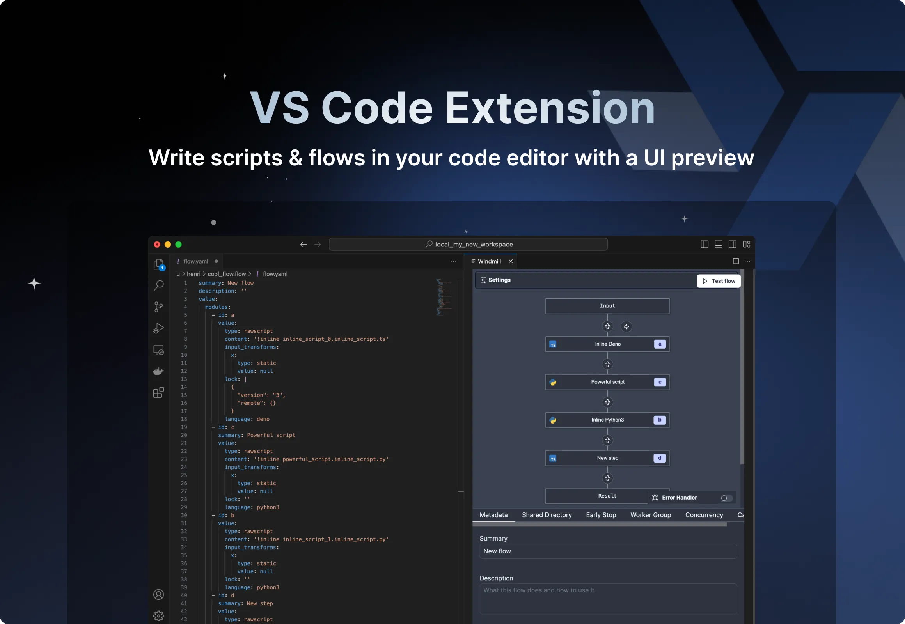

import DocCard from '@site/src/components/DocCard';

# Local Development

Windmill has [its own integrated development environment](../../code_editor/index.mdx), but you can also develop and run scripts locally, on both [self-hosted](../1_self_host/index.mdx) and cloud instances.

## Local Development Recommended Setup

For a more complex and robust local development process, we recommend the following setup with one git repository, a staging and a prod workspace:

It works as follows:
- A git repository with 2 branches: staging and main.
- A staging workspace with [Git Sync](../11_git_sync/index.mdx) workspace mode (all items stored in [folders](../../core_concepts/8_groups_and_folders/index.mdx) are commited to the repo) to staging branch and [Git Sync](../11_git_sync/index.mdx) item mode (any change is committed to an item-specific branch targeting main, with an associated PR, this can be done with GitHub Action [Open PR on Commit](https://github.com/windmill-labs/windmill-sync-example/blob/main/.github/workflows/open-pr-on-commit.yaml)) to main branch.
- A prod workspace with [Git Sync](../11_git_sync/index.mdx) workspace mode to main branch.
- Continuous Integration + [Windmill CLI](../../advanced/3_cli/index.mdx) between Main (resp. Staging) branch and Prod (resp. Staging) workspace to automatically push repo branch changes to workspace. This can be done with GitHub Action [Push on Merge](https://github.com/windmill-labs/windmill-sync-example/blob/main/.github/workflows/push-on-merge.yaml).

With this set up, users can concurrently iterate on both Windmill IDE and code editors locally and commit changes to an item-specific branch targetting main.

## Editing scripts and flows

Scripts and flow can be editied from any code editor. For VS Code, Windmill has a dedicated [VS Code Extnsion](../../cli_local_dev/1_vscode-extension/index.mdx) that can be found on [VS Code Marketplace](https://marketplace.visualstudio.com/items?itemName=windmill-labs.windmill). The extension allows for [UI pre-visualization](../../core_concepts/23_instant_preview/index.mdx), fetching resources, variables, scripts & flows, and testing them. However, these runs and executions are technically carried out from your remote instance.

	<DocCard
		title="VS Code Extension"
		description="Build scripts and flows in the comfort of your VS Code Editor, while leveraging Windmill UIs for test & flows edition."
		href="/docs/cli_local_dev/vscode-extension"
	/>

 

## Run locally

For iteration, integration with CI/CD and testing purposes you may need to [run a script locally](./run_locally.mdx) that also interacts with Windmill (for example, to retrieve resources). It will allow to integrate Windmill with any testing framework. To do this, you will need to fill out the context variables that would otherwise be filled out by the Windmill runtime for you.

<iframe
    style={{ aspectRatio: '16/9' }}
    src="https://www.youtube.com/embed/w2HVTlR2QDI?vq=hd1080"
    title="YouTube video player"
    frameBorder="0"
    allow="accelerometer; autoplay; clipboard-write; encrypted-media; gyroscope; picture-in-picture; web-share"
    allowFullScreen
    className="border-2 rounded-xl object-cover w-full dark:border-gray-800"
></iframe>

 

    <DocCard
		title="Run Locally"
		description="Run scripts locally that interact with a Windmill instance."
		href="/docs/advanced/local_development/run_locally"
	/>
    <DocCard
		title="Command-Line Interface (CLI)"
		description="Interact with Windmill instances right from your terminal."
		href="/docs/advanced/cli"
	/>

