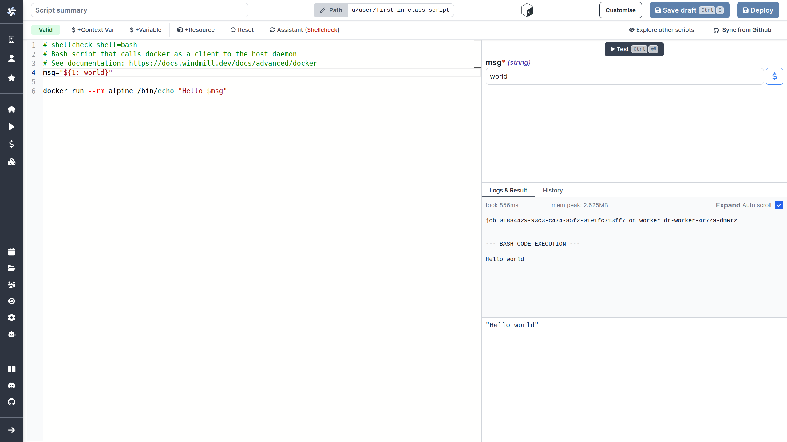
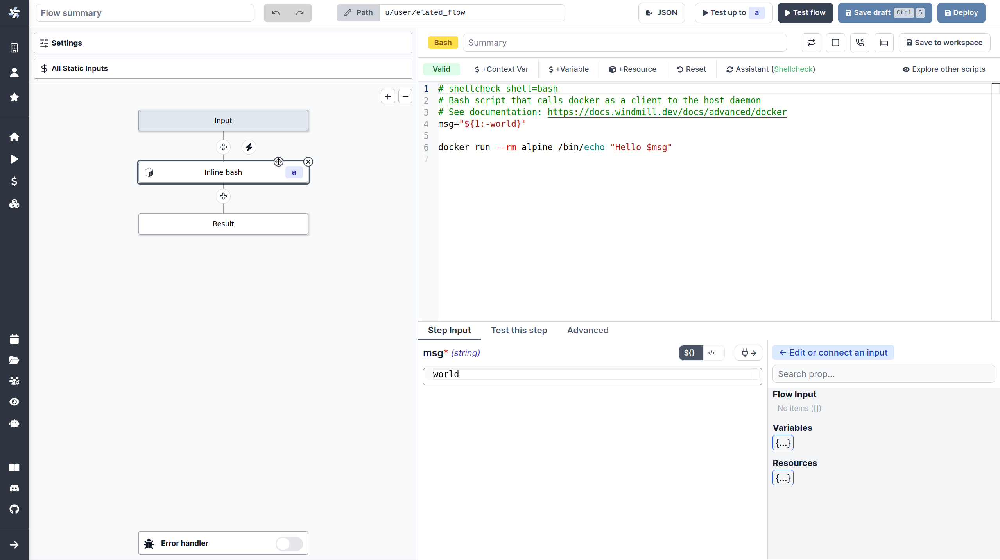

# Run docker containers

Windmill support running any docker container through its bash support. As a pre-requisite, the host docker daemon need to be mounted into the worker container. This is done through a simple volume mount: `/var/run/docker.sock:/var/run/docker.sock`

## Setup

### Docker compose

On the docker-compose, it is enough to uncomment the volume mount of the windmill worker

```dockerfile
      # mount the docker socket to allow to run docker containers from within the workers
      # - /var/run/docker.sock:/var/run/docker.sock
```

### Helm charts

In the charts values of our [helm charts](https://github.com/windmill-labs/windmill-helm-charts), set `windmill.exposeHostDocker` to `true`

## Use

As a script:




As a flow step:



