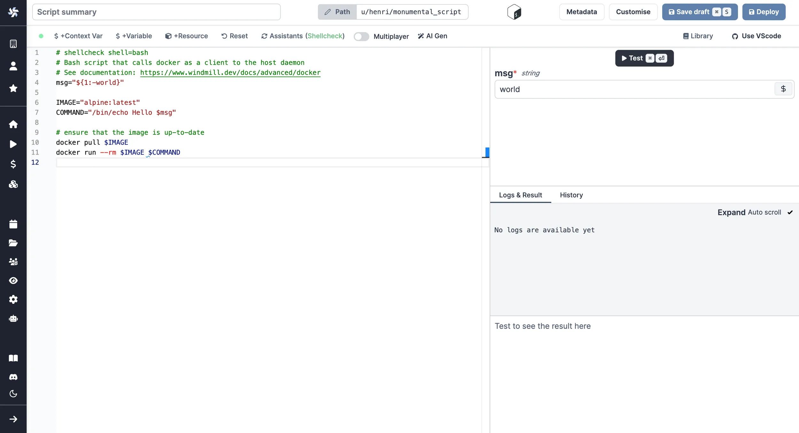
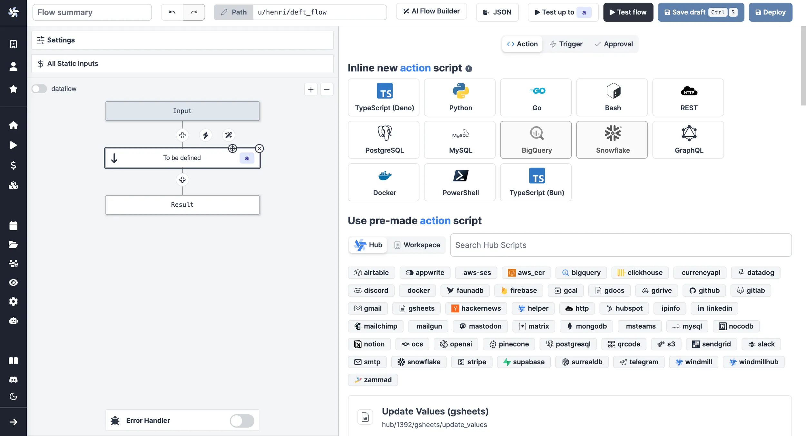
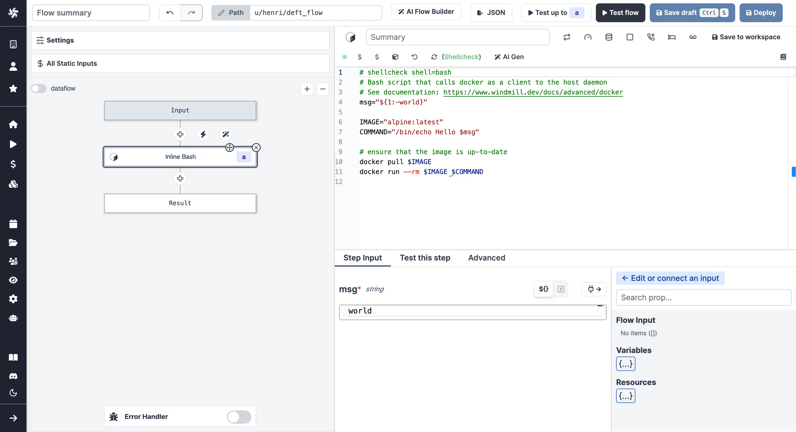

import DocCard from '@site/src/components/DocCard';

# Run Docker Containers

Windmill supports running any [Docker](https://www.docker.com/) container through its [Bash](../../getting_started/0_scripts_quickstart/4_bash_quickstart/index.mdx) support. As a pre-requisite, the host docker daemon needs to be mounted into the worker container. This is done through a simple volume mount: `/var/run/docker.sock:/var/run/docker.sock`.

Once Docker is set up, see:

<div className="grid grid-cols-2 gap-6 mb-4">
	<DocCard
		title="Docker Quickstart"
		description="Learn to run a script using from Docker containers."
		href="/docs/getting_started/scripts_quickstart/docker"
	/>
</div>

## Setup

### Docker compose

On the docker-compose, it is enough to uncomment the volume mount of the Windmill worker

```dockerfile
      # mount the docker socket to allow to run docker containers from within the workers
      # - /var/run/docker.sock:/var/run/docker.sock
```

### Helm charts

In the charts values of our [helm charts](https://github.com/windmill-labs/windmill-helm-charts), set `windmill.exposeHostDocker` to `true`.

### Remote Docker Daemon

One possibility to use the docker daemon with k8s with containerd is to run a docker daemon in the same pod using "Docker-in-Docker" ( dind) Using the official image `docker:stable-dind`:

Here an example of a dind template to be adapted:

```yaml
apiVersion: v1
kind: Pod
metadata:
  name: dind
spec:
  containers:
    - name: dind
      image: 'docker:stable-dind'
      command:
        - dockerd
        - --host=tcp://0.0.0.0:8000
      securityContext:
        privileged: true
```

## Use

The default code is as follows:

```
msg="${1:-world}"

docker run --rm alpine /bin/echo "Hello $msg"
```

`msg` is just a normal bash variable. It can be used to pass arguments to the script. This syntax is the standard bash one to assign default values to parameters.

```
docker run --rm <image> <command>
```

--rm is so that the container dispose itself after being executed. It helps unpollute the host.

The image is the docker image to run. It can be any image available on docker hub or any private registry. It can also be a local image.

The command is the command to run inside the container. It can be any command available in the image.

It is just a bash script so it will behave exactly the same as a local command or if running this as an ssh command on the host. As a consequence, you can use any strategy to cache docker images or handle authentication.

Do not use the daemon mode `-d` otherwise the script will immediately return while the container continue to run in the background. However, in some cases, that might be what you want.

Like any bash script, it will return the last line of the stdout. So be sure to print the return value from your command if you'd like to use it as a result.

As a script:




As a flow step:





## Use with Remote Docker Daemon

```bash
#!/bin/bash

set -ex

# The Remote Docker Daemon Address -> 100.64.2.97:8000
# In the example, 100.64.2.97 is my pod address.

DOCKER="docker -H 100.64.2.97:8000"
$DOCKER run --rm alpine /bin/echo "Hello $msg"
```

output

```log
+ DOCKER='docker -H 100.64.2.97:8000'
+ docker -H 100.64.2.97:8000 run --rm alpine /bin/echo 'Hello '
Unable to find image 'alpine:latest' locally
latest: Pulling from library/alpine
7264a8db6415: Pulling fs layer
7264a8db6415: Verifying Checksum
7264a8db6415: Download complete
7264a8db6415: Pull complete
Digest: sha256:7144f7bab3d4c2648d7e59409f15ec52a18006a128c733fcff20d3a4a54ba44a
Status: Downloaded newer image for alpine:latest
Hello
+ exit 0
```

## Kubernetes

If you use kubernetes and would like to run your docker file directly on the kubernetes host, use the following script:

```
# shellcheck shell=bash
# Bash script that calls docker as a client to the host daemon
# See documentation: https://www.windmill.dev/docs/advanced/docker
msg="${1:-world}"

IMAGE="docker/whalesay:latest"
COMMAND=(sh -c "cowsay $msg")

APISERVER=https://kubernetes.default.svc
SERVICEACCOUNT=/var/run/secrets/kubernetes.io/serviceaccount
NAMESPACE=$(cat ${SERVICEACCOUNT}/namespace)
TOKEN=$(cat ${SERVICEACCOUNT}/token)
CACERT=${SERVICEACCOUNT}/ca.crt

KUBECONFIG_TMP_DIR="$(mktemp -d)"
export KUBECONFIG="${KUBECONFIG_TMP_DIR}/kubeconfig"

trap "rm -rfv ${KUBECONFIG_TMP_DIR}" EXIT

kubectl config set-cluster local --server="${APISERVER}" --certificate-authority="${CACERT}"
kubectl config set-credentials local --token="${TOKEN}"
kubectl config set-context local --cluster=local --user=local --namespace="${NAMESPACE}"
kubectl config use-context local

kubectl run task -it --rm --restart=Never --image="$IMAGE" -- "${COMMAND[@]}"
```

and use the following additional privileges

```yaml
---
apiVersion: rbac.authorization.k8s.io/v1
kind: Role
metadata:
  namespace: windmill
  name: pod-management
rules:
  - apiGroups: ['']
    resources: ['pods']
    verbs: ['get', 'list', 'watch', 'create', 'update', 'patch', 'delete']
  - apiGroups: ['']
    resources: ['pods/log']
    verbs: ['get', 'list', 'watch']
  - apiGroups: ['']
    resources: ['pods/attach']
    verbs: ['get', 'list', 'watch', 'create', 'update', 'patch', 'delete']
  - apiGroups: ['']
    resources: ['events']
    verbs: ['get', 'list', 'watch']
---
apiVersion: rbac.authorization.k8s.io/v1
kind: RoleBinding
metadata:
  name: pod-management
  namespace: windmill
subjects:
  - kind: ServiceAccount
    name: windmill-chart
    namespace: windmill
roleRef:
  kind: Role
  name: pod-management
  apiGroup: rbac.authorization.k8s.io
```
