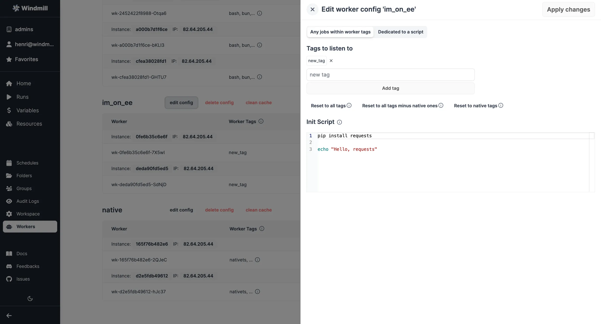

import DocCard from '@site/src/components/DocCard';

# Preinstall binaries

[Workers](../../core_concepts/9_worker_groups/index.mdx) in Windmill can preinstall binaries. This allows them to execute these binaries in subprocesses or directly within bash. While some common binaries like npm, aws-cli, kubectl, and helm are already present in the standard images, you can add more by extending the base image of Windmill.

:::tip Init scripts

For an efficient way to preinstall binaries without the need to modify the base image, see [Init scripts](#init-scripts).

:::

Below are the steps and examples to extend the base image:

```dockerfile
FROM ghcr.io/windmill-labs/windmill:main
# or FROM ghcr.io/windmill-labs/windmill-ee:main for extending the enterprise edition

RUN apt-get update && apt install [...]

CMD ["windmill"]
```

## Example: Installing Puppeteer (via npm)

```dockerfile
FROM ghcr.io/windmill-labs/windmill-ee:main

RUN apt update
RUN apt install npm -y
RUN mkdir -p /etc/apt/keyrings
RUN curl -fsSL https://deb.nodesource.com/gpgkey/nodesource-repo.gpg.key |  gpg --dearmor -o /etc/apt/keyrings/nodesource.gpg
RUN echo "deb [signed-by=/etc/apt/keyrings/nodesource.gpg] https://deb.nodesource.com/node_20.x nodistro main" | tee /etc/apt/sources.list.d/nodesource.list
RUN apt-get update -y
RUN apt install nodejs libnss3-dev  libatk1.0-0 libatk-bridge2.0-0 libcups2-dev  libdrm-dev libxkbcommon-dev libxcomposite-dev libxdamage-dev libxrandr-dev\
  libgbm-dev libpango-1.0 libcairo-dev libasound-dev -y
RUN npm install -g puppeteer -y

CMD ["windmill"]
```

> Note: The example above uses the enterprise edition (`windmill-ee`) as the base.

## Example: Installing Playwright (via uv)

```dockerfile
FROM ghcr.io/windmill-labs/windmill-ee:main

RUN uv tool install playwright
RUN playwright install
RUN playwright install-deps

CMD ["windmill"]
```

> Note: The example above uses the enterprise edition (`windmill-ee`) as the base.

## Examples with docker compose

All examples above can be used in your [`docker-compose.yml`](https://github.com/windmill-labs/windmill/blob/main/docker-compose.yml) by specifying the build context.

Replace:

```
  windmill_worker:
    image: ${WM_IMAGE}
```

With the following:

```
  windmill_worker:
    build:
      context: ./path/to/dockerfile
      args:
        WM_IMAGE: ${WM_IMAGE}
```

Note that you can pass environment variables from your `.env` file via the args above and use them in your `Dockerfile`:

```dockerfile
ARG WM_IMAGE
FROM ${WM_IMAGE}

[...]
```

## Init scripts

Init scripts provide a method to pre-install binaries or set initial configurations without the need to modify the base image. This approach offers added convenience.
Init scripts are executed at the beginning when the worker starts, ensuring that any necessary binaries or configurations are set up before the worker undertakes any other job.

Init scripts are available only on [self-hosting and enterprise edition](/pricing) on private clusters.

<div style={{ display: 'flex', justifyContent: 'center', alignItems: 'center', height: '100%' }}>
	
</div>

<br />

Any scripts are set from the [Worker Management UI](../../misc/11_worker_group_management_ui/index.mdx), at the worker group level. Any script content specified in `INIT_SCRIPT` will be executed at the beginning when each worker of the worker group starts.

When adjustments are made in the [Worker Management UI](../../misc/11_worker_group_management_ui/index.mdx), the workers will shut down and are expected to be restarted by their supervisor (Docker or k8s).

The execution of Init scripts is inspectable in the superadmin workspace, with `Kind = All` filter. The path of those executions are `init_script_{worker_name}`.



<iframe
	style={{ aspectRatio: '16/9' }}
	src="https://www.youtube.com/embed/2o28HMF1Cnk"
	title="YouTube video player"
	frameBorder="0"
	allow="accelerometer; autoplay; clipboard-write; encrypted-media; gyroscope; picture-in-picture; web-share"
	allowFullScreen
	className="border-2 rounded-lg object-cover w-full dark:border-gray-800"
></iframe>

<br />

:::info
Windmill does not pre-install pip or python directly in the base image as system binaries, instead it uses uv and uv manages the python versions (including pre-installing one for performance).

To pre-install packages using pip, you will want to use uv, in particular the [uv tool install](https://docs.astral.sh/uv/concepts/tools/#tools-directory) command. The bin path of uv tool is already in the PATH of the worker, so your jobs will be able to run directly binaries installed in such way.

To have packages be available for import, place them in `/tmp/windmill/cache/python_x_y/global-site-packages` where x_y is the python version intended. For python 3.11.*, the path would be `/tmp/windmill/cache/python_3_11/global-site-packages`.

:::

### Example: Installing Pandas

```bash
uv pip install --system pandas --target /tmp/windmill/cache/python_3_11/global-site-packages
```

### Example: Installing Playwright (via uv)

```bash
uv tool install playwright
playwright install
playwright install-deps
```

More at:

<div className="grid grid-cols-2 gap-6 mb-4">
	<DocCard
		title="Workers and worker groups"
		description="Worker Groups allow users to run scripts and flows on different machines with varying specifications."
		href="/docs/core_concepts/worker_groups"
	/>
	<DocCard
		title="Worker groups management UI"
		description="On Enterpris Edition, worker groups can be managed through Windmill UI."
		href="/docs/misc/worker_group_management_ui"
	/>
</div>
