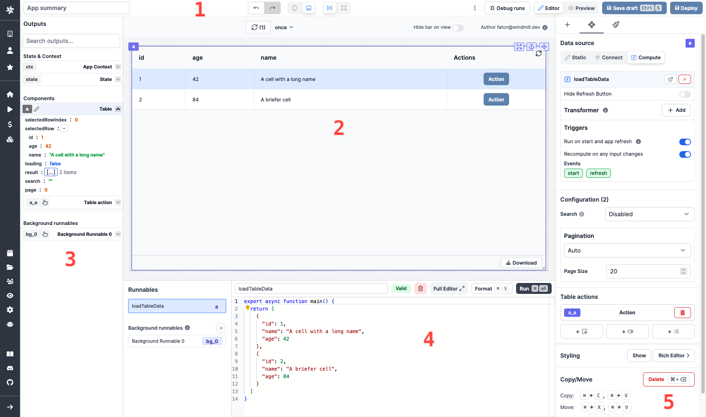

# App Editor

Windmill's App editor allows you to build internal applications with a low-code builder.

:::info Apps

An app is a collection of components. It can be used to build a dashboard, a workflow, a form, a CRM, etc.

 

Apps are made of:

- **[Components](./4_app_component_library.md)**: the components are the building blocks of an app. They can be used to display data, to perform actions, to create forms, etc. The components are displayed on a grid and can be nested in containers.
- **[Runnables](./5_app-runnable.md)**: the runnables are the scripts or flows that are linked to components, or ran in the background. They are used to perform actions when a component is clicked, to fetch data, etc.
:::

    <a href="/docs/getting_started/apps_quickstart" class="rounded-md p-6 border border-gray-200 hover:border-orange-500 transition-all cursor-pointer flex flex-col gap-2 !no-underline" target="_blank">
      
Apps Quickstart

      
4-minute presentation of our App editor.

    </a>
    <a href="/docs/react_vue_svelte_apps" class="rounded-md p-6 border border-gray-200 hover:border-blue-500 transition-all cursor-pointer flex flex-col gap-2 !no-underline" target="_blank">
      
React/Vue/Svelte Apps

      
Override Windmill's App Editor and import your own apps.

    </a>
    <a href="./app_e-commerce" class="rounded-md p-6 border border-gray-200 hover:border-orange-500 transition-all cursor-pointer flex flex-col gap-2 !no-underline" target="_blank">
      
E-commerce CRM App

      
Tutorial on how to build a complex CRM app.

    </a>

 

Windmill's App editor has the following major elements:

    <a href="./app_toolbar" class="rounded-md p-6 border border-gray-200 hover:border-orange-500 transition-all cursor-pointer flex flex-col gap-2 !no-underline" target="_blank">
      
Toolbar

      
Configure app settings, toggle preview (desktop/mobile) and debug runs.

    </a>
    <a href="./app_outputs" class="rounded-md p-6 border border-gray-200 hover:border-orange-500 transition-all cursor-pointer flex flex-col gap-2 !no-underline" target="_blank">
      
Outputs

      
View all components outputs and context.

    </a>
    <a href="./app_canvas" class="rounded-md p-6 border border-gray-200 hover:border-orange-500 transition-all cursor-pointer flex flex-col gap-2 !no-underline" target="_blank">
      
Canvas

      
Drag, drop and resize components on the canvas.

    </a>
    <a href="./app_component_library" class="rounded-md p-6 border border-gray-200 hover:border-orange-500 transition-all cursor-pointer flex flex-col gap-2 !no-underline" target="_blank">
      
Component Library

      
Insert any component or modify the property or styling.

    </a>
    <a href="./app-runnable" class="rounded-md p-6 border border-gray-200 hover:border-orange-500 transition-all cursor-pointer flex flex-col gap-2 !no-underline" target="_blank">
      
Runnable Editor

      
Create, edit or manage the scripts or flows linked to components (Runnable), and background runnables.

    </a>
    <a href="./8_app_styling.md" class="rounded-md p-6 border border-gray-200 hover:border-orange-500 transition-all cursor-pointer flex flex-col gap-2 !no-underline" target="_blank">
      
Styling

      
Set a custom style on a component and app-level.

    </a>
    <a href="./app_settings" class="rounded-md p-6 border border-gray-200 hover:border-orange-500 transition-all cursor-pointer flex flex-col gap-2 !no-underline" target="_blank">
      
Settings

      
Configure the components settings.

    </a>

 

