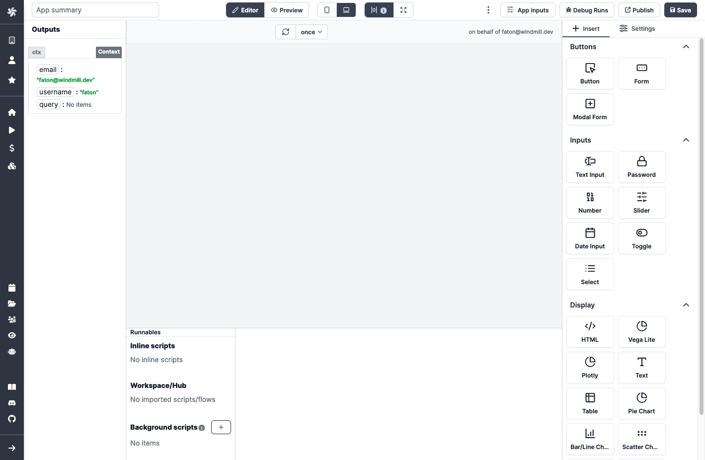

# Overview

Windmill's App editor allows you to build internal applications. Windmill's App editor has the following major components:

- [Toolbar](./app_toolbar): configure app settings, toggle preview (desktop/mobile) and debug runs.
- [Outputs](./app_outputs): view all components outputs and context.
- [Canvas](./app_canvas): drag, drop and resize components on the canvas.
- [Component Library](./app_component_library): insert any component or modify the property or styling.
- [Runnable editor](./app-runnable): create, edit or manage the scripts or flows linked to components (Runnable), and background scripts.

  

&nbsp;  
You will find more details in the next pages.