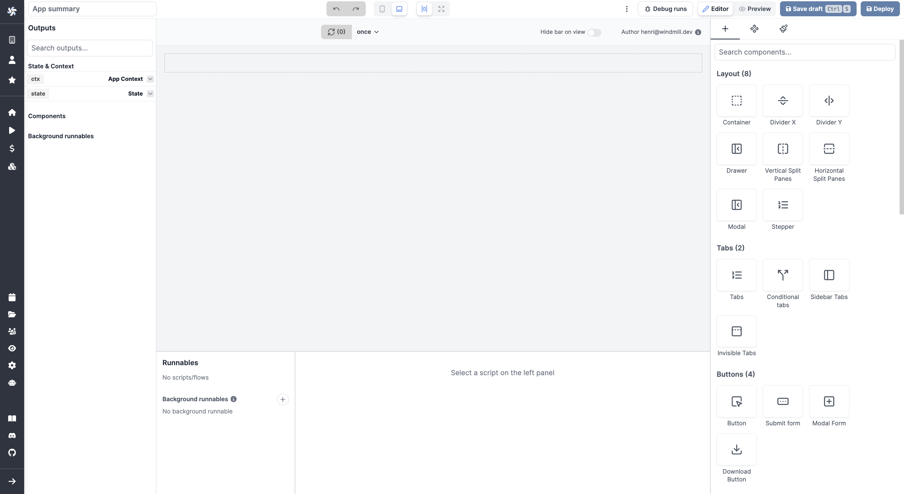
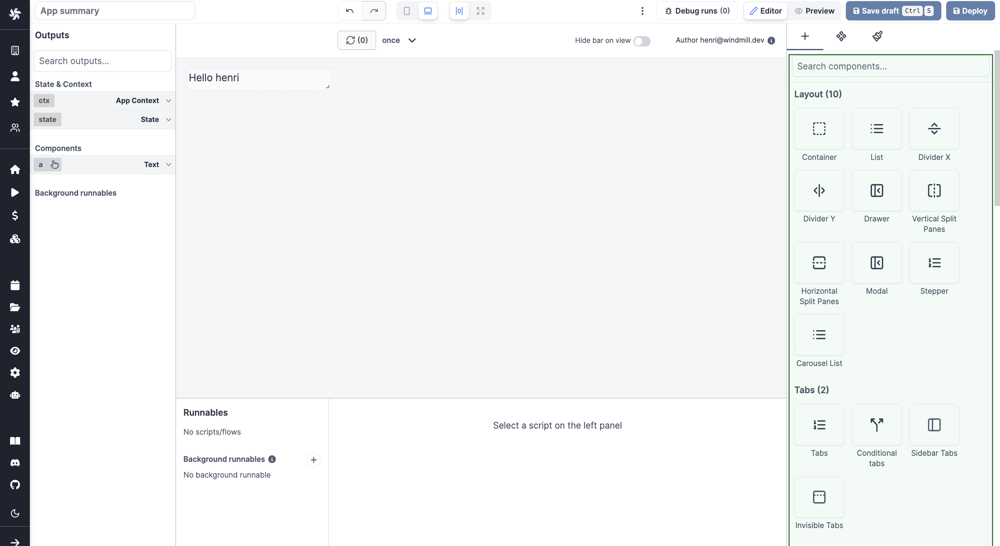
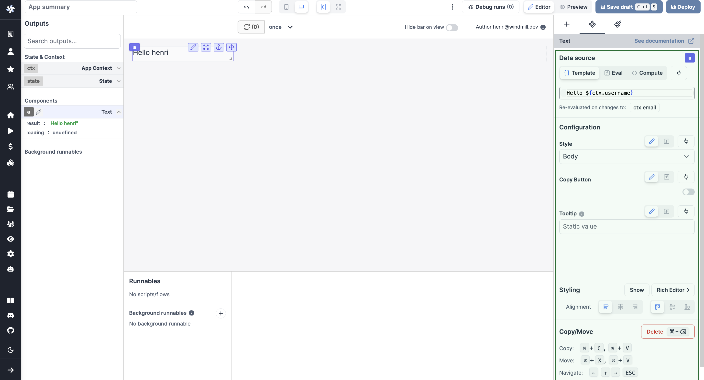

import DocCard from '@site/src/components/DocCard';

# App Editor

The app editor is a low-code builder to create apps with components, create interactions with runnables, and configure the app settings.

	<DocCard
		color="orange"
		title="Apps Quickstart"
		description="Learn how to build your first app in a matter of minutes."
		href="/docs/getting_started/apps_quickstart"
	/>
	<DocCard
		color="orange"
		title="React/Vue/Svelte Apps"
		description="Users can import their own React/Vue/Svelte Apps in addition to using Windmill's built-in App editor."
		href="/docs/react_vue_svelte_apps"
	/>

 

The app editor is composed of 5 main sections:

1. [Toolbar](/docs/apps/app_editor#toolbar)
2. [Canvas](#canvas)
3. [Outputs](#outputs)
4. [Runnables panel](#runnables-panel)
5. [Component Library and Settings](#component-library-and-settings)

## Toolbar

The topbar helps you in your app editing.

#### Learn more

	<DocCard
		color="orange"
		title="Toolbar guide"
		description="Discover all the features of the toolbar."
		href="/docs/apps/toolbar"
	/>

## Canvas

The canvas at the center of the editor is where you design and see the overall UI. Insert new components, move them around, resize them, or nest them in containers.

<video
	className="border-2 rounded-xl object-cover w-full h-full"
	autoPlay
	loop
	controls
	src="/videos/app-canvas-overview.mp4"
/>

#### Learn more

	<DocCard
		color="orange"
		title="Canvas guide"
		description="Move, resize, and nest components."
		href="/docs/apps/canvas"
	/>
	<DocCard
		color="orange"
		title="Component Library"
		description="Discover all the components available."
		href="/docs/apps/app_configuration-settings/app_component_library"
	/>

## Outputs

On the left panel of the editor, you can see the list of outputs of the app. These outputs represent the state of the app and are categorized into four types:

- **Context**: The context holds information such as the user email, username, workspace, query parameters, and more.
- **State**: The state holds the app's current state, which can be manipulated by the frontend scripts.
- **Component Outputs**: These outputs correspond to the outputs of the individual components.
- **Background Runnables**: These outputs represent the outputs of the background runnables.

You can perform the following actions with the outputs:

- Search for an output.
- Edit the output's ID.
- Select a component to view its outputs.
- [Connect an input to an output](../2_outputs.md#connecting-inputs).

#### Learn more

	<DocCard
		color="orange"
		title="Context"
		description="The context holds such information as the user email, username, the workspace, the query parameters, etc."
		href="/docs/apps/outputs"
	/>
	<DocCard
		color="orange"
		title="State"
		description="Learn how to interact with the app's state using frontend scripts."
		href="/docs/apps/app-runnable-panel#state"
	/>

## Runnables panel

On the bottom panel of the editor, you can see the list of runnables of the app. The runnables are the scripts or flows that are linked to components, or ran in the background. They are used to perform actions when a component is clicked, to fetch data, etc. They make all the interactions of the app.

#### Learn more

	<DocCard
		color="orange"
		title="Runnable Guide"
		description="Learn how to create and configure runnables."
		href="/docs/apps/app-runnable-panel"
	/>

## Component Library and Settings

Finally, on the right panel of the editor, you can insert a new component, configure a component or edit the component styles.

#### Learn more

	<DocCard
		color="orange"
		title="Component Library"
		description="Discover all the components available in the library, and their configurations."
		href="/docs/apps/app_configuration-settings/app_component_library"
	/>
	<DocCard
		color="orange"
		title="Runnable Triggers"
		description="Learn how to trigger a runnable."
		href="/docs/apps/app_configuration-settings/app_runnable_triggers"
	/>
	<DocCard
		title="Group of Components"
		description="Components can be grouped within containers."
		href="/docs/apps/app_configuration-settings/components_groups"
		color="orange"
	/>
	<DocCard
		color="orange"
		title="Styling"
		description="Learn how to edit the component styles."
		href="/docs/apps/app_configuration-settings/app_styling"
	/>

