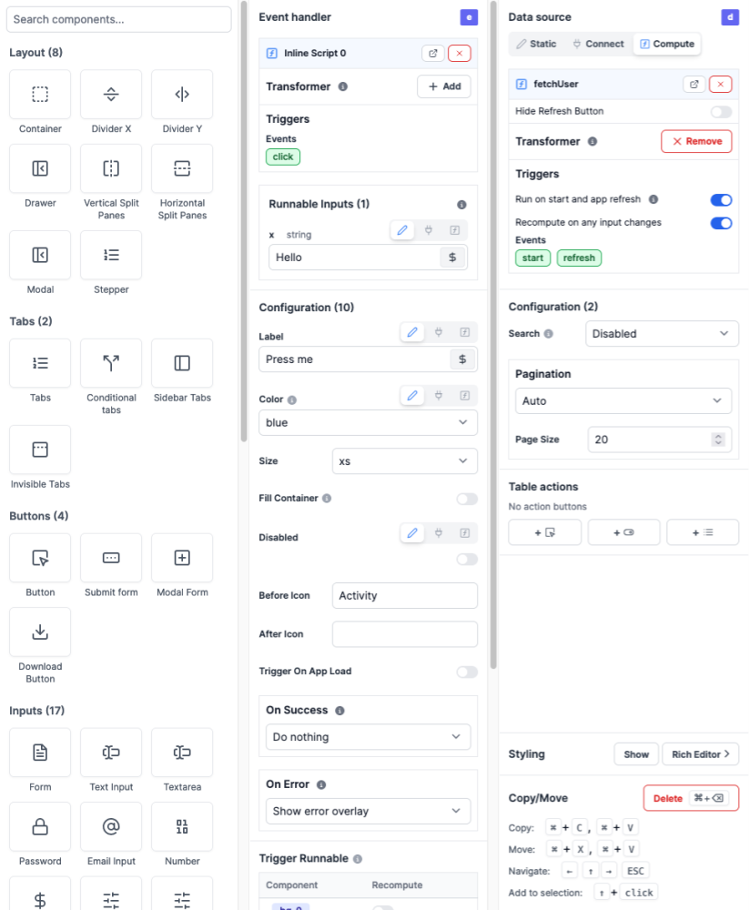

# App Editor

The app editor is where you build an app with components, create interactions with runnables, and configure the app settings. It is composed of 5 main sections:

1. [Toolbar](#toolbar)
2. [Canvas](#canvas)
3. [Outputs](#outputs)
4. [Runnables panel](#runnables-panel)
5. [Component Library and Settings](./app_component_library)

## Toolbar

On the topbar, you can configure your app as follows:

- Change the app summary
- Undo/Redo an action
- Toggle between Mobile and Desktop layout
- Toggle between full and max width
- Export the app as JSON
- Debug your app: Check out the [Debugging](./app_debugging) section for more details
- Toggle between Editor and Preview mode
- Save the app as draft
- Deploy the app to the Hub: Check out the [Deployment](./app_deployment) section for more details

	<a
		href="/docs/misc/note_of_intent"
		class="rounded-md p-6 border border-gray-200 hover:border-blue-500 transition-all cursor-pointer flex flex-col gap-2 !no-underline"
		target="_blank"
	>
		
Toolbar guide

		
Discover all the features of the toolbar.

	</a>

## Canvas

The canvas at the center of the editor is where you design and see the overall UI. Insert new components, move them around, resize them, or nest them in containers.

  <a href="/docs/misc/note_of_intent" class="rounded-md p-6 border border-gray-200 hover:border-blue-500 transition-all cursor-pointer flex flex-col gap-2 !no-underline" target="_blank">
   
Canvas Guide

    

     Move, resize, and nest components. 
    

  </a>

<video
	className="border-2 rounded-xl object-cover w-full h-full"
	autoPlay
	loop
	controls
	id="main-video"
	src="/videos/app-canvas-overview.mp4"
/>

## Outputs

On the left panel of the editor, you can see the list of outputs of the app. They represent the state of the app.
They are four types of outputs:

- Context: The context holds such information as the user email, username, the workspace, the query parameters, etc.
- State: The state holds the state of the app, that can be manipulated by the frontend scripts.
- Component outputs: The outputs of the components.
- Background runnables: The outputs of the background runnables.

You can search for an output, edit its id, and select a component to see its outputs.

	<a
		href="/docs/misc/note_of_intent"
		class="rounded-md p-6 border border-gray-200 hover:border-blue-500 transition-all cursor-pointer flex flex-col gap-2 !no-underline"
		target="_blank"
	>
		
Output panel guide

		

			Discover the different types of outputs and how to use them.
		

	</a>

## Runnables panel

On the bottom panel of the editor, you can see the list of runnables of the app. The runnables are the scripts or flows that are linked to components, or ran in the background. They are used to perform actions when a component is clicked, to fetch data, etc. They make all the interactions of the app.

	<a
		href="/docs/getting_started/how_to_use_windmill"
		class="rounded-md p-6 border border-gray-200 hover:border-blue-500 transition-all cursor-pointer flex flex-col gap-2 !no-underline"
		target="_blank"
	>
		
Runnables

		

			The runnables are the scripts or flows that are linked to components, or ran in the
			background. They are used to perform actions when a component is clicked, to fetch data, etc.
		

	</a>

## Component Library and Settings

Finally, on the right panel of the editor, you can insert a new component, configure a component or edit the component styles.

	<a
		href="/docs/misc/note_of_intent"
		class="rounded-md p-6 border border-gray-200 hover:border-blue-500 transition-all cursor-pointer flex flex-col gap-2 !no-underline"
		target="_blank"
	>
		
Component Library

		

			Discover all the components available in the library, and their configurations.
		

	</a>
	<a
		href="/docs/misc/note_of_intent"
		class="rounded-md p-6 border border-gray-200 hover:border-blue-500 transition-all cursor-pointer flex flex-col gap-2 !no-underline"
		target="_blank"
	>
		
Component configuration

		

			Learn how to configure a component, and how to use the component settings.
		

	</a>
	<a
		href="/docs/misc/note_of_intent"
		class="rounded-md p-6 border border-gray-200 hover:border-blue-500 transition-all cursor-pointer flex flex-col gap-2 !no-underline"
		target="_blank"
	>
		
Styling

		

			Discover how to style your app, and how to use the style settings.
		

	</a>

