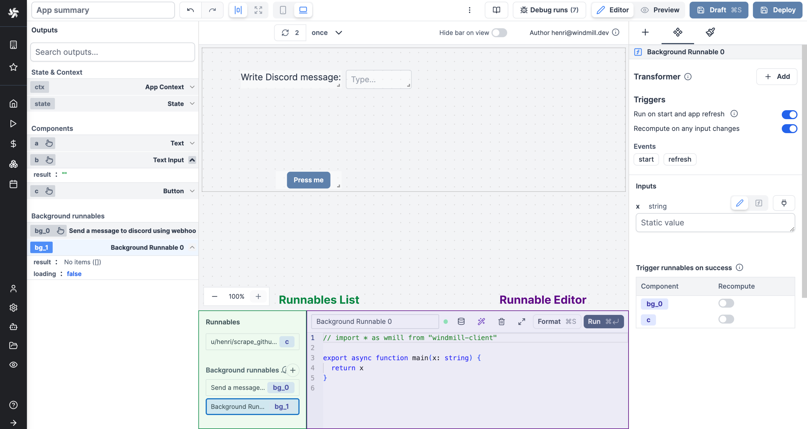

import DocCard from '@site/src/components/DocCard';
import { Timer } from 'lucide-react';

# App editor

The app editor is a low-code builder to create custom User Interfaces with a mix of drag-and-drop and code.

	<DocCard
		color="orange"
		title="Apps quickstart"
		description="Learn how to build your first app in a matter of minutes."
		href="/docs/getting_started/apps_quickstart"
		Icon={Timer}
	/>
	<DocCard
		color="orange"
		title="React/Vue/Svelte apps"
		description="Users can import their own React/Vue/Svelte apps in addition to using Windmill's built-in App editor."
		href="/docs/react_vue_svelte_apps"
	/>

If you're more into videos, you can check out our tutorial on the App editor:

<iframe
	style={{ aspectRatio: '16/9' }}
	src="https://www.youtube.com/embed/lxqdncP8XR4"
	title="App editor Tutorial"
	frameBorder="0"
	allow="accelerometer; autoplay; clipboard-write; encrypted-media; gyroscope; picture-in-picture; web-share"
	allowFullScreen
	className="border-2 rounded-lg object-cover w-full dark:border-gray-800"
></iframe>

 

The app editor is composed of 6 main sections:

1. [Toolbar](/docs/apps/app_editor#toolbar)
2. [Canvas](#canvas)

_Connecting components_:  3. [Outputs](#outputs)  4. [Runnables panel](#runnables-panel)

5. [Component library and Settings](#component-library-and-settings)
6. [App Styling](#styling)

## Toolbar

The topbar helps you in your app editing.

#### Learn more

	<DocCard
		color="orange"
		title="Toolbar"
		description="Discover all the features of the toolbar."
		href="/docs/apps/toolbar"
	/>

## Canvas

The canvas at the center of the editor is where you design and see the overall UI. Insert new components, move them around, resize them, or nest them in containers.

<video
	className="border-2 rounded-lg object-cover w-full h-full"
	autoPlay
	loop
	controls
	src="/videos/app-canvas-overview.mp4"
/>

#### Learn more

	<DocCard
		color="orange"
		title="Canvas"
		description="Move, resize, and nest components."
		href="/docs/apps/canvas"
	/>
	<DocCard
		color="orange"
		title="Component library"
		description="Discover all the components available."
		href="/docs/apps/app_configuration_settings/app_component_library"
	/>

## Connecting components

The strength of Windmill's app editor is the ability to connect everything together:

- components can be linked to each other
- components can be directly linked to scripts and trigger them
- background runnables can be that are run in the background on app refresh on when an input changes
- frontend scripts can be used to manipulate the client app state

	<DocCard
		color="orange"
		title="Connecting components"
		description="The strength of Windmill's app editor is the ability to connect everything together."
		href="/docs/apps/connecting_components"
	/>

In Windmill's app editor:

- the [runnable editor](#runnables-panel) catalogs and configures all the scripts present in the application
- the [output panel](#outputs) lists the outputs of all the components and scripts in your application

### Runnables panel

On the bottom panel of the editor, you can see the list of runnables of the app. The runnables are the scripts or flows that are linked to components, or ran in the background. They are used to perform actions when a component is clicked, to fetch data, etc. They make all the interactions of the app.

#### Learn more

	<DocCard
		color="orange"
		title="Runnable editor"
		description="Learn how to create and configure Apps runnables."
		href="/docs/apps/app-runnable-panel"
	/>

### Outputs

On the left panel of the editor, you can see the list of outputs of the app. These outputs represent the states & results of the app and are categorized into four types:

- **Context**: The context holds information such as the user email, username, workspace, query parameters, and more.
- **State**: The state holds the app's current state, which can be manipulated by the frontend scripts.
- **Component Outputs**: These outputs correspond to the outputs of the individual components.
- **Background Runnables**: These outputs represent the outputs of the background runnables.

You can perform the following actions with the outputs:

- Search for an output.
- Edit the output's ID.
- Select a component to view its outputs.
- [Connect an input to an output](../2_connecting_components/index.mdx).

#### Learn more

	<DocCard
		color="orange"
		title="Outputs"
		description="The outputs represent the states & results of the app"
		href="/docs/apps/outputs"
	/>
	<DocCard
		color="orange"
		title="State"
		description="Learn how to interact with the app's state using frontend scripts."
		href="/docs/apps/app-runnable-panel#state"
	/>

## Component library and Settings

Finally, on the right panel of the editor, you can insert a new component, configure a component or edit the component styles.

#### Learn more

	<DocCard
		color="orange"
		title="Component library"
		description="Discover all the components available in the library, and their configurations."
		href="/docs/apps/app_configuration_settings/app_component_library"
	/>
	<DocCard
		color="orange"
		title="Component configuration"
		description="Each component can be configured individually. This allows for adjusting its value, behavior (especially by linking a script to the component), and styling."
		href="/docs/apps/app_configuration_settings/app_component_configuration"
	/>

## Styling

Styling on the app editor can be managed at the component and app-level, with pre-set configurations or using CSS & [Tailwind](https://tailwindcss.com/).

#### Learn more

	<DocCard
		color="orange"
		title="Styling"
		description="Give styling to your app & components."
		href="/docs/apps/app_configuration_settings/app_styling"
	/>

## Other App Features

	<DocCard
		title="Public apps"
		description="Apps can be accessed as a standalone app by anyone who has the secret URL."
		href="/docs/apps/public_apps"
		color="orange"
	/>
	<DocCard
		title="Schedule app reports"
		description="Send a PDF or PNG preview of any app at a given schedule."
		href="/docs/apps/schedule_reports"
		color="orange"
	/>
	<DocCard
		title="Group of components"
		description="Components can be grouped within containers."
		href="/docs/apps/app_configuration_settings/components_groups"
		color="orange"
	/>
	<DocCard
		color="orange"
		title="Import custom React components"
		description="Define components in React or Vanilla JS that interact with the rest of your app."
		href="/docs/apps/react_components"
	/>

