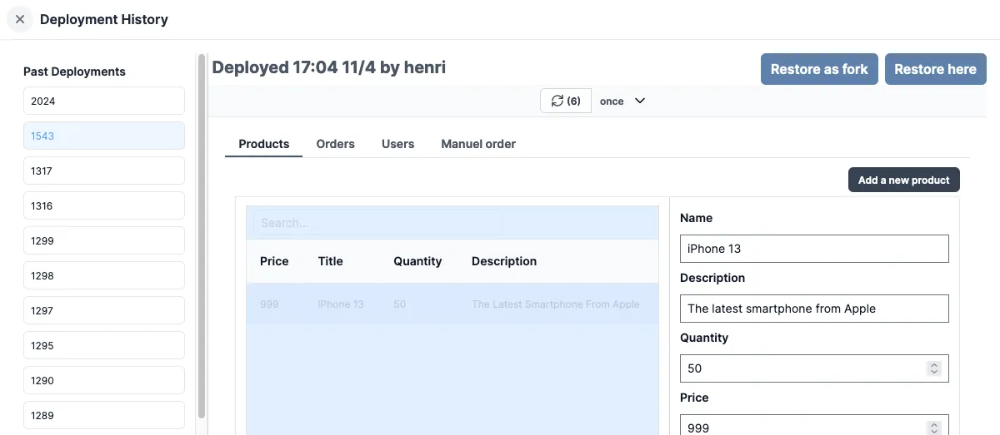

# Toolbar

The app toolbar is located at the top of the app editor. It enables you to adjust app settings.

## App Summary

The app summary can be modified on the left side of the toolbar. It serves to describe the app and is displayed in the app list. By default, the summary is the app's name.

## Undo/Redo

The undo/redo buttons facilitate undoing or redoing the most recent action.

## Desktop/Mobile Mode

You can switch the canvas' mode to `Mobile` or `Desktop` layout from the toolbar. This enables you to manually set the position and size of the components in both modes.

## Width

You can set the canvas' width to:
- Limited width: The max width is 1168px and the content stay centered instead of taking the full page width.
- Max width: The width is of the app if the full width of its container.

## Menu `⋮`

The `⋮` menu provides access to the following options:

### Deployement history

In the menu, you can view the [deployment](./6_app_deployment.mdx) history of the app. It displays the date and time of the deployment, the user who deployed the app, and the version of the app.

You can:

- View the app at a specific version.
- Restore a fork.
- Restore here.

### Export

View the [YAML or JSON representation](../core_concepts/13_json_schema_and_parsing/index.md) of the app.

### Hub compatible JSON

Hub Compatible JSON: View the JSON / YAML representation of the app in a format that is compatible with the [Windmill Hub](https://hub.windmill.dev/).

### App Inputs

The app inputs menu displays a list of all the inputs of each component. A toggle allows you to display only resources inputs, enabling you to easily configure your third-party resources for an app imported from the Hub, for example:

### Diff

Visualize changes between [current](../core_concepts/0_draft_and_deploy/index.mdx#local-edits) and [lastest deployed version](../core_concepts/0_draft_and_deploy/index.mdx#deployed-version) or [latest draft](../core_concepts/0_draft_and_deploy/index.mdx#draft).

## Debug Runs

The app builder enables you to examine recent runs to [identify potential bugs](./5_app_debugging.md).

<video
	className="border-2 rounded-xl object-cover w-full h-full dark:border-gray-800"
	controls
	src="/videos/debug_app.mp4"
/>

## Preview Mode

The app editor mode can be toggled between `Editor` and `Preview` modes. The preview mode allows you to see the app in action.

## Save as draft

You can [save](./6_app_deployment.mdx) the app. The first time you save the app, you'll be asked to select the owner of the app. You can choose either a user or a [folder](../core_concepts/8_groups_and_folders/index.mdx#folders).

## Deploy

Windmill apps are custom-made user interfaces meant to interact with scripts and flows.

There are two ways to [deploy](./6_app_deployment.mdx) an app:
- **Read-Access Required**: The app can be accessed & triggered by anyone who has [read access](../core_concepts/16_roles_and_permissions/index.mdx) to the app.
- **Publish Publicly**: The app can be accessed as a standalone app by anyone who has the secret URL.