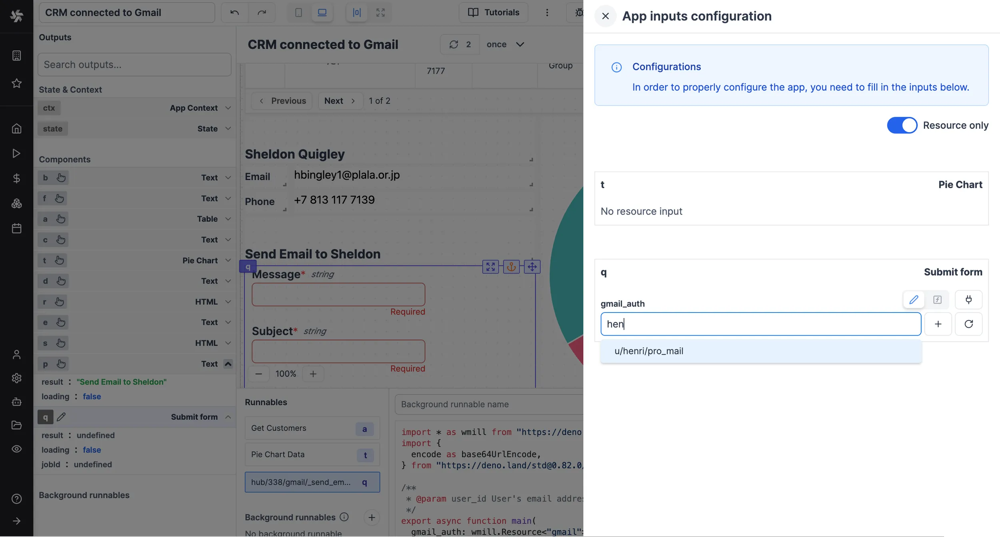
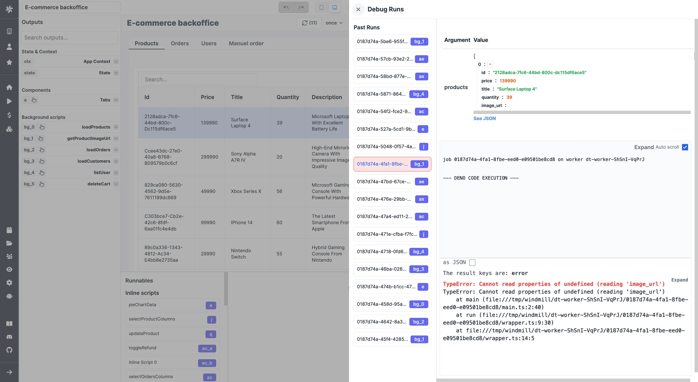
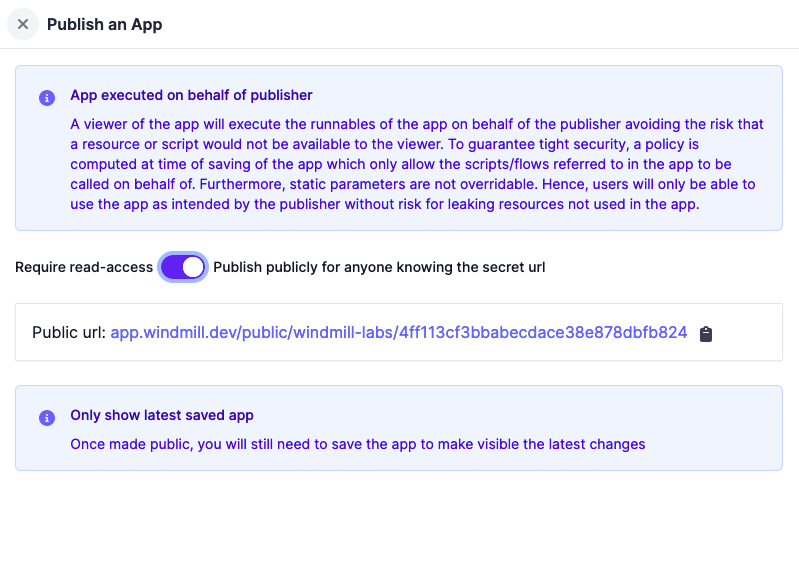

# Toolbar Guide

The app toolbar is located at the top of the app editor. It enables you to adjust app settings, toggle between desktop/mobile preview, and debug runs.

- [App Summary](#app-summary): The summary is the name that will be displayed for your app.
- [Undo/Redo](#app-summary): Perform undo or redo actions.
- [Desktop/Mobile Mode](#desktopmobile-mode): Switch between Mobile and Desktop layout.
- [Width](#width): Switch between full and max width.
- [Deployement history](#deployement-history): View the deployment history of the app.
- [JSON](#json): Export your app as a JSON or [Hub](https://hub.windmill.dev/) compatible file.
- [Hub compatible JSON](#hub-compatible-json): View the JSON representation of the app in a format that is compatible with the [Windmill Hub](https://hub.windmill.dev/).
- [App Inputs Configuration](#app-inputs-configuration): the app inputs menu displays a list of all the inputs of each component.
- [Debugging](#debug-runs): Open the debugging panel.
- [Editor/Preview Mode](#preview-mode): Toggle between the Editor and Preview modes.
- [Save as Draft](#save-as-draft): Save your app as a [draft](../core_concepts/0_draft_and_deploy/index.mdx#draft).
- [Deploy](#deploy): [Deploy](../core_concepts/0_draft_and_deploy/index.mdx#deployed-version) your app.

## App Summary

The app summary can be modified on the left side of the toolbar. It serves to describe the app and is displayed in the app list. By default, the summary is the app's name.

## Undo/Redo

The undo/redo buttons facilitate undoing or redoing the most recent action.

## Desktop/Mobile Mode

You can switch the canvas' mode to `Mobile` or `Desktop` layout from the toolbar. This enables you to manually set the position and size of the components in both modes.

## Width

You can set the canvas' width to:
- Limited width: The max width is 1168px and the content stay centered instead of taking the full page width.
- Max width: The width is of the app if the full width of its container.

## Menu `⋮`

The `⋮` menu provides access to the following options:

### Deployement history

In the menu, you can view the deployment history of the app. It displays the date and time of the deployment, the user who deployed the app, and the version of the app.

You can:

- View the app at a specific version.
- Restore a fork
- Restore here

### JSON

View the JSON representation of the app.

### Hub compatible JSON

Hub Compatible JSON: View the JSON representation of the app in a format that is compatible with the [Windmill Hub](https://hub.windmill.dev/).

### App Inputs Configuration

The app inputs menu displays a list of all the inputs of each component. A toggle allows you to display only resources inputs, enabling you to easily configure your third-party resources for an app imported from the Hub, for example:

## Debug Runs

The app builder enables you to examine recent runs to identify potential bugs.

## Preview Mode

The app editor mode can be toggled between `Editor` and `Preview` modes. The preview mode allows you to see the app in action.

## Save as draft

You can [save](../core_concepts/0_draft_and_deploy/index.mdx) the app. The first time you save the app, you'll be asked to select the owner of the app. You can choose either a user or a [folder](../core_concepts/8_groups_and_folders/index.mdx#folders).

## Deploy

You can [deploy](../core_concepts/0_draft_and_deploy/index.mdx#deployed-version) the app as a standalone app via a URL. There are two ways to publish an app:

- Read-Access Required: The app can be accessed by anyone who has read access to the app.
- Publish Publicly: The app can be accessed by anyone who knows the secret URL. If set to `Publish Publicly`, the secret URL will be displayed here.

