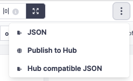
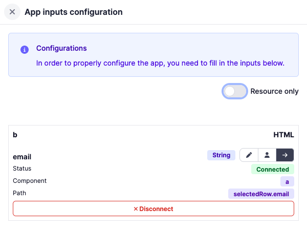
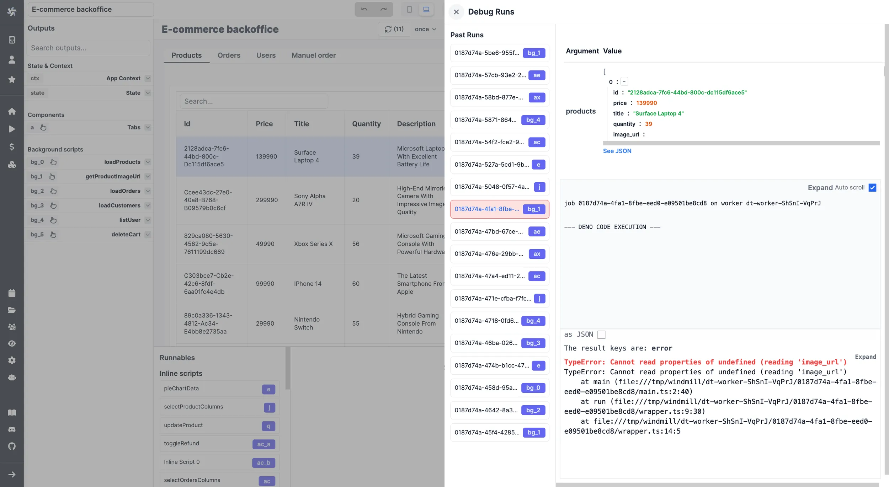
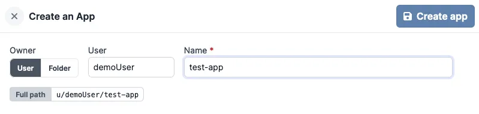
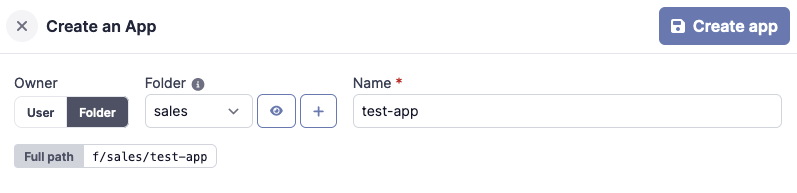
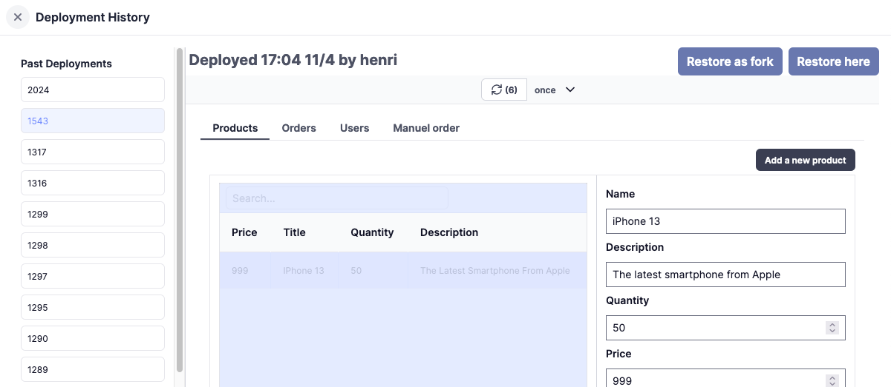
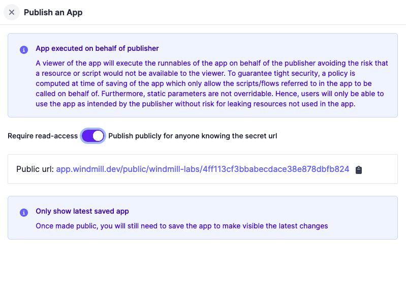

# Toolbar Guide

The app toolbar is located at the top of the app editor. It enables you to adjust app settings, toggle between desktop/mobile preview, and debug runs.

## App Summary

The app summary can be modified on the left side of the toolbar. It serves to describe the app and is displayed in the app list. By default, the summary is the app's name.

## Undo/Redo

The undo/redo buttons facilitate undoing or redoing the most recent action.

## Preview Mode

The app editor mode can be toggled between `Editor` and `Preview` modes. The preview mode allows you to see the app in action.

## Desktop/Mobile Mode

You can switch the canvas mode to `Mobile` or `Desktop` layout from the toolbar. This enables you to manually set the position and size of the components in both modes.

## Menu `⋮`

The `⋮` menu provides access to the following options:

- JSON: View the JSON representation of the app.
- Publish to Hub: Publish the app to the Windmill Hub.
- Hub Compatible JSON: View the JSON representation of the app in a format that is compatible with the [Windmill Hub](https://hub.windmill.dev/).

## App Inputs Configuration

The app inputs menu displays a list of all the inputs of each component. A toggle allows you to display only resources inputs, enabling you to easily configure your third-party resources for an app imported from the Hub, for example:

## Debug Runs

The app builder enables you to examine recent runs to identify potential bugs.

## Save as draft

You can [save](../core_concepts/0_draft_and_deploy/index.mdx) the app. The first time you save the app, you'll be asked to select the owner of the app. You can choose either a user or a [folder](../core_concepts/8_groups_and_folders/index.mdx#folders).

### Owner: User

### Owner: Folder

Read and write permissions are granted to groups and users at the folder level and are shared by all items inside the folder.

## Deployement history

In the menu, you can view the deployment history of the app. It displays the date and time of the deployment, the user who deployed the app, and the version of the app.

You can:

- View the app at a specific version.
- Restore a fork
- Restore here

## Deploy

You can [deploy](../core_concepts/0_draft_and_deploy/index.mdx#deployed-version) the app as a standalone app via a URL. There are two ways to publish an app:

- Read-Access Required: The app can be accessed by anyone who has read access to the app.
- Publish Publicly: The app can be accessed by anyone who knows the secret URL. If set to `Publish Publicly`, the secret URL will be displayed here.

