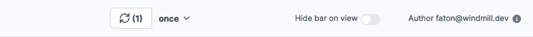

import DocCard from '@site/src/components/DocCard';

# Canvas

The app canvas is the main area of the app editor. It displays the app components and allows you to configure them.
You can move and resize components and lock them to prevent them from being moved or resized by another component.

<video
	className="border-2 rounded-lg object-cover w-full h-full dark:border-gray-800"
	autoPlay
	loop
	controls
	id="main-video"
	src="/videos/dnd.mp4"
/>

 

The apps are defined by two layouts: `Mobile` and `Desktop`. The layout can be toggled from the toolbar. Layouts are independent and can be configured separately.

## Header

The header has the following elements:

- **Reload Button**: a reload button to manually reload the runnables that are triggerd on app load or refresh. It excludes the runnables that are triggered by click events for example.
- **Schedule Button**: a schedule button to schedule the app to reload periodically.
- **Hide bar on view**: When enabled, the app bar will be hidden when the app is viewed.
- **Author**: The scripts will be run on behalf of the author and a tight policy ensure security about the possible inputs of the runnables.

## Canvas

### Component selection

[Components](./4_app_configuration_settings/1_app_component_library.mdx) can be selected by clicking on them. The selected component will be highlighted with a indigo border.
When hovering a component, a blue border will be displayed around the component.

You can also select multiple components by clicking on the `Shift` key and clicking on the components you want to select.

<video
	className="border-2 rounded-lg object-cover w-full h-full"
	autoPlay
	controls
	id="app-component-selection"
	src="/videos/app-component-selection.mp4"
/>

### Positioning

Components can be positioned by dragging and dropping them on the canvas. You can also move components by clicking on the move handler on the top-right corner of the component.

<video
	className="border-2 rounded-lg object-cover w-full h-full"
	autoPlay
	controls
	id="component-moving"
	src="/videos/component-moving.mp4"
/>

### Resizing

Components can be resized by dragging the resize handler on the top-right corner of the component.

### Lock the position of a component

<video
	className="border-2 rounded-lg object-cover w-full h-full"
	autoPlay
	controls
	id="app-lock"
	src="/videos/app-lock.mp4"
/>

 

A locked component can't be moved or resized by another component. It can still be moved or resized by the user.

You can lock a component by clicking on the lock button on the top-right corner of the component.

:::tip
Moving a component will move all unlocked components on its way.
:::

### Expand a component

Components can be expanded by clicking on the expand button on the top-right corner of the component. It will try to expand the component to take as much width as possible and at most 12 columns of height, taking into account the other components on the canvas.

<video
	className="border-2 rounded-lg object-cover w-full h-full"
	autoPlay
	controls
	id="component-expand"
	src="/videos/component-expand.mp4"
/>

### Nesting components

Some components can be nested inside other components. For example, a `Button` component can be nested inside a `Container` component.

### Shortcuts

| Shortcut      | Description                                                                                                                                                                                                                                 |
| ------------- | ------------------------------------------------------------------------------------------------------------------------------------------------------------------------------------------------------------------------------------------- |
| `Ctrl + C`    | Copy selected components                                                                                                                                                                                                                    |
| `Ctrl + V`    | Paste copied components                                                                                                                                                                                                                     |
| `Ctrl + X`    | Cut selected components                                                                                                                                                                                                                     |
| 'Arrow down'  | If no component is selected, select the first component of the canvas. If a container component is selected, select the first component inside the container.                                                                               |
| 'Arrow up'    | If the selected component is inside a container, select the parent. Otherwise, clear selection.                                                                                                                                             |
| 'Arrow left'  | Select the next available component from top to bottom and left to right. If the selected component has a parent with multiple subgrids and is the last one of the current subgrid, select the first component of the next subgrid.         |
| 'Arrow right' | Select the previous available component from bottom to top and right to left. If the selected component has a parent with multiple subgrids and is the first one of the current subgrid, select the last component of the previous subgrid. |

### Selected component actions

All component have the following actions:

- Expand
- Lock
- Move handle

### Special actions

Some components have special actions:

#### Text component

Edit text directly on the canvas. Either click on the `Pen` icon or double click on the text.

<video
	className="border-2 rounded-lg object-cover w-full h-full"
	autoPlay
	controls
	id="app-text-inline-editor"
	src="/videos/app-text-inline-editor.mp4"
/>

#### Conditional and invisible tabs components

Debug a tab by clicking on the arrow down button on the top-right corner of the component.

<video
	className="border-2 rounded-lg object-cover w-full h-full"
	autoPlay
	loop
	controls
	id="app-debug-tabs"
	src="/videos/app-debug-tabs.mp4"
/>

### Learn More

	<DocCard
		color="orange"
		title="Component Library"
		description="Discover all the components available in the library, and their configurations."
		href="/docs/apps/app_configuration_settings/app_component_library"
	/>
	<DocCard
		color="orange"
		title="Styling"
		description="Give styling to your app & components."
		href="/docs/apps/app_configuration_settings/app_styling"
	/>
	<DocCard
		color="orange"
		title="Component Configuration"
		description="Learn how to configure a component."
		href="/docs/apps/app_configuration_settings/app_component_configuration"
	/>

