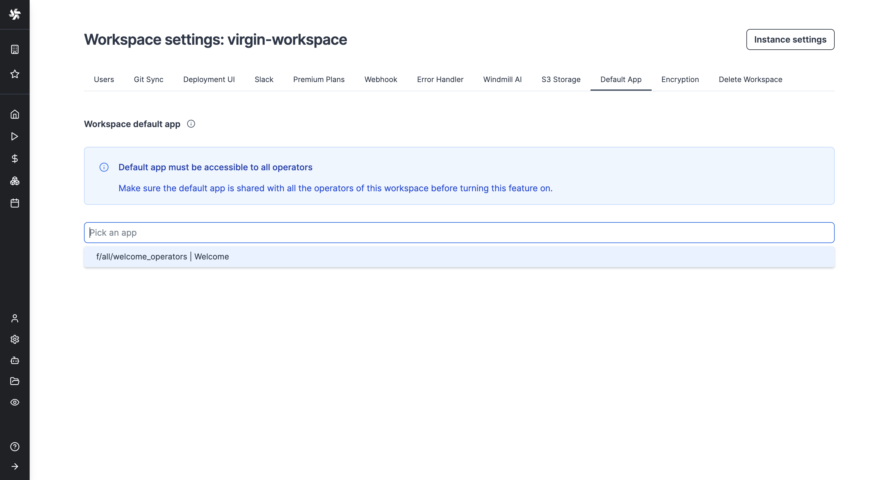

# Workspace default app

If configured, users who are [operators](../../core_concepts/16_roles_and_permissions/index.mdx) in this workspace will be redirected to this app automatically when logging into this workspace. Workspace default app is a [Cloud plan & Self-Hosted Enterprise](/pricing) feature.

Make sure the default app is [shared with all the operators](../../core_concepts/8_groups_and_folders/index.mdx) of this workspace before turning this feature on.

Set up the app from workspace settings:

Operators will have it open right when logging into the workspace:

<video
	className="border-2 rounded-lg object-cover w-full h-full dark:border-gray-800"
	controls
	src="/videos/default_app_operator.mp4"
/>