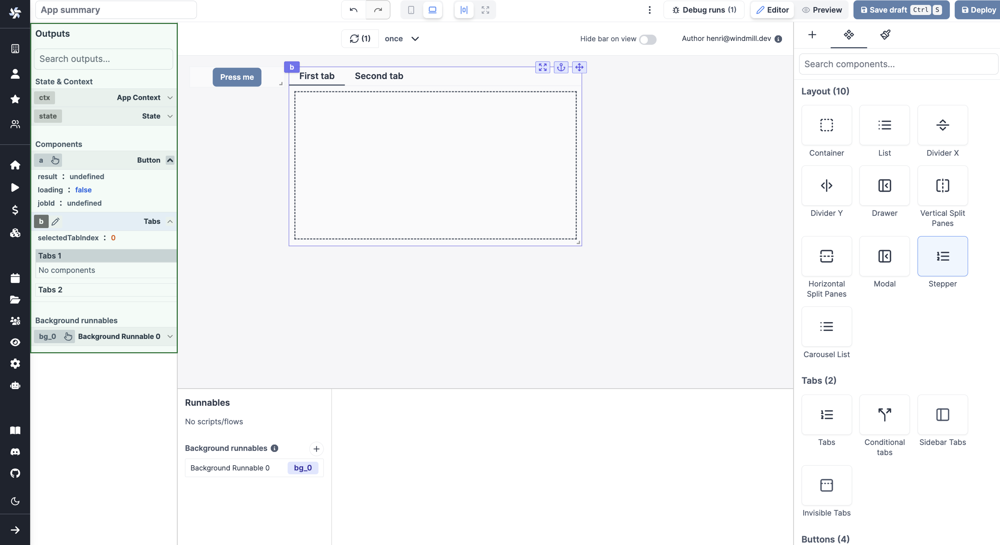

import DocCard from '@site/src/components/DocCard';

# Connecting Components

The strength of Windmill's app editor is the ability to connect everything together:

- components [can be linked to each other](#connecting-inputs--outputs)
- components can be directly [linked to scripts](../3_app-runnable-panel.mdx) and trigger them
- [background runnables](../3_app-runnable-panel.mdx#background-runnables) can be that are run in the background on app refresh on when an input changes
- [frontend scripts](../3_app-runnable-panel.mdx#evals) can be used to manipulate the client app state

<video
	className="border-2 rounded-xl object-cover w-full h-full"
	controls
	src="/videos/connecting_components.mp4"
	id="main-video"
/>

 

In Windmill's app editor:

- the [runnable editor](#runnable-editor) catalogs and configures all the scripts present in the application
- the [output panel](#outputs-panel) lists the outputs of all the components and scripts in your application
- the [component settings](#component-configuration) allows for managing the inputs of the components as well as linking them to scripts.

## Runnables & Outputs

In order to connect the components, it is best to be familiar with the concepts of [Runnable](#runnable-editor) and [Output](#outputs-panel).

### Runnable Editor

On the bottom of the app editor, you can find the Runnable Editor. It allows you to create, edit, or manage the scripts or flows linked to components (runnables) and background runnables.

The panel is structured as follows:

- **Runnable list**: A list of all the runnables. Click on a runnable to select it.
- **Runnable editor**: The editor of the selected runnable.

Each script can have [inputs from other components](../3_app-runnable-panel.mdx#configure-triggers). The script will return [outputs](#outputs-panel) that can be used in other components.

	<DocCard
		color="orange"
		title="Runnable Editor"
		description="Learn how to create and configure runnables."
		href="/docs/apps/app-runnable-panel"
	/>

### Outputs Panel

On the left panel of the editor, you can see the list of outputs of the app. These outputs represent the states & results of the app and are categorized into four types:

- **Context**: The context holds information such as the user email, username, workspace, query parameters, and more.
- **State**: The state holds the app's current state, which can be manipulated by the frontend scripts.
- **Component Outputs**: These outputs correspond to the outputs of the individual components.
- **Background Runnables**: These outputs represent the outputs of the background runnables.

You can perform the following actions with the outputs:

- Search for an output.
- Edit the output's ID.
- Select a component to view its outputs.
- [Connect an input to an output](../2_connecting_components/index.mdx).

	<DocCard
		color="orange"
		title="Outputs"
		description="The outputs represent the states & results of the app"
		href="/docs/apps/outputs"
	/>

### Component Configuration

Each component can be configured individually. This allows for adjusting its value, behavior (especially by linking a script) to the component, and styling.

	<DocCard
		color="orange"
		title="Component Configuration"
		description="Learn how to configure a component."
		href="/docs/apps/app_configuration_settings/app_component_configuration"
	/>

## Connecting Inputs & Outputs

Inputs (from scripts or components) can be connected to any outputs. When connecting, you can click on the output to connect the input to it. The data source will change to [eval](../3_app-runnable-panel.mdx#evals).

Note that you can select nested outputs, objects and arrays.

<video
	className="border-2 rounded-xl object-cover w-full h-full dark:border-gray-800"
	controls
	src="/videos/app-connections.mp4"
	alt="Connecting inputs"
/>

 

Here are the steps to connect an input to an output:

- Click on the component input you want to connect to an output.
- Click on the plug icon to open the connection menu, then:
  - either click on the red plug directly next to the component, and pick the output
  - or pick the component directly from the output menu on the left.
- The input is now connected to the output through an eval.

Alternatively, refer to the component directly through an [eval](../3_app-runnable-panel.mdx#evals), e.g. `a.result`.

