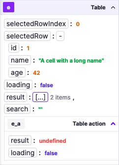
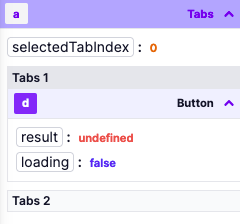

# Outputs guide

On the left-hand side of the app editor, you can find the app outputs. They are three kind of outputs:

- Context and state
- Component outputs
- Background runnables outputs

When a component or a background runnable is selected, the outputs of the component or the background runnable are displayed.
You can manually open an output by clicking on the header of the output. Once manually opened, the output will stay open until you close it.

You can search for an output by typing in the search bar. It searches in the output name and in the output object keys, recursively.

### App context

The app context contains the following outputs:

- email: the email of the current user
- username: the username of the current user
- query: the query parameters of the URL
- hash: the hash parameters of the URL

### State

The app state is a client-side store that can be used to store data. The app state can be manipulated by frontend scripts.

### Component outputs

Each component has its own outputs. The outputs are displayed in a tree structure. The tree structure is collapsible and can be expanded by clicking on the `{...}` button. Next to the button, you can see the number of outputs.

For example, the `Table` component has the following outputs:

- selectedRow: the selected row as an object
- loading: the loading state of the table
- result: the result of the table
- search: the search value of the table
- selectedRowIndex: the selected row index

The outputs are used to quickly visualize the current state of the app.

### Containers

Some components are "containers" and can contain other components. They are 4 types of containers:

- Containers: Plain container that can contain other components
- Tabs: Tabs that can contain other components
- Horizontal split: Horizontal split that can contain other components
- Vertical split: Vertical split that can contain other components

The components contained in a container have their outputs displayed in the container outputs.

### Background runnables outputs

A background runnable is a script or flow that runs in the background and can be used to perform actions that are not related to the UI.

### Connecting inputs

Inputs can be connected to any outputs. When connecting, you can click on the output to connect the input to the output. Note that you can select nested outputs, objects and arrays.

<video
    className="border-2 rounded-xl object-cover w-full h-full"
    autoPlay
    loop
    controls
    id="main-video"
    src="/videos/app-connections.mp4"
/>

Here are the steps to connect an input to an output:

- Click on the component input you want to connect to an output
- Click the right arrow to open the connection menu
  - You can now navigate you app, without running any scripts
  - When you hover a component, the corresponding outputs are highlighted in orange
  - If you click on a component, the output will be pinned and stays open
- You can now click on the output you want to connect to the input
- The input is now connected to the output

### Editing the id of a component

You can edit the id of a component by clicking on the id. Component id can only contain letters and numbers.

<video
    className="border-2 rounded-xl object-cover w-full h-full"
    autoPlay
    loop
    controls
    id="main-video"
    src="/videos/app-edit-id.mp4"
/>
