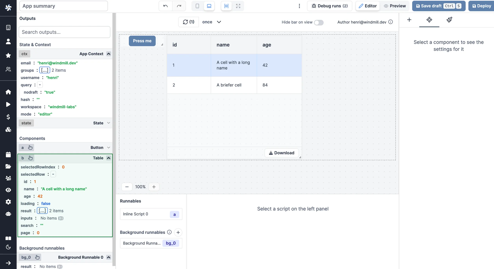

import DocCard from '@site/src/components/DocCard';

# Outputs Guide

The outputs represent the states & results of the app.

All outputs can be found on the left-hand side of the app editor. There are three kind of outputs:

- Context and state
- Component outputs
- Background runnables outputs


When a component or a background runnable is selected, the outputs of the component or the background runnable are displayed.
You can manually open an output by clicking on the header of the output. Once manually opened, the output will stay open until you close it.

You can search for an output by typing in the search bar. It searches in the output name and in the output object keys, recursively.


## Context and State

### App Context

The app context contains the following outputs:

- `email`: the email of the current user.
- `username`: the username of the current user.
- `query`: the query parameters of the URL.
- `hash`: the hash parameters of the URL.

### State

The app state is a client-side store that can be used to store data. The app state can be manipulated by frontend scripts.

## Component Outputs

Each component has its own outputs. The outputs are displayed in a tree structure. The tree structure is collapsible and can be expanded by clicking on the `{...}` button. Next to the button, you can see the number of outputs.


For example, the [Table component](./4_app_configuration_settings/table.mdx) has the following outputs:

- selectedRow: the selected row as an object
- loading: the loading state of the table
- result: the result of the table
- search: the search value of the table
- selectedRowIndex: the selected row index



The outputs are used to quickly visualize the current state of the app.

## Containers

Some components are "containers" and can contain other components.

The components contained in a container have their outputs displayed in the container outputs.


<div className="grid grid-cols-2 gap-6 mb-4">
	<DocCard
		title="Layout (Containers)"
		description="Containers can group other components."
		href="/docs/apps/app_configuration_settings/app_component_library#layout"
		color="orange"
	/>
</div>

## Background Runnables Outputs

A [background runnable](./3_app-runnable-panel.mdx#background-runnables) is a script or flow that runs in the background and can be used to perform actions that are not related to the UI.

## Connecting Inputs

Inputs can be connected to any outputs. When connecting, you can click on the output to connect the input to it. The data source will change to [eval](./3_app-runnable-panel.mdx#evals). Note that you can select nested outputs, objects and arrays.

<video
	className="border-2 rounded-lg object-cover w-full h-full dark:border-gray-800"
	controls
	src="/videos/app-connections.mp4"
	alt="Connecting inputs"
/>

<br />

Here are the steps to connect an input to an output:

- Click on the component input you want to connect to an output.
- Click on the plug icon to open the connection menu, then:
  - either click on the red plug directly next to the component, and pick the output
  - or pick the component directly from the output menu on the left.
- The input is now connected to the output through an eval.

Alternatively, refer to the component directly through an [eval](./3_app-runnable-panel.mdx#evals), e.g. `a.result`.


### Forcing the Value of a Component

You can use a [frontend script helper](./3_app-runnable-panel.mdx#frontend-scripts-helpers): [setValue](./3_app-runnable-panel.mdx#setvalue) that is meant to manually set or force the value of a component. This can be convenient in cases where connecting components is not the easiest pattern.

```js
setValue(id: string, value: any)
```

Note that it's a bad idea to mix dynamic default value and setValue together.

### Connecting Runnables Inputs to Resources

Apps are [executed on behalf of publishers](./3_app-runnable-panel.mdx#policy) and by default cannot access viewer's [resources](../core_concepts/3_resources_and_types/index.mdx).

If the resource passed here as a reference does not come from a static [Resource Select](./4_app_configuration_settings/resource_select.mdx) component (which will be whitelisted by the auto-generated policy), you need to toggle "Resources from users allowed".

The toggle "Static resource select only / Resources from users allowed" can be found for each runnable input when the [source](./2_connecting_components/index.mdx) is an [eval](#evals).


## Editing the id of a Component

You can edit the id of a component by clicking on the id. Component id can only contain letters and numbers.

<video
	className="border-2 rounded-lg object-cover w-full h-full dark:border-gray-800"
	controls
	src="/videos/app-edit-id.mp4"
/>