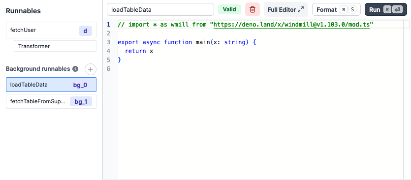
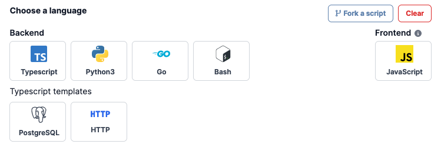

# Runnable Guide

## Overview

On the bottom of the app editor, you can find the runnable editor. It allows you to create, edit, or manage the scripts or flows linked to components (runnables) and background runnables.



The panel is structured as follows:

- **Runnable list**: A list of all the runnables. Click on a runnable to select it.
- **Runnable editor**: The editor of the selected runnable.

When a runnable is selected, the runnable editor is displayed. It is composed of:

- **Header**: The header of the runnable editor. It contains:

  - An editable name
  - The status of the runnable can either be valid, invalid depending on the LSP response.
  - A delete button
  - A format button: Formats the code of the runnable. It's also triggered when you save the runnable.
  - A run button: Runs the runnable.

- **Runnable editor**: The code editor of the runnable.

:::tip Auto-complete code with AI

Note that you can have [AI suggest code on Windmill](../misc/11_code_autocompletion/index.md):

<br />

<video
	className="border-2 rounded-xl object-cover w-full h-full"
	controls
	id="main-video"
	src="/videos/codeium_example.mp4"
/>

:::

## Types of runnables

There are 4 types of runnables:

- Inline scripts: Scripts that are defined on the app editor, linked to a component.
- Workspace/Hub: Runnables (scripts; flows) linked to a component, but defined in the workspace or the Hub.
- Background runnables: Runnables that are not linked to a component, but run in the background.
- Frontend scripts: Scripts that can be used to manipulate the client app state. They can either be linked to a component or be a background runnable. If they are a background runnable, they are not executed unless manually set to run when the app starts or reloads.

They provide interactivity to your app.

## Inline scripts

Inline scripts are scripts that are defined on the app editor.
They can be either attached to a component or detached.

## Background runnables

Background runnables are scripts that are executed in the background. They are not attached to any component.

## Creating a runnable

There are several ways to create runnables:

- Create an inline script and attach it to a component.
- Select a script or a flow from the list of detached inline scripts, workspace scripts and flows, or Hub scripts.
- Create a background runnable.

When you create an inline script attached to a component or a background script, the first thing you need to do is to choose the language of the script.



There are two kinds of scripts:

#### Backend scripts

Backend scripts are executed on the server and support the following languages:

- Typescript
- Python3
- Go
- Bash

In addition, we also provide Typescript templates for common use cases:

- **PostgreSQL**: A script that connects to a PostgreSQL database and executes a query.
- **HTTP**: A script that makes an HTTP request.

#### Frontend scripts

Frontend scripts are scripts that are executed on the browser.

## Frontend scripts helpers

We expose a few functions and global objects to help you interact with the app from a frontend script.

### Context

You can access the context object with the `ctx` global variable.

```js
console.log(ctx.email);
```

### State

The app state is a client-side store that can be used to store data.

You can access the state object with the `state` global variable.

```js
console.log(state);
```

You can update the state directly by manipulating the `state` object.

```js
state.foo = 'bar';
```

### goto

Use the `goto` function to navigate to a specific URL.

#### Syntax

```js
goto(path: string, newTab?: boolean)
```

#### Parameters

`path`
The URL to navigate to.

`newTab` (optional)
Whether to open the URL in a new tab or not.

#### Example

```js
goto('/apps/1');
goto('https://www.windmill.dev/', true);
```

### setTab

Use the `setTab` function to manually set the tab of a Tab component.

#### Syntax

```js
setTab(id: string, index: string)
```

#### Parameters

`id` string
The tab to set.

`index` string
The index of the tab to set.

#### Example

```js
setTab('a', '1');
```

### recompute

Use the `recompute` function to recompute a component.

#### Syntax

```js
recompute(id: string)
```

#### Parameters

`id` string
The id of the component to recompute.

#### Example

```js
recompute('a');
```

### getAgGrid

Use the `getAgGrid` function to get the ag-grid instance of a table.

#### Syntax

```js
getAgGrid(id: string)
```

#### Parameters

`id` string

## Recompute

Other component can trigger a component to recompute. For example, a button can trigger a table to recompute. When the button is clicked, the table is reloaded. See Recompute Others for more information.

## Recompute others

Button and Form components can trigger other components to recompute. For example, a button can trigger a table to recompute. When the button is clicked, the table is reloaded.

## Policy

A viewer of the app will execute the runnables of the app on behalf of the publisher avoiding the risk that a resource or script would not be available to the viewer. To guarantee tight security, a policy is computed at time of saving of the app which only allow the scripts/flows referred to in the app to be called on behalf of. Furthermore, static parameters are not overridable. Hence, users will only be able to use the app as intended by the publisher without risk for leaking resources not used in the app.
