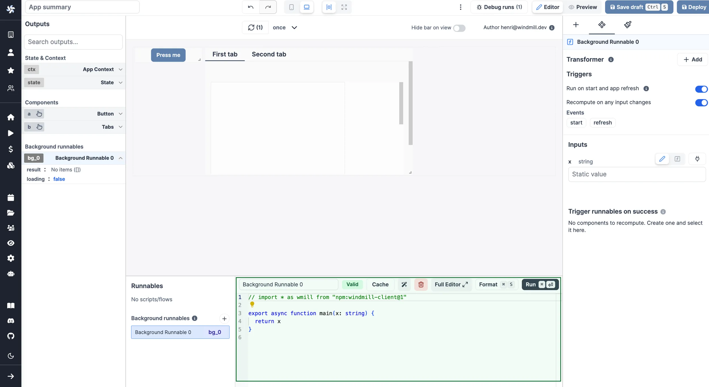
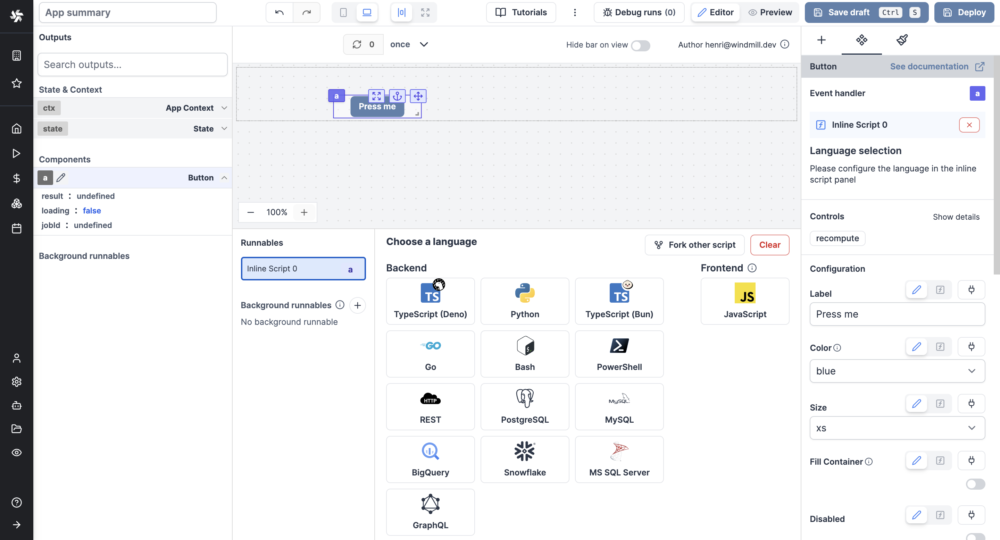
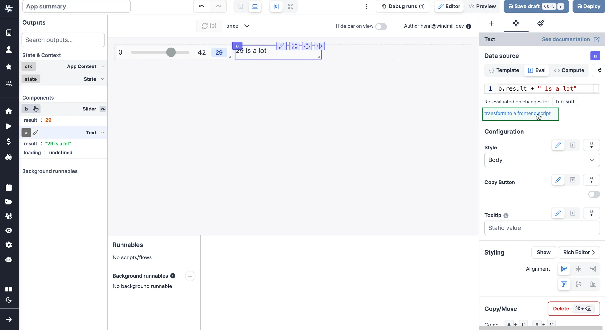
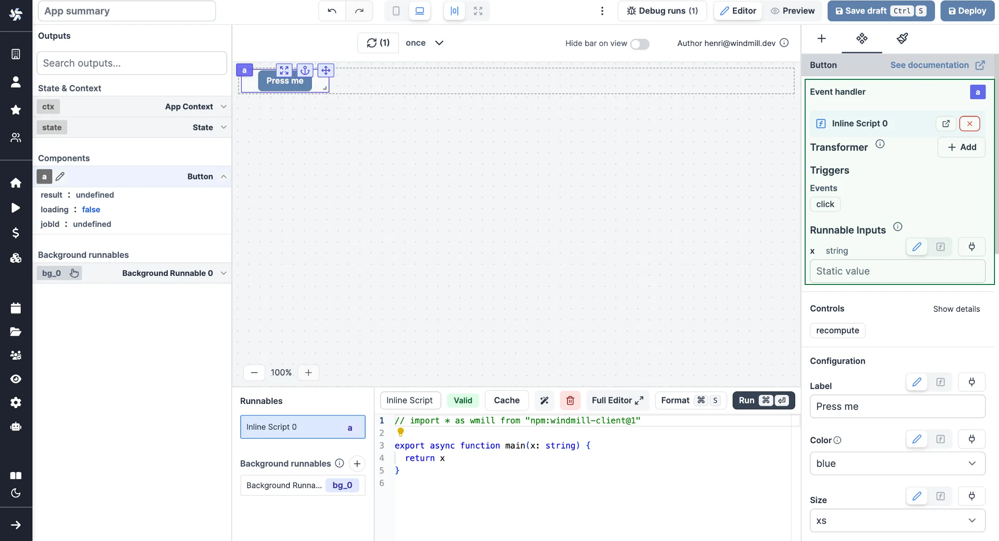

import DocCard from '@site/src/components/DocCard';

# Runnable Editor

The strength of Windmill's app editor is the ability to connect everything together:

- components [can be linked to each other](./2_connecting_components/index.mdx)
- components can be directly [linked to scripts](#inline-scripts) and trigger them
- [background runnables](#background-runnables) can be that are run in the background on app refresh on when an input changes
- [evals](#evals) can be used to manipulate the client app state

On the bottom of the app editor, you can find the runnable editor. The runnable editor is a [code editor](../code_editor/index.mdx) that allows to create, edit, or manage the scripts or flows linked to components (runnables) and background runnables.



The panel is structured as follows:

- **Runnable list**: A list of all the runnables. Click on a runnable to select it.
- **Runnable editor**: The editor of the selected runnable.

When a runnable is selected, the runnable editor is displayed. It is composed of:

- **Header**: The header of the runnable editor. It contains:

  - An editable name.
  - The status of the runnable can either be valid, invalid depending on the LSP response.
  - A delete button.
  - A format button: Formats the code of the runnable. It's also triggered when you save the runnable.
  - A run button: Runs the runnable.

- **Runnable editor**: The code editor of the runnable.

<div className="grid grid-cols-2 gap-6 mb-4">
	<DocCard
		title="Code Editor"
		description="The code editor is Windmill's integrated development environment."
		href="/docs/code_editor"
		color="orange"
	/>
</div>

## Types of runnables

There are 5 types of runnables:

- **Inline scripts**: Scripts that are defined on the app editor, linked to a component.
- **Workspace/Hub**: Runnables (scripts; flows) linked to a component, but defined in the workspace or the [Hub](https://hub.windmill.dev/).
- **Background runnables**: Runnables that are not linked to a component, but run in the background.
- **Frontend scripts**: Scripts that can be used to manipulate the client app state. They can either be linked to a component or be a background runnable. If they are a background runnable, they are not executed unless manually set to run when the app starts or reloads.
- **Evals**: Evals are used to connect data sources to other components or parameters. They are only evaluated on changes to the outputs that have been identified.

They provide interactivity to your app.



### Inline scripts

Inline scripts are scripts that are defined on the app editor.
They can be either attached to a component or detached.

### Frontend scripts

Frontend scripts are JavaScripts that are executed on the browser.

They come with [frontend script helpers](#frontend-scripts-helpers) that are functions and global objects to help you interact with the app.

Frontend scripts can read outputs and ctx of the rest of the app with for example:

```js
// read outputs and ctx
console.log(ctx.email)

// access a global state store
if (!state.foo) { state.foo = 0 }
state.foo += 1

// for reactivity to work, you need to assign a value and not modify it in place
// e.g: state.foo.push(1) will not work but 'state.foo = [...state.foo, 1]' will.
// you may also just reassign as next statement 'state.foo = state.foo'

// you can also navigate (goto), recompute a script (recompute), or set a tab (setTab)
// Inputs and display components support settings their value directly
setValue('a', "Bar") 

// Tables support setting their selected index (setSelectedIndex)

return state.foo
```

### Background runnables

Background runnables are scripts that are executed in the background. They are executed on the server.
They can be triggered on app refresh or when their input changes. They are not attached to any component but their result can be shared among many components.

See Background runnables configurations at [Runnable Execution](#runnable-execution).

### Evals

Evals are used to [connect data sources](./2_connecting_components/index.mdx) to other components or parameters.

<video
	className="border-2 rounded-xl object-cover w-full h-full dark:border-gray-800"
	autoPlay
	loop
	controls
	src="/videos/app-connections.mp4"
/>
<br />

Windmill parses your eval and frontend scripts using the swc parser compiled to wasm to extract any references to outputs.
It allows Windmill to suggest dependencies for frontend scripts.

<video
	className="border-2 rounded-xl object-cover w-full h-full dark:border-gray-800"
	controls
	src="/videos/eval_1.mp4"
/>

<br />

Evals are only evaluated on changes to the outputs that have been identified.

Clicking on the dedicated link, evals can be "transformed to a frontend script".



## Creating a Runnable

There are several ways to create runnables:

- Create an inline script and attach it to a component.
- Select a script or a flow from the list of detached inline scripts, workspace scripts and flows, or Hub scripts.
- Create a background runnable.

When you create an inline script attached to a component or a background script, the first thing you need to do is to choose the language of the script.


The outputs of your script [can be used](./2_connecting_components/index.mdx) by other scripts or components:

<video
	className="border-2 rounded-xl object-cover w-full h-full"
	controls
	src="/videos/connecting_components.mp4"
/>

<br />

<div className="grid grid-cols-2 gap-6 mb-4">
	<DocCard
		color="orange"
		title="Connecting Components"
		description="The strength of Windmill's app editor is the ability to connect everything together."
		href="/docs/apps/connecting_components"
	/>
</div>

## Runnable Configuration

The runnable configuration consists of:

- Hide refresh button: Some components have a refresh button. This can be hidden by checking this box.
- Transformer: A transformer is a function that alters the output of the runnable, often used to format the output.
- List of triggers: Configure whether the script runs on app start, app refresh, or whenever an input changes.
- Runnable Inputs: The runnable inputs are [inferred from the inputs](../core_concepts/13_json_schema_and_parsing/index.md) of the flow or script parameters this component is attached to.



### Transformer

A transformer is an optional frontend script executed immediately after the component's script. It's used to perform lightweight transformations in the browser. It accepts the previous computation's result as `result`.

For instance, if component has a script that returns:

```js
{
	data: {
		name: 'John',
		age: 20
	}
}
```

A transformer could be used to extract the data object:

```js
return result.data;
```

Here is an example of a transformer used with a [background script](#background-runnables) to automatically [download a file](./11_download_files.md) upon input change (here the selected row of a [table](./4_app_configuration_settings/table.mdx)).

<video
	className="border-2 rounded-xl object-cover w-full h-full dark:border-gray-800"
	controls
	src="/videos/transformer_background.mp4"
	alt="Transformer background script"
/>

## Runnable Execution

A component can have runnables attached to it. Depending on the component type, the runnables are executed at different times:

- **Data source**: The runnable's result is used as the component's data source. It executes on app start and app refresh. For instance, if the component is a table, the runnable's result is used as the table's data source.
- **Event handler**: The runnable executes when the event is triggered. For instance, if the component is a button, the runnable executes when the button is clicked.
- **Validations**: Only the `Stepper` component has validations. The runnable executes when the step of the stepper changes.

### Configure Triggers

#### Run on Start and App Refresh

Two types of runnables can be configured to run on app start and app refresh:

- **Background runnables**: Runnables that are run in the background and aren't attached to a component.
- **Component runnables used as data sources**: Runnables attached to a component and used as the component's data source.

### Recompute on Any Input Change

Runnables can be configured to recompute whenever an input changes. This is useful for recomputing a component's runnable when an input changes.

Two types of runnables can be configured to recompute on any input change:

- **Backend background runnables**: Background runnable that are executed on the server.
- **Component runnables used as data sources**: Runnables attached to a component and used as the component's data source.

Inputs of runnables that are either connected to an output or [evaluated](#evals) can trigger a recompute. These are displayed in the `Change on value` section.

Runnables can "Recompute" and "Recompute others":

#### Recompute

Other component can trigger a component to recompute. For example, a button can trigger a table to recompute. When the button is clicked, the table is reloaded. See Recompute Others for more information.

#### Recompute others

[Button](./4_app_configuration_settings/button.mdx) & [Form](./4_app_configuration_settings/submit_form.mdx) components and [background scripts](#background-runnables) can trigger other components to recompute. For example, a button can trigger a table to recompute. When the button is clicked, the table is reloaded.

### Manual Dependencies

Frontend scripts don't have any inputs. However, you can manually specify a frontend script's dependencies. This is useful when you want to recompute a frontend script when an input changes.

Manual dependencies are found in the `Change on value` section and can be removed by clicking on the `x` button.

## Cache app inline scripts

Caching an app inline script means caching the results of that script for a certain duration. If the script is triggered with the same inputs during the given duration, it will return the cached result.

<video
	className="border-2 rounded-xl object-cover w-full h-full"
	controls
	src="/videos/caching_app.mp4"
/>

<br />

You can enable caching for an app inline script directly its editor settings. Here's how you can do it:

1. **Settings**: From the Code Editor, go to the top bar and pick the `Cache` tab.
2. **Enable Caching**: To enable caching, toggle on "Cache the results for each possible inputs" and specify the desired duration for caching results (in seconds.)

In the above example, the result of step the script will be cached for 5 minutes. If `Inline Script 0` is re-triggered with the same input within this period, Windmill will immediately return the cached result.

<div className="grid grid-cols-2 gap-6 mb-4">
	<DocCard
		color="orange"
		title="Caching"
		description="Caching is used to cache the results of a script, flow, flow step or app inline scripts for a specified number of seconds."
		href="/docs/core_concepts/caching"
	/>
</div>

## Frontend scripts helpers

We expose a few functions and global objects to help you interact with the app from a [frontend script](#frontend-scripts).

### ctx

You can access the context object with the `ctx` global variable.

```js
console.log(ctx.email);
```

Context objects can be seen on the [Output menu](./2_outputs.mdx).

### state

The app state is a client-side store that can be used to store data.

You can access the state object with the `state` global variable.

```js
console.log(state);
```

You can update the state directly by manipulating the `state` object.

```js
state.foo = 'bar';
```

### goto

Use the `goto` function to navigate to a specific URL.

Syntax:

```js
goto(path: string, newTab?: boolean)
```

Parameters:

`path`
The URL to navigate to.

`newTab` (optional)
Whether to open the URL in a new tab or not.

Example:

```js
goto('/apps/1');
goto('https://www.windmill.dev/', true);
```

### setTab

Use the `setTab` function to manually set the tab of a Tab component.

This works for all components that have multiple tabs ([Tabs](./4_app_configuration_settings/tabs.mdx), [Conditional tabs](./4_app_configuration_settings/conditional_tabs.mdx), [Sidebar Tabs](./4_app_configuration_settings/sidebar_tabs.mdx), [Invisible Tabs](./4_app_configuration_settings/invisible_tabs.mdx), [Stepper](./4_app_configuration_settings/stepper.mdx), [Decision Tree](./4_app_configuration_settings/stepper.mdx)).

Syntax:

```js
setTab(id: string, index: string)
```

Parameters:

`id` string: The id of the component.

`index` string: The index of the tab to set.

Example:

```js
setTab('a', 1);
```

Where 'a' is the id of the component and 1 is the index of the tab to set.

<video
	className="border-2 rounded-xl object-cover w-full h-full dark:border-gray-800"
	controls
	src="/videos/setTab.mp4"
/>
<br />

### open

Use the `open` function to open a modal or drawer.

Syntax:

```js
open(id: string)
```

Parameters:

`id` string
The id of the modal or drawer component to open.

Example:

```js
open('a');
```

### close

Use the `close` function to close a modal.

Syntax:

```js
close(id: string)
```

Parameters:

`id` string
The id of the modal or drawer component to close.

Example:

```js
close('a');
```

### recompute

Use the `recompute` function to recompute a component.

Syntax:

```js
recompute(id: string)
```

Parameters:

`id` string
The id of the component to recompute.

Example:

```js
recompute('a');
```

### getAgGrid

Use the `getAgGrid` function to get the ag-grid instance of a table.

Syntax:

```js
getAgGrid(id: string)
```

### setSelectedIndex

Use the `setSelectedIndex` function to select a row in a table or an AG Grid table.

Syntax:

```js
setSelectedIndex(id: string, index: number)
```

### setValue

The `setValue` function is meant to manually set or force the value of a component. This can be convenient in cases where [connecting components](./2_connecting_components/index.mdx) is not the easiest pattern.

```js
setValue(id: string, value: any)
```

Note that it's a bad idea to mix dynamic default value and setValue together.

### validate

Make a specific field of a form in a Validate state.

```js
validate(id: string, key: string)
```

### validateAll

Make all fields of a form in a Validate state.

```js
validateAll(id: string, key: string)
```

### invalidate

Invalidate a specific field of a form.

```js
invalidate(id: string, key: string, error: string)
```

Parameters:

`id` string

### recompute

Recompute a component.

```js
recompute(id: string)
```

Parameters:

`id` string

### clearFiles

Clear the files of a file input.

```js
clearFiles(id: string)
```

Parameters:

`id` string

### showToast

Sends a toast notification.

```js
recompute(message: string, error: boolean)
```

Parameters:

`message` string
`error` boolean

## Policy

A viewer of the app will execute the runnables of the app on behalf of the publisher avoiding the risk that a resource or script would not be available to the viewer. To guarantee tight security, a policy is computed at time of saving of the app which only allow the scripts/flows referred to in the app to be called on behalf of. Furthermore, static parameters are not overridable. Hence, users will only be able to use the app as intended by the publisher without risk for leaking resources not used in the app.

<div className="grid grid-cols-2 gap-6 mb-4">
	<DocCard
		title="Roles and Permissions"
		description="Control access and manage permissions within your instance and workspaces."
		href="/docs/core_concepts/roles_and_permissions"
		color="orange"
	/>
</div>
