# Component library

The app component library is located on the right-hand side of the app editor. It displays the app components and allows you to configure them.

## Component properties

Component can be configured in three ways:

- **Inputs**: inputs can be connected to an output or computed using a runnable.
  - e.g. `Table` component has an input that can be connected to an output or computed using a runnable, which is an array of objects.
   

- **Configuration**: property such as the button label, the text input placeholder, etc.
  - e.g. `Table` component has a configuration property that allows you to configure the search bar: Client-side search, Server-side search, or no search.

## Component outputs

- **Runnable**: some component can trigger a runnable when an event occurs, usually when a user interacts with the component. The result of the runnable is stored in the component output in the key `result`. It also stores the `loading` state of the component.
  - e.g. `Button` component can trigger a runnable when clicked.
 

- **Own outputs**: some component have outputs defined by the component.
  - e.g. `Table` component has a selectedRow output

## Inserting components

Click on a component in the component library to insert it in the app canvas. It will be automatically positioned.

## Component list

Windmill provides a set of components that can be used to build apps. Here is the list of the available components (constantly growing according to our users' expectations):

- Button
- Form
- Form Modal
- Text Input
- Password Input
- Number Input
- Slider
- Range
- Date Input
- Toggle
- Select
- HTML
- Vega Lite
- Plotly
- Text
- Table
- Pie Chart
- Bar/Line Chart
- Scatter Chart
- Timeseries
- Result

Below you will find details about each component.

### Button API

The component triggers a runnable when clicked. If the runnable has parameters, they need to be configured in the component configuration.
The runnable parameters are defined:

- **Static**: the parameter is defined in the component configuration.
- **Connected**: the parameter is connected to an output.

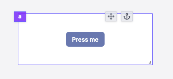

#### Button configuration

| Name           |                Type                 | Connectable | Templatable | Default  | Description                                   |
| -------------- | :---------------------------------: | :---------: | :---------: | :------: | --------------------------------------------- |
| label          |               string                |    true     |    false    | Press me | The button label.                             |
| color          | blue, red, dark, light, green, gray |    false    |    false    |   blue   | The button color.                             |
| size           |         xs, sm, md , lg, xl         |    false    |    false    |    sm    | The button size.                              |
| Fill container |               boolean               |    false    |    false    |  false   | Whether the button should fill the container. |
| disabled       |               boolean               |    false    |    false    |  false   | Whether the button should be disabled.        |

#### Outputs

| Name    |  Type   | Description                      |
| ------- | :-----: | -------------------------------- |
| result  |   any   | The result of the runnable.      |
| loading | boolean | The loading state of the button. |

### Form API

The form component allows you to create a form. It has a submit button that triggers a runnable when clicked.
The runnable parameters are defined:

- **Static**: the parameter is defined in the component configuration.
- **User input**: the parameter is defined by the user input.
- **Connected**: the parameter is connected to an output.

Only user inputs are displayed in the form.

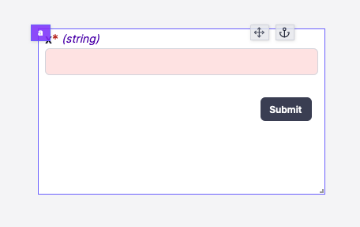

#### Form configuration

| Name  |                Type                 | Connectable | Templatable | Default | Description       |
| ----- | :---------------------------------: | :---------: | :---------: | :-----: | ----------------- |
| label |               string                |    true     |    false    | Submit  | The button label. |
| color | blue, red, dark, light, green, gray |    false    |    false    |  dark   | The button color. |
| size  |         xs, sm, md , lg, xl         |    false    |    false    |   sm    | The button size.  |

#### Outputs

| Name    |  Type   | Description                      |
| ------- | :-----: | -------------------------------- |
| result  |   any   | The result of the runnable.      |
| loading | boolean | The loading state of the button. |

### Form Modal API

The form modal component allows you to create a form. It has a submit button that triggers a runnable when clicked. The form is displayed in a modal, which can be opened by clicking on a button.

The runnable parameters are defined:

- **Static**: the parameter is defined in the component configuration.
- **User input**: the parameter is defined by the user input.
- **Connected**: the parameter is connected to an output.

Only user inputs are displayed in the form in the modal.

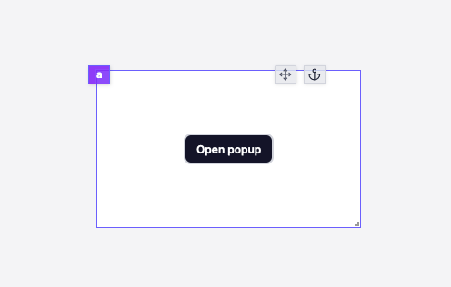
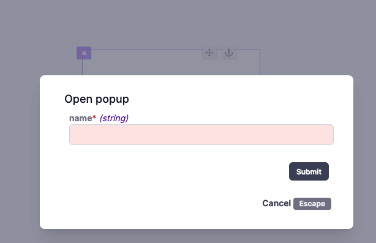

#### Form Modal configuration

| Name  |                Type                 | Connectable | Templatable |  Default   | Description       |
| ----- | :---------------------------------: | :---------: | :---------: | :--------: | ----------------- |
| label |               string                |    true     |    false    | Open popup | The button label. |
| color | blue, red, dark, light, green, gray |    false    |    false    |    dark    | The button color. |
| size  |         xs, sm, md , lg, xl         |    false    |    false    |     sm     | The button size.  |

:::info
The button label is used as the modal title.
:::

#### Outputs

| Name    |  Type   | Description                      |
| ------- | :-----: | -------------------------------- |
| result  |   any   | The result of the runnable.      |
| loading | boolean | The loading state of the button. |

### Text Input API

The text input component allows you to get a string from the user.

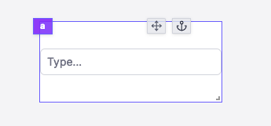

#### Text Input configuration

| Name          |  Type  | Connectable | Templatable | Default | Description                          |
| ------------- | :----: | :---------: | :---------: | :-----: | ------------------------------------ |
| placeholder   | string |    false    |    false    | Type... | The text input placeholder.          |
| default value | string |    true     |    false    |         | The default value of the text input. |

#### Outputs

| Name   |  Type  | Description           |
| ------ | :----: | --------------------- |
| result | string | The text input value. |

### Password Input API

The password input component allows you to get a password from the user.

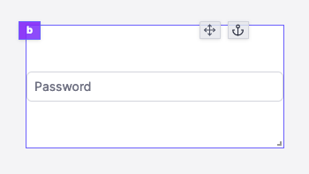

#### Password Input configuration

| Name        |  Type  | Connectable | Templatable | Default  | Description                     |
| ----------- | :----: | :---------: | :---------: | :------: | ------------------------------- |
| placeholder | string |    false    |    false    | Password | The password input placeholder. |

#### Outputs

| Name   |  Type  | Description               |
| ------ | :----: | ------------------------- |
| result | string | The password input value. |

### Number Input API

The number input component allows you to get a number from the user.

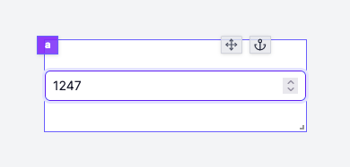

#### Number Input configuration

| Name          |  Type  | Connectable | Templatable | Default | Description                           |
| ------------- | :----: | :---------: | :---------: | :-----: | ------------------------------------- |
| placeholder   | string |    false    |    false    | Type... | The number input placeholder.         |
| default value | number |    true     |    false    |         | The default value of the number input. |

#### Outputs

| Name   |  Type  | Description            |
| ------ | :----: | ---------------------- |
| result | number | The number input value |

### Slider API

The slider component allows you to get a number from the user.

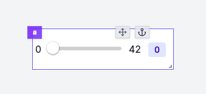

#### Slider configuration

| Name |  Type  | Connectable | Templatable | Default | Description                      |
| ---- | :----: | :---------: | :---------: | :-----: | -------------------------------- |
| min  | number |    false    |    false    |    0    | The minimum value of the slider. |
| max  | number |    false    |    false    |   42    | The maximum value of the slider. |

#### Outputs

| Name   |  Type  | Description       |
| ------ | :----: | ----------------- |
| result | number | The slider value. |

### Range API

The slider component allows you to get a range of numbers from the user.

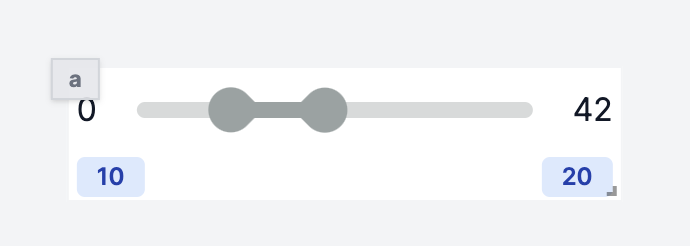

#### Range configuration

| Name |  Type  | Connectable | Templatable | Default | Description                      |
| ---- | :----: | :---------: | :---------: | :-----: | -------------------------------- |
| min  | number |    false    |    false    |    0    | The minimum value of the range. |
| max  | number |    false    |    false    |   42    | The maximum value of the range. |

#### Outputs

| Name   |  Type  | Description       |
| ------ | :----: | ----------------- |
| result 0 | number | The range bottom value. |
| result 1 | number | The range top value. |

### Date Input API

The date input component allows you to get a date from the user.

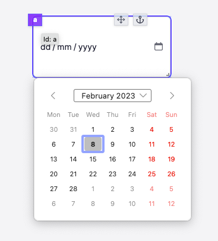

#### Date Input configuration

| Name          |  Type  | Connectable | Templatable | Default | Description                          |
| ------------- | :----: | :---------: | :---------: | :-----: | ------------------------------------ |
| minDate       | string |    true     |    false    |         | The minimum date of the date input.  |
| maxDate       | string |    true     |    false    |         | The maximum date of the date input.  |
| default value | string |    true     |    false    |         | The default value of the date input. |

#### Outputs

| Name   |  Type  | Description           |
| ------ | :----: | --------------------- |
| result | string | The date input value. |

### Toggle API

The toggle component allows you to get a boolean from the user.

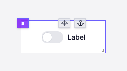

#### Toggle configuration

| Name          |  Type   | Connectable | Templatable | Default | Description                      |
| ------------- | :-----: | :---------: | :---------: | :-----: | -------------------------------- |
| label         | string  |    true     |    false    |  Label  | The toggle label.                |
| default value | boolean |    true     |    false    |         | The default value of the toggle. |

### Select API

The select component allows you to get a string from the user.

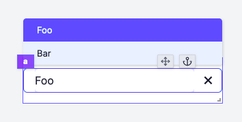

#### Select configuration

| Name     |  Type  | Connectable | Templatable | Default | Description                     |
| -------- | :----: | :---------: | :---------: | :-----: | ------------------------------- |
| items    | Array  |    true     |    false    |         | The select items.               |
| item key | string |    true     |    false    |         | The key of the item to display. |

### HTML API

The HTML component allows you to display HTML content.

#### HTML Input

|  Type  | Connectable | Templatable |                                          Default                                          | Description                |
| :----: | :---------: | :---------: | :---------------------------------------------------------------------------------------: | -------------------------- |
| string |    true     |    true     | `<h1 class="absolute top-4 left-2 text-white">Hello ${ctx.username}</h1>` | The HTML content to render |

#### Outputs

| Name    |  Type   | Description                              |
| ------- | :-----: | ---------------------------------------- |
| result  | string  | The HTML.                                |
| loading | boolean | The loading state of the HTML component. |

### Vega Lite API

The Vega Lite component allows you to display a Vega Lite chart.

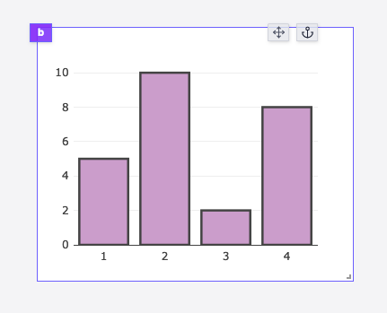

#### Vega Lite Input

|  Type  | Connectable | Templatable | Default | Description                |
| :----: | :---------: | :---------: | :-----: | -------------------------- |
| object |    true     |    false    |         | The Vega Lite chart config |

#### Vega Lite configuration

| Name   |  Type   | Connectable | Templatable | Default | Description                                                               |
| ------ | :-----: | :---------: | :---------: | :-----: | ------------------------------------------------------------------------- |
| canvas | boolean |    false    |    false    |  false  | Use the canvas renderer instead of the svg one for more interactive plots |

#### Outputs

| Name    |  Type   | Description                              |
| ------- | :-----: | ---------------------------------------- |
| result  | Object  | The Vega Lite chart data.                |
| loading | boolean | The loading state of the Vega Lite chart |

### Plotly API

The Plotly component allows you to display a Plotly chart.

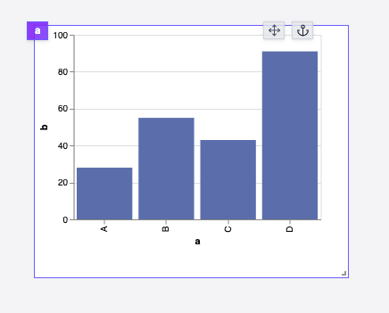

#### Plotly Input

|  Type  | Connectable | Templatable | Default | Description             |
| :----: | :---------: | :---------: | :-----: | ----------------------- |
| object |    true     |    false    |         | The Plotly chart config |

#### Outputs

| Name   |  Type  | Description            |
| ------ | :----: | ---------------------- |
| result | Object | The Plotly chart data. |

### Text API

The text component allows you to display text.

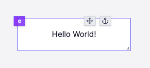

#### Text Input

|  Type  | Connectable | Templatable |   Default    | Description          |
| :----: | :---------: | :---------: | :----------: | -------------------- |
| string |    true     |    true     | Hello World! | The text to display. |

#### Text configuration

| Name        |                      Type                      | Connectable | Templatable | Default | Description                                                     |
| ----------- | :--------------------------------------------: | :---------: | :---------: | :-----: | --------------------------------------------------------------- |
| style       | 'title', 'subtitle', 'body', 'label','caption' |    false    |    false    | 'body'  | The text style.                                                 |
| Extra Style |                     string                     |    false    |    false    |         | Extra style to apply to the text: CSS rules like "color: blue;" |

#### Outputs

| Name    |  Type   | Description                              |
| ------- | :-----: | ---------------------------------------- |
| result  | string  | The text.                                |
| loading | boolean | The loading state of the text component. |

### Table API

The table component allows you to display a table.

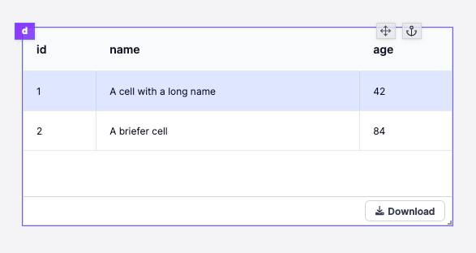

#### Table Input

|      Type       | Connectable | Templatable | Default | Description     |
| :-------------: | :---------: | :---------: | :-----: | --------------- |
| `Array<Object>` |    true     |    false    |         | The table data. |

:::info
The columns are automatically generated from all the keys of the objects in the array.
:::

#### Table configuration

| Name   |                   Type                    | Connectable | Templatable |  Default   | Description                           |
| ------ | :---------------------------------------: | :---------: | :---------: | :--------: | ------------------------------------- |
| search | 'Disabled', 'By Runnable', 'By component' |    false    |    false    | 'Disabled' | The search query to filter the table. |

Search can be configured in the following ways:

- **Disabled**: The search is disabled.
- **By Runnable**: The search is done in the backend.
- **By component**: The search is done in the frontend.

#### Table actions

`Table` can define actions that will be displayed in each row of the table. An action is a `Button` component that cannot be moved.

#### Outputs

| Name             |  Type   | Description                              |
| ---------------- | :-----: | ---------------------------------------- |
| result           | Object  | The table data.                          |
| loading          | boolean | The loading state of the table component |
| selectedRow      | Object  | The selected row                         |
| selectedRowIndex | number  | The selected row index                   |
| search           | string  | The search query                         |

### Pie Chart API

The Pie Chart component allows you to display a Pie Chart using the [Chart.js](https://www.chartjs.org/) library.

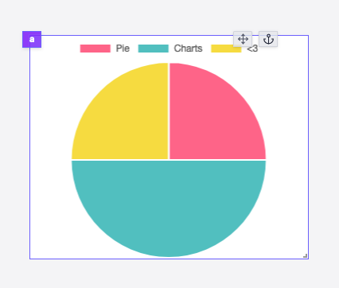

#### Pie Chart Input

|  Type  | Connectable | Templatable | Default | Description         |
| :----: | :---------: | :---------: | :-----: | ------------------- |
| Object |    true     |    false    |         | The pie chart data. |

#### Pie Chart configuration

| Name          |  Type   | Connectable | Templatable | Default | Description                     |
| ------------- | :-----: | :---------: | :---------: | :-----: | ------------------------------- |
| theme         | string  |    false    |    false    | Theme1  | The chart theme.                |
| Doghnut style | boolean |    false    |    false    |  false  | Whether to use a doghnut style. |

#### Outputs

| Name    |  Type   | Description                                   |
| ------- | :-----: | --------------------------------------------- |
| result  | Object  | The pie chart data.                           |
| loading | boolean | The loading state of the pie chart component. |

### Bar/Line Chart API

The Bar Chart component allows you to display a Bar Chart using the [Chart.js](https://www.chartjs.org/) library. It can also be used to display a Line Chart.

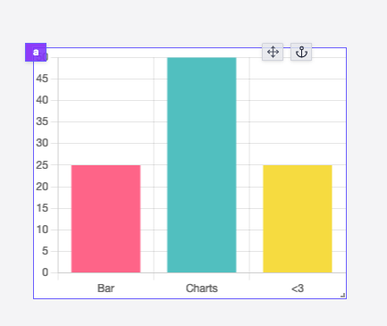

#### Bar/Line Chart Input

|  Type  | Connectable | Templatable | Default | Description         |
| :----: | :---------: | :---------: | :-----: | ------------------- |
| Object |    true     |    false    |         | The bar chart data. |

#### Bar/Line Chart configuration

| Name  |  Type   | Connectable | Templatable | Default | Description                  |
| ----- | :-----: | :---------: | :---------: | :-----: | ---------------------------- |
| Theme | string  |    false    |    false    | Theme1  | The chart theme.             |
| Line  | boolean |    false    |    false    |  false  | Whether to use a line style. |

#### Outputs

| Name    |  Type   | Description                                   |
| ------- | :-----: | --------------------------------------------- |
| result  | Object  | The bar chart data.                           |
| loading | boolean | The loading state of the bar chart component. |

### Scatter Chart API

The Scatter Chart component allows you to display a Scatter Chart using the [Chart.js](https://www.chartjs.org/) library.

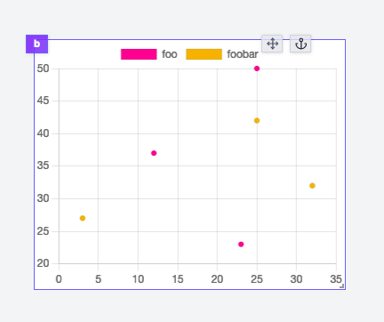

#### Scatter Chart Input

|      Type       | Connectable | Templatable | Default | Description             |
| :-------------: | :---------: | :---------: | :-----: | ----------------------- |
| `Array<Object>` |    true     |    false    |         | The scatter chart data. |

#### Scatter Chart configuration

| Name     |  Type   | Connectable | Templatable | Default | Description                      |
| -------- | :-----: | :---------: | :---------: | :-----: | -------------------------------- |
| zoomable | boolean |    false    |    false    |  false  | Whether to use a zoomable style. |
| panable  | boolean |    false    |    false    |  false  | Whether to use a panable style.  |

#### Outputs

| Name    |  Type   | Description                                       |
| ------- | :-----: | ------------------------------------------------- |
| result  | Object  | The scatter chart data.                           |
| loading | boolean | The loading state of the scatter chart component. |

### Timeseries API

The Timeseries component allows you to display a Timeseries using the [Chart.js](https://www.chartjs.org/) library.

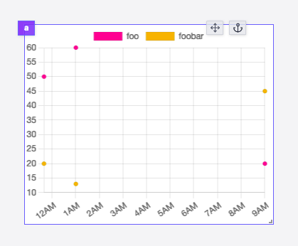

#### Timeseries Input

|      Type       | Connectable | Templatable | Default | Description          |
| :-------------: | :---------: | :---------: | :-----: | -------------------- |
| `Array<Object>` |    true     |    false    |         | The timeseries data. |

#### Timeseries configuration

| Name              |  Type   | Connectable | Templatable | Default | Description                         |
| ----------------- | :-----: | :---------: | :---------: | :-----: | ----------------------------------- |
| Logarithmic scale | boolean |    false    |    false    |  false  | Whether to use a logarithmic scale. |
| zoomable          | boolean |    false    |    false    |  false  | Whether to use a zoomable style.    |
| panable           | boolean |    false    |    false    |  false  | Whether to use a panable style.     |

#### Outputs

| Name    |  Type   | Description                                    |
| ------- | :-----: | ---------------------------------------------- |
| result  | Object  | The timeseries data.                           |
| loading | boolean | The loading state of the timeseries component. |

### Result API

The Result component allows you to display the result of a Runnable. It tries to display the result in a human-readable way.
