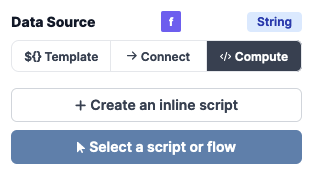

# Input types

Windmill supports the following input types, as well as the corresponding array types:

- **Text**: a simple text input.
- **Text area**: a multi-line text input.
- **Number**: a number input.
- **Boolean**: a checkbox.
- **Date**: a date picker. The date format is `DD.MM.YYYY`.
- **Template**
- **Object**: a JSON editor.
- **Select**: a dropdown list.
- **Color**: a color picker. The color format is `#RRGGBB`.

## Data source types

The data source is the data that will be used by the component. For example, the `Text` component will display the text that is defined in the data source.
They are 4 ways to define the data source, depending on the component:

- **Static**: the data source is defined in the settings panel.
- **Connect**: the data source is connected to the output of another component, to an output of a background runnable, the state or the context.
- **Compute**: the data source is the result of a script
- **Template**: the data source is a result of a template. A template is a special type of input where we can use variables. For example, if we have a variable `username` the context, we can use it in the template like this: `Hello ${username}}`. Not all components support templates.

### Static

Depending on the type of the data source, the input will be different. For example, if the type of the data source is `string`, the input will be a text input. If the type of the data source is `boolean`, the input will be a checkbox. If the type of the data source is `object`, the input will be a JSON editor.

### Connect

Inputs can be connected to any outputs. When connecting, you can click on the output to connect the input to the output. Note that you can select nested outputs, objects and arrays.

<video
    className="border-2 rounded-xl object-cover w-full h-full"
    autoPlay
    loop
    controls
    id="main-video"
    src="/videos/app-connections.mp4"
/>

Here are the steps to connect an input to an output:

- Click on the component input you want to connect to an output
- Click the right arrow to open the connection menu
  - You can now navigate you app, without running any scripts
  - When you hover a component, the corresponding outputs are highlighted in orange
  - If you click on a component, the output will be pinned and stays open
- You can now click on the output you want to connect to the input
- The input is now connected to the output

### Compute

The data source can be computed using a script. The script is executed when the component is rendered.
They are two ways to define the script:

- **Inline**: the script is defined in the settings panel.
- **Select from workspace**: the script of flow is defined in the workspace.

Once the script is defined, we can see the script in the Runnable pannel
