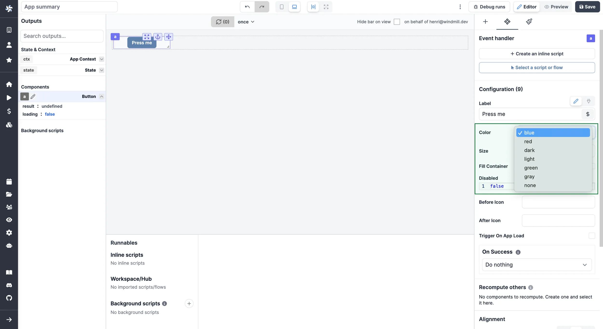
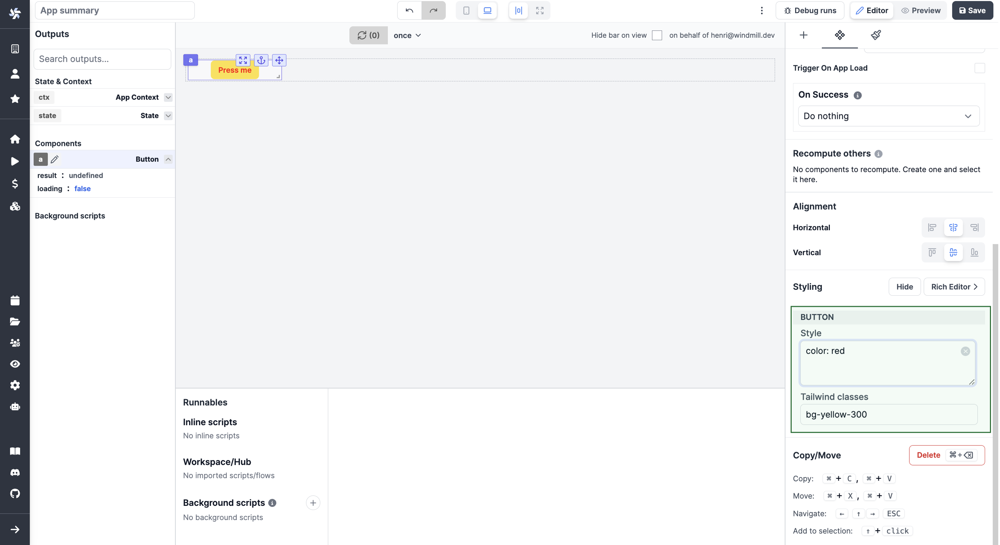

# Styling

Styling on the app editor can be managed at the component and app-level.

## Component level

### Pre-set

Some components have pre-set options for styling. They can be configured from the `Components settings` tab in the `Configuration` section.

### Styling Menu

Components come with a styling menu. From there, pick styles either from [CSS](https://www.w3schools.com/html/html_css.asp) or [Tailwind classes](https://tailwind.build/classes).

Please note that these different style classes can be combined.

### Rich Editor

You can configure manually your own classes with our Rich Editor.

<video
    className="border-2 rounded-xl object-cover w-full h-full dark:border-gray-800"
    autoPlay
    controls
    id="main-video"
    src="/videos/rich_editor.mp4"
/>

 

Elements like background color (incl. shadow, opacity), border (incl. stlye, radius), typography (incl. font size, family, weight, spacing) etc. can all be configured for each component.

## Global Styling

For complex apps, you may not want to repeat the styling configuration on each component.

On the right-side menu, pick `Global styling` and go on a component to define pre-set styling in CSS or Tailwind.

<video
    className="border-2 rounded-xl object-cover w-full h-full dark:border-gray-800"
    autoPlay
    controls
    id="main-video"
    src="/videos/global_styling.mp4"
/>

 

:::tip Configure manually and replicate pre-set styling

Styling on a component level can be replicated to all the components of the same class from the Rich Editor.

Just click on `Copy style to global CSS`.

 

<video
    className="border-2 rounded-xl object-cover w-full h-full dark:border-gray-800"
    autoPlay
    controls
    id="main-video"
    src="/videos/copy_style_global_css.mp4"
/>

:::
