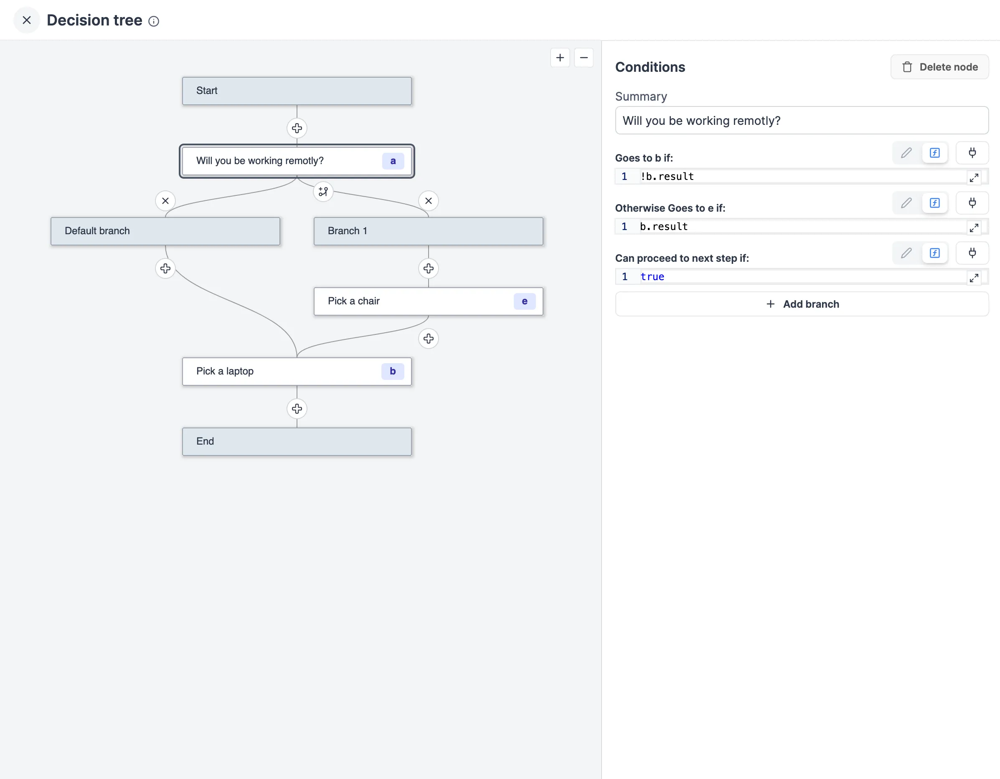
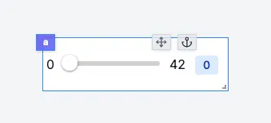
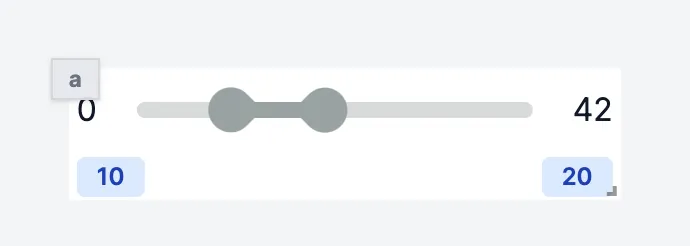
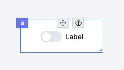
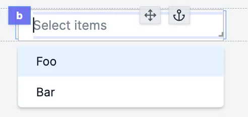
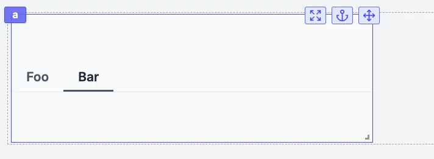
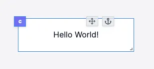
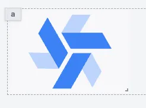
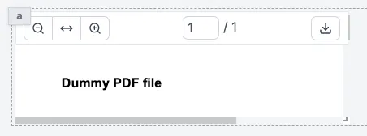
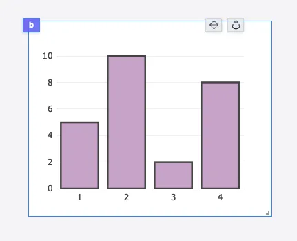

import DocCard from '@site/src/components/DocCard';

# Component library

Windmill provides a set of components that can be used to build apps.

The app components library is located on the right-hand side of the app editor. It displays the app components and allows you to configure them.

The list of components is constantly growing according to our users' expectations. If you feel like a new component would be useful, please [reach out to us](/docs/misc/getting_help/).

Even though the list of components is never as up to date as on <a href="https://app.windmill.dev/" rel="nofollow">Windmill cloud</a>, here is the list of the available components:

## Components properties

Components can be configured in two ways:

- **Inputs**: inputs can be [connected to an output](../2_connecting_components/index.mdx) or computed using a runnable.

  - e.g. `Table` component has an input that can be connected to an output or computed using a runnable, which is an array of objects.
     

- **Configuration**: [configure](./3_app_component_configuration.mdx) property such as the button label, the text input placeholder, etc.
  - e.g. `Table` component has a configuration property that allows you to configure the search bar: Client-side search, Server-side search, or no search.

## Component outputs

- **Runnable**: some component can [trigger a runnable](../3_app-runnable-panel.mdx) when an event occurs, usually when a user interacts with the component. The result of the runnable is stored in the component output in the key `result`. It also stores the `loading` state of the component.

  - e.g. `Button` component can trigger a runnable when clicked.
     

- **Own outputs**: some component have [outputs defined by the component](../2_outputs.mdx).
  - e.g. `Table` component has a selectedRow output

## Inserting components

Click on a component in the component library to insert it in the app canvas. It will be automatically positioned to the first available spot starting from the top left corner.

## Layout

The layout components are used to organize the components in the app canvas.

### [Container](./container.mdx)

Containers allow you to host other components in a box. Moving a container means moving all the components inside.

<video
	className="border-2 rounded-lg object-cover w-full h-full dark:border-gray-800"
	controls
	src="/videos/container.mp4"
	alt="container component"
/>

### [List](./list.mdx)

The List component enables duplication of cards or rows with consistent structure, allowing for containment of other components. By default, editing or moving a component will apply changes to all cards or rows, while still allowing customization and exceptions for unique values per component.

<video
	className="border-2 rounded-lg object-cover w-full h-full dark:border-gray-800"
	controls
	src="/videos/list_component.mp4"
	alt="list component"
/>

### [Divider X](./divider_x.mdx)

Divider X is a horizontal line.

### [Divider Y](./divider_y.mdx)

Divider Y is a vertical line.

### [Drawer](./drawer.mdx)

The drawer is container called by a button. Once you click on the button, a side tab will appear on which you can display other components.

<video
	className="border-2 rounded-lg object-cover w-full h-full dark:border-gray-800"
	controls
	src="/videos/drawer.mp4"
	alt="drawer component"
/>

### [Vertical split panes](./vertical_split_panes.mdx)

Split panes component is a container split in x number of panes vertically.

<video
	className="border-2 rounded-lg object-cover w-full h-full dark:border-gray-800"
	controls
	src="/videos/vertical_split.mp4"
	alt="vertical split panes"
/>

### [Horizontal split panes](./horizontal_split_panes.mdx)

Split panes component is a container split in x number of panes horizontally.

<video
	className="border-2 rounded-lg object-cover w-full h-full dark:border-gray-800"
	controls
	src="/videos/horizontal_split.mp4"
	alt="horizontal split panes"
/>

### [Modal](./modal.mdx)

The modal is container called by a button. Once you click on the button, a modal will appear on which you can display other components.

<video
	className="border-2 rounded-lg object-cover w-full h-full dark:border-gray-800"
	controls
	id="modal-layout"
	src="/videos/modal-layout.mp4"
	alt="modal component"
/>

### [Stepper](./stepper.mdx)

The stepper component helps you lay out multi-step apps, with an optional validation function to validate a step.

<video
	className="border-2 rounded-lg object-cover w-full h-full dark:border-gray-800"
	controls
	id="modal-layout"
	src="/videos/stepper.mp4"
	alt="stepper"
/>

### [Carousel list](./carousel.mdx)

The Carousel list component enables duplication of cards or rows with consistent structure in a carousel, allowing for containment of other components. By default, editing or moving a component will apply changes to all cards or rows, while still allowing customization and exceptions for unique values per component.

<video
	className="border-2 rounded-lg object-cover w-full h-full dark:border-gray-800"
	autoPlay
	controls
	src="/videos/carousel_component.mp4"
	alt="carousel list component"
/>

### [Accordion list](./accordion.mdx)

The Accordion list component enables duplication of cards or rows with consistent structure in an accordion, allowing for containment of other components. By default, editing or moving a component will apply changes to all cards or rows, while still allowing customization and exceptions for unique values per component.

<video
	className="border-2 rounded-lg object-cover w-full h-full dark:border-gray-800"
	controls
	src="/videos/accordion_list.mp4"
	alt="accordion list component"
/>

### [Decision tree](./decision_tree.mdx)

This app component allows you to create a decision tree controlled by a flow-like structure. Each node in the tree represents a decision point with a dedicated subgrid and can lead to one or more subsequent nodes based on specified conditions.

### [Navbar](./navbar.mdx)

The navbar component facilitates control over the browser's URL bar, enabling:
1. Changing the behavior of the app by manipulating the query arguments and hash of the URL.
2. Opening an external URL in a new tab.
3. Opening another Windmill app, which allows for creating embedded apps where the user navigates between several of your Windmill apps.

<iframe
	style={{ aspectRatio: '16/9' }}
	src="https://www.youtube.com/embed/-COM6XozpIc"
	title="Navbar component video"
	frameBorder="0"
	allow="accelerometer; autoplay; clipboard-write; encrypted-media; gyroscope; picture-in-picture; web-share"
	allowFullScreen
	className="border-2 rounded-lg object-cover w-full dark:border-gray-800"
></iframe>

### [Recompute all](./recompute_all.mdx)

The Recompute all component allows you to recompute all elements in the app.

### [Top bar](./topbar.mdx)

The Top bar component displays a top bar on your app, with the app Summary and the Recompute all button.

<video
	className="border-2 rounded-lg object-cover w-full h-full dark:border-gray-800"
	controls
	src="/videos/topbar.mp4"
/>

## Tabs

### [Tabs](./tabs.mdx)

Tabs components allow you to host other components in several tabs. Each tab is a container.

<video
	className="border-2 rounded-lg object-cover w-full h-full dark:border-gray-800"
	controls
	src="/videos/tabs.mp4"
	alt="tabs component"
/>

### [Conditional tabs](./conditional_tabs.mdx)

Conditional tabs are tabs that are displayed only if a condition is met. The conditions are an array of conditions. Conditions are evaluated in order. The first condition that evaluates to true will render its subgrid. If no condition evaluates to true, the last subgrid will be rendered.

<video
	className="border-2 rounded-lg object-cover w-full h-full dark:border-gray-800"
	controls
	id="conditional-tabs-video"
	src="/videos/conditional-tabs.mp4"
	alt="Conditional tabs component"
/>

### [Sidebar tabs](./sidebar_tabs.mdx)

The Sidebar tabs component is basically a Tabs component whose `Tabs Kind` is "Sidebar".

### [Invisible tabs](./invisible_tabs.mdx)

The Invisible tabs component is basically a Tabs component whose `Tabs Kind` is "Invisible", meaning the tabs labels are not visible by the user.

## Buttons

### [Button](./button.mdx)

The component triggers a runnable when clicked.

### [Submit form](./submit_form.mdx)

The submit form component allows you to create a submit form linked to a runnable. It has a submit button that triggers a runnable when clicked.

<video
	className="border-2 rounded-lg object-cover w-full h-full dark:border-gray-800"
	controls
	src="/videos/submit_form.mp4"
/>

### [Modal form](./modal_form.mdx)

The modal form component allows you to create a form linked to a script or flow. It is a Submit form component but with a dedicated modal opened when triggered. It has a submit button that triggers a runnable when clicked. The form is displayed in a modal, which can be opened by clicking on a button.

### [Download button](./download_button.mdx)

The download button component allows you to download a file.

<video
	className="border-2 rounded-lg object-cover w-full h-full dark:border-gray-800"
	controls
	src="/videos/download_button.mp4"
	alt="Download button"
/>

## Inputs

### [Form](./form_input.mdx)

The Form component allows you to create a form and get answers from the user.

### [Text input](./text_input.mdx)

The text input component allows you to get a string from the user.

### [Textarea](./textarea.mdx)

The textarea component allows you to get a string from the user, with an expandable text area.

### [Rich text editor](./rich_text_editor.mdx)

The Rich text editor component allows to have to user enter text with a layout, on top of files or videos.

### [Password](./password_input.mdx)

The password input component allows you to get a password from the user.

### [Email input](./email_input.mdx)

The email input component allows you to get an email from the user.

### [Number](./number_input.mdx)

The number input component allows you to get a number from the user.

### [Currency](./currency_input.mdx)

The currency input component allows you to get a written amount of money in a set currency from the user.

### [Slider](./slider.mdx)

The slider component allows you to get a number from the user.

### [Date slider](./date_slider.mdx)

The slider component allows you to get a date from a range of dates.

### [Range](./range.mdx)

The slider component allows you to get a range of numbers from the user.

### [Date](./date_input.mdx)

The date input component allows you to get a date from the user.

### [Time](./time_input.mdx)

The Time input component allows the user to fill in a time.

### [Date & Time](./datetime_input.mdx)

The Date & Time input component allows the user to fill in a date and time.

### [Date select](./date_select.mdx)

The Date select component allows the user to fill in a date by picking a day, month and year.

### [File input](./file_input.mdx)

The file input allows users to drop files into the app.

### [S3 file uploader](./s3fileinput.mdx)

The S3 file uploader component allows you to upload files to an S3 bucket.

### [Toggle](./toggle.mdx)

The toggle component allows you to get a boolean from the user.

### [Select](./select.mdx)

The select component allows you to get a string from the user.

### [Resource select](./resource_select.mdx)

The Resource select component allows you to have users pick [resources](../../core_concepts/3_resources_and_types/index.mdx) from your Windmill workspace to interact with integrations.

### [Multi select](./multiselect.mdx)

The Multi select component allows you to get multiple strings from the user.

### [Select tab](./select_tab.mdx)

The Select tab is standalone tab component that behaves like a select component. It is meant to have the chosen tab to be chosen as input by components or runnables.

### [Select step](./select_step.mdx)

The Select step is standalone tab component that behaves like a select component. It is meant to have the chosen tab to be chosen as input by components or runnables.

## Tables

### [AgGrid table](./aggrid_table.mdx)

The AgGrid table component allows you to display an Ag Grid table.

<video
	className="border-2 rounded-lg object-cover w-full h-full dark:border-gray-800"
	controls
	src="/videos/aggrid_table.mp4"
	alt="aggrid table"
/>
 

### [Database studio](./database_studio.mdx)

This component allows you to create a database studio. The database studio is a web-based database management tool. It allows you to display and edit the content of a database. It uses Ag Grid to display the table.

### [TanStack table (depreciated)](./table.mdx)

The table component allows you to display a table.

:::note Depreciated

integrationsand will be removed in the future. Please use the [AgGrid table](./aggrid_table.mdx) or [Database studio](./database_studio.mdx) components instead.

:::

## Display

### [Text](./text.mdx)

The text component allows you to display text.

### [Icon](./icon.mdx)

The Icon API allows you to display an icon chosen in a library of icons.

### [Image](./image.mdx)

The Image component allows you to display a picture.

### [Map](./map.mdx)

The Map component allows you to display an interactive map.

### [HTML](./html.mdx)

The HTML component allows you to display HTML content.

### [Markdown](./markdown.mdx)

The Markdown component allows you to display Markdown content.

### [PDF](./pdf.mdx)

The PDF component allows you to display a PDF file.

### [Rich result](./rich_result.mdx)

The Rich result component allows you to display the result of a Runnable.

### [Log by job id](./log_display.mdx)

The Log display component allows you to display the log of a Runnable by providing its Job id.

### [Flow status by job id](./flow_status.mdx)

The Flow status component allows you to display the status of a flow by providing its Job id.

### [Rich result by job id](./rich_result_by_job_id.mdx)

The Rich result by job id component allows you to display the result of a Runnable by providing its Job id.

### [Statistic card](./statistic_card.mdx)

The statistic card component is a panel meant to display a value and progress.

<video
	className="border-2 rounded-lg object-cover w-full h-full dark:border-gray-800"
	controls
	src="/videos/stat_card.mp4"
/>

### [Dropdown menu](./dropdown_menu.mdx)

The Dropdown menu component is meant to embed one of several [Button](#button) components and display them in a dropdown menu.

<video
	className="border-2 rounded-lg object-cover w-full h-full dark:border-gray-800"
	controls
	src="/videos/dropdown_menu.mp4"
/>

### [Alert](./alert.mdx)

The alert component allows you to display a message in 4 different styles: `info`, `success`, `warning`, and `error`.

## Charts

### [Plotly](./plotly.mdx)

The Plotly component allows you to display a Plotly chart.

<video
	className="border-2 rounded-lg object-cover w-full h-full dark:border-gray-800"
	autoPlay
	controls
	src="/videos/plotly_config.mp4"
	alt="Plotly chart"
/>

### [ChartJs](./chartjs.mdx)

The ChartJs component allows you to display a ChartJs using the [Chart.js](https://www.chartjs.org/) library.

<video
	className="border-2 rounded-lg object-cover w-full h-full dark:border-gray-800"
	autoPlay
	controls
	src="/videos/chartjs.mp4"
	alt="ChartJS"
/>

### [Vega lite](./vega_lite.mdx)

The Vega lite component allows you to display a Vega lite chart.

### [AgCharts](./agcharts.mdx)

The Ag charts component allows you to display a chart using the [Ag charts](https://charts.ag-grid.com/) library.

## Groups

Components can be grouped within containers:

	<DocCard
		title="Group of components"
		description="Components can be grouped within containers."
		href="/docs/apps/app_configuration_settings/components_groups"
		color="orange"
	/>

## Custom components

For more control and standardization with your existing stack, you might want to import your own components in React.

	<DocCard
		color="orange"
		title="Import custom React components"
		description="Define components in React or Vanilla JS that interact with the rest of your app."
		href="/docs/apps/react_components"
	/>

