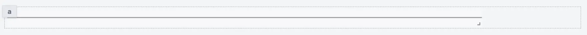
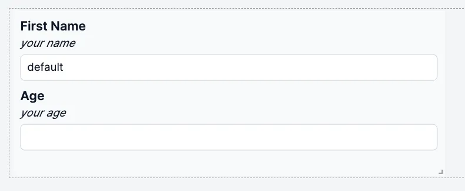
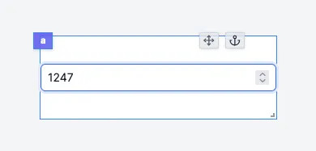
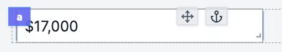
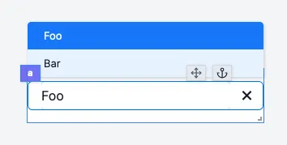
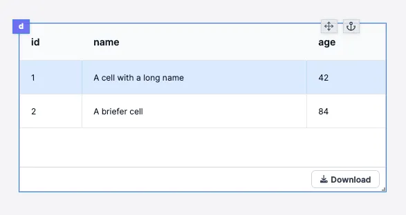
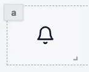

import DocCard from '@site/src/components/DocCard';

# Component Library

Windmill provides a set of components that can be used to build apps.

The app components library is located on the right-hand side of the app editor. It displays the app components and allows you to configure them.

The list of components is constantly growing according to our users' expectations. If you feel like a new component would be useful, please [reach out to us](/docs/misc/getting_help/).

Even though the list of components is never as up to date as on [Windmill Cloud](https://app.windmill.dev/user/login), here is the list of the available components:

## Components properties

Components can be configured in two ways:

- **Inputs**: inputs can be [connected to an output](../2_connecting_components/index.mdx) or computed using a runnable.

  - e.g. `Table` component has an input that can be connected to an output or computed using a runnable, which is an array of objects.
     

- **Configuration**: [configure](./3_app_component_configuration.mdx) property such as the button label, the text input placeholder, etc.
  - e.g. `Table` component has a configuration property that allows you to configure the search bar: Client-side search, Server-side search, or no search.

## Component outputs

- **Runnable**: some component can [trigger a runnable](../3_app-runnable-panel.mdx) when an event occurs, usually when a user interacts with the component. The result of the runnable is stored in the component output in the key `result`. It also stores the `loading` state of the component.

  - e.g. `Button` component can trigger a runnable when clicked.
     

- **Own outputs**: some component have [outputs defined by the component](../2_outputs.mdx).
  - e.g. `Table` component has a selectedRow output

## Inserting components

Click on a component in the component library to insert it in the app canvas. It will be automatically positioned to the first available spot starting from the top left corner.

## Layout

The layout components are used to organize the components in the app canvas.

### [Container](./container.mdx)

<video
	className="border-2 rounded-xl object-cover w-full h-full dark:border-gray-800"
	controls
	src="/videos/container.mp4"
	alt="container component"
/>

### [List](./list.mdx)

<video
	className="border-2 rounded-xl object-cover w-full h-full dark:border-gray-800"
	controls
	src="/videos/list_component.mp4"
	alt="list component"
/>

### [Divider X](./divider_x.mdx)

### [Divider Y](./divider_y.mdx)

### [Drawer](./drawer.mdx)

<video
	className="border-2 rounded-xl object-cover w-full h-full dark:border-gray-800"
	controls
	src="/videos/drawer.mp4"
	alt="drawer component"
/>

### [Vertical Split Panes](./vertical_split_panes.mdx)

<video
	className="border-2 rounded-xl object-cover w-full h-full dark:border-gray-800"
	controls
	src="/videos/vertical_split.mp4"
	alt="vertical split panes"
/>

### [Horizontal Split Panes](./horizontal_split_panes.mdx)

<video
	className="border-2 rounded-xl object-cover w-full h-full dark:border-gray-800"
	controls
	src="/videos/horizontal_split.mp4"
	alt="horizontal split panes"
/>

### [Modal](./modal.mdx)

<video
	className="border-2 rounded-xl object-cover w-full h-full dark:border-gray-800"
	controls
	id="modal-layout"
	src="/videos/modal-layout.mp4"
	alt="modal component"
/>

### [Stepper](./stepper.mdx)

<video
	className="border-2 rounded-xl object-cover w-full h-full dark:border-gray-800"
	controls
	id="modal-layout"
	src="/videos/stepper.mp4"
	alt="stepper"
/>

### [Carousel List](./carousel.mdx)

The Carousel List component enables duplication of cards or rows with consistent structure in a carousel, allowing for containment of other components. By default, editing or moving a component will apply changes to all cards or rows, while still allowing customization and exceptions for unique values per component.

<video
    className="border-2 rounded-xl object-cover w-full h-full dark:border-gray-800"
    autoPlay
    controls
    src="/videos/carousel_component.mp4"
    alt="carousel list component"
/>

### [Decision Tree](./decision_tree.mdx)

This component allows you to create a decision tree. The decision tree is controlled by a flow-like structure. Each node in the tree represents a decision point and can lead to one or more subsequent nodes based on specified conditions.

## Tabs

### [Tabs](./tabs.mdx)

<video
	className="border-2 rounded-xl object-cover w-full h-full dark:border-gray-800"
	controls
	src="/videos/tabs.mp4"
	alt="tabs component"
/>

### [Conditional Tabs](./conditional_tabs.mdx)

<video
	className="border-2 rounded-xl object-cover w-full h-full dark:border-gray-800"
	controls
	id="conditional-tabs-video"
	src="/videos/conditional-tabs.mp4"
	alt="Conditional tabs component"
/>

### [Sidebar Tabs](./sidebar_tabs.mdx)

### [Invisible Tabs](./invisible_tabs.mdx)

## Buttons

### [Button](./button.mdx)

### [Submit](./submit_form.mdx)

<video
	className="border-2 rounded-xl object-cover w-full h-full dark:border-gray-800"
	controls
	src="/videos/submit_form.mp4"
/>

### [Modal Form](./modal_form.mdx)

### [Download Button](./download_button.mdx)

<video
	className="border-2 rounded-xl object-cover w-full h-full dark:border-gray-800"
	controls
	src="/videos/download_button.mp4"
	alt="Download Button"
/>

## Inputs

### [Form](./form_input.mdx)

### [Text Input](./text_input.mdx)

### [Textarea](./textarea.mdx)

### [Rich Text Editor](./rich_text_editor.mdx)

### [Password](./password_input.mdx)

### [Email Input](./email_input.mdx)

### [Number](./number_input.mdx)

### [Currency](./currency_input.mdx)

### [Slider](./slider.mdx)

### [Range](./range.mdx)

### [Date](./date_input.mdx)

### [File Input](./file_input.mdx)

### [Toggle](./toggle.mdx)

### [Select](./select.mdx)

### [Resource Select](./resource_select.mdx)

### [MultiSelect](./multiselect.mdx)

### [Select Tab](./select_tab.mdx)

### [Select Step](./select_step.mdx)

## Tables

### [Table](./table.mdx)

### [AgGrid Table](./aggrid_table.mdx)

<video
	className="border-2 rounded-xl object-cover w-full h-full dark:border-gray-800"
	controls
	src="/videos/aggrid_table.mp4"
	alt="aggrid table"
/>
 

## Display

### [Text](./text.mdx)

### [Icon](./icon.mdx)

### [Image](./image.mdx)

### [Map](./map.mdx)

### [HTML](./html.mdx)

### [PDF](./pdf.mdx)

### [Rich Result](./rich_result.mdx)

### [Log](./log_display.mdx)

### [Flow Status](./flow_status.mdx)

## Charts

### [Plotly](./plotly.mdx)

<video
	className="border-2 rounded-xl object-cover w-full h-full dark:border-gray-800"
	autoPlay
	controls
	src="/videos/plotly_config.mp4"
	alt="Plotly chart"
/>

### [ChartJs](./chartjs.mdx)

<video
	className="border-2 rounded-xl object-cover w-full h-full dark:border-gray-800"
	autoPlay
	controls
	src="/videos/chartjs.mp4"
	alt="ChartJS"
/>

### [Vega Lite](./vega_lite.mdx)

## Groups

	<DocCard
		title="Group of Components"
		description="Components can be grouped within containers."
		href="/docs/apps/app_configuration_settings/components_groups"
		color="orange"
	/>

