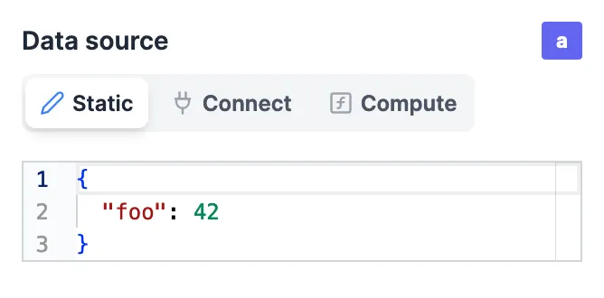
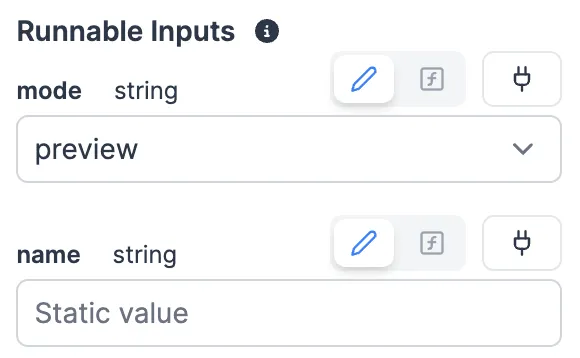
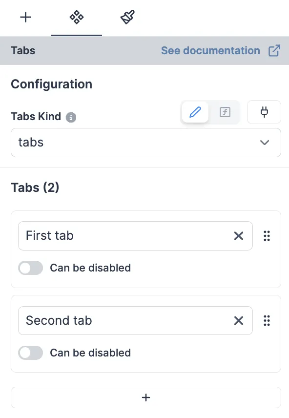

import DocCard from '@site/src/components/DocCard';

# Component configuration

Each component can be configured individually. This allows for adjusting its value, behavior (especially by [linking a script](../2_connecting_components/index.mdx) to the component), and [styling](../4_app_configuration_settings/4_app_styling.mdx).

For more details on the configuration of each type of component, see the [list of components](./1_app_component_library.mdx).

<div className="grid grid-cols-2 gap-2 my-4">
	<DocCard
		title="Component library"
		description="Find out the type of the data source of a component in the component library."
		href="/docs/apps/app_configuration_settings/app_component_library"
		color="orange"
	/>
</div>

## Component with data source

Most of components settings can take a data source. The data source can be a static value, connected to an output or the result of a attached runnable.


### Static data source / Template



Depending of the type of the data source, the input will be different. For example, if the type of the data source is `string`, the input will be a text input.

### Connected data source

The data source can be [connected to any outputs](../2_connecting_components/index.mdx) through [evals](../3_app-runnable-panel.mdx#evals)


#### Learn more

<div className="grid grid-cols-2 gap-6 mb-4">
	<DocCard
		color="orange"
		title="Connecting components"
		description="The strength of Windmill's app editor is the ability to connect everything together."
		href="/docs/apps/connecting_components"
	/>
</div>

### Runnable data source

We can also use the result of a runnable as a data source.


#### Learn more

<div className="grid grid-cols-2 gap-2 my-4">
	<DocCard
		title="Connecting components"
		description="Learn how to configure the triggers of the runnable."
		href="/docs/apps/app-runnable-panel#runnable-configuration"
		color="orange"
	/>
</div>

### Template data source

We have a special type of input called template. A template is a special type of input where we can use variables. For example, if we have a variable `username` the context, we can use it in the template like this: `Hello ${ctx.username}}`.

The `Text` component has a template data source, and it replaces the static data source.

## Runnable inputs

If a runnable is attached to a component, the component will have a new section called `Runnable inputs`. This section contains all the inputs of the runnable.

In the same way as the component inputs, the runnable inputs can be static, connected to an output or the result of an evaluated template.

The type of the inputs are automatically inferred from the scripts. For example, for this TS script:

```ts
export async function main(mode: 'editor' | 'preview', name: string) {
	return mode;
}
```

The type of the input will be `select` with the values `editor` and `preview`, and the type of the input `name` will be `string`.



## Component configuration

Each component has a configuration section. This section contains all the configuration of the component.



#### Learn more

<div className="grid grid-cols-2 gap-2 my-4">
	<DocCard
		title="Component library"
		description="Find out the configuration of each component in the component library."
		href="/docs/apps/app_configuration_settings/app_component_library"
		color="orange"
	/>
</div>

## Inputs

Windmill supports multiple types of inputs. Inputs are used to configure the components and runnables.
We supports the following input types, as well as the corresponding array types:

- **Text**: a simple text input.
- **Text area**: a multi-line text input.
- **Number**: a number input.
- **Boolean**: a checkbox.
- **Date**: a date picker. The date format is `DD.MM.YYYY`.
- **Template**
- **Object**: a JSON editor.
- **Select**: a dropdown list.
- **Color**: a color picker. The color format is `#RRGGBB`.
- **Icon select**: a dropdown list with icons. The icons come from [Lucide](https://lucide.dev/).
- **Labeled resource**: a dropdown list with resources.
