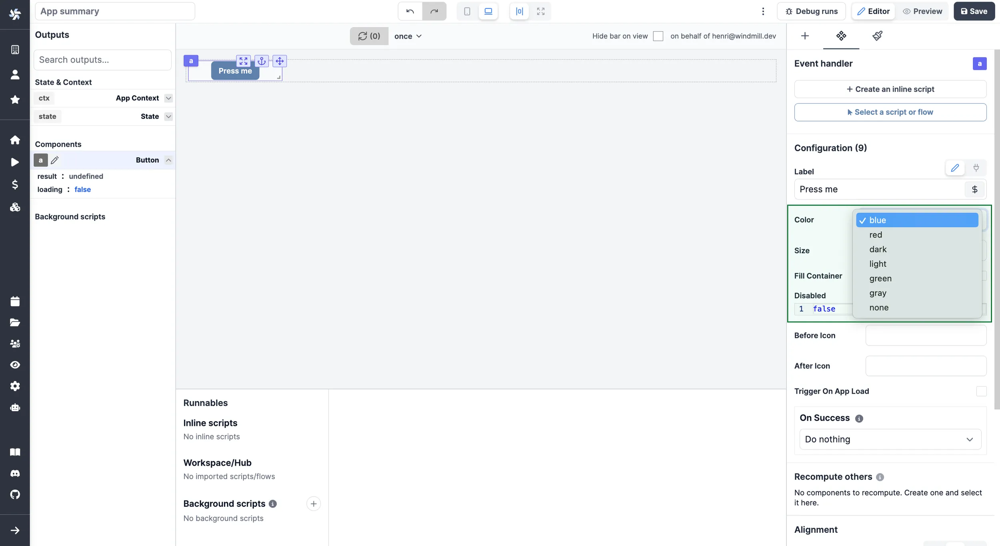
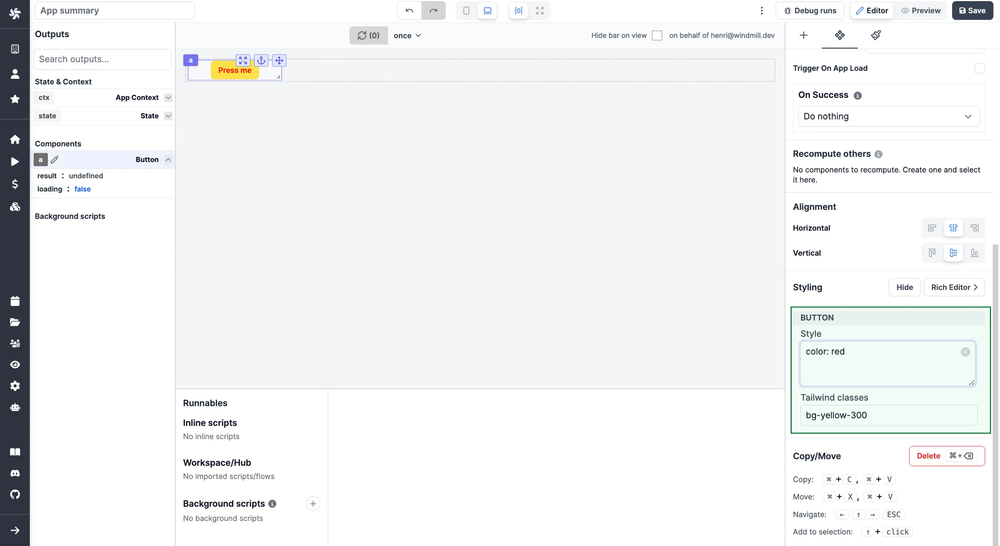

import DocCard from '@site/src/components/DocCard';

# Styling

Styling on the app editor can be managed at the component and app-level.

<video
	className="border-2 rounded-xl object-cover w-full h-full dark:border-gray-800"
	autoPlay
	controls
	src="/videos/app_styling.mp4"
/>

## Component level

Styling can be defined at the component-level. CSS settings can be turned to [global level](#global-styling).

Component-level CSS has priority over the global level.

<video
	className="border-2 rounded-xl object-cover w-full h-full dark:border-gray-800"
	controls
	src="/videos/styling_component.mp4"
/>

### Pre-set

Some components have pre-set options for styling. They can be configured from the `Components settings` tab in the `Configuration` section.

### Styling Menu

Components come with a styling menu. From there, pick styles either from [CSS](https://www.w3schools.com/html/html_css.asp) or [Tailwind classes](https://tailwind.build/classes).

Please note that these different style classes can be combined.

### Rich Editor

You can configure manually your own classes with our Rich Editor.

<video
	className="border-2 rounded-xl object-cover w-full h-full dark:border-gray-800"
	controls
	src="/videos/rich_editor.mp4"
/>

 

Elements like background color (incl. shadow, opacity), border (incl. style, radius), typography (incl. font size, family, weight, spacing) etc. can all be configured for each component.

## Global Styling

For complex apps, you may not want to repeat the styling configuration on each component.

<video
	className="border-2 rounded-xl object-cover w-full h-full dark:border-gray-800"
	controls
	src="/videos/global_styling.mp4"
/>

### CSS Editor

The [Global CSS Editor](../9_css_editor.mdx) is designed to give styling and theming across your entire app. This functionality offers a centralized location for defining, managing, and applying CSS rules. It's useful for ensuring consistent styling and for creating reusable themes.

The Global CSS Editor is a feature exclusive to [Cloud plans and Self-Hosted Enterprise Edition](/pricing). However, users on the Community Edition can still access and experiment with this tool directly in the editor for evaluation purposes, although these changes will not be reflected in the app preview.

<iframe
	width="560"
	height="315"
	src="https://www.youtube.com/embed/6_MjKgbdCFQ?vq=hd1080"
	title="YouTube video player"
	frameborder="0"
	allow="accelerometer; autoplay; clipboard-write; encrypted-media; gyroscope; picture-in-picture; web-share"
	allowFullScreen="true"
></iframe>

 

	<DocCard
		title="CSS Editor"
		description="The Global CSS Editor is designed to give styling and theming across your entire app."
		href="/docs/apps/css_editor"
		color="orange"
	/>

### Configure manually and replicate pre-set styling

Styling on a component level can be replicated to all the components of the same class from the Rich Editor.

Just click on `Convert to global CSS`.

<video
	className="border-2 rounded-xl object-cover w-full h-full dark:border-gray-800"
	controls
	src="/videos/copy_style_global_css.mp4"
/>
