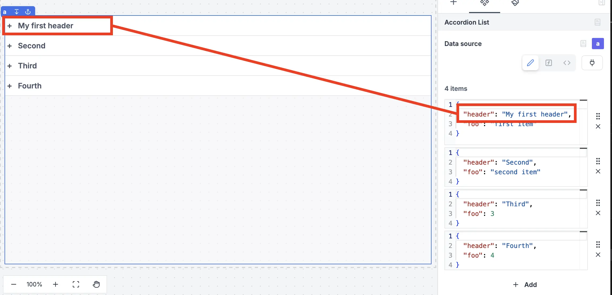

import DocCard from '@site/src/components/DocCard';

# Accordion list

The Accordion list component enables duplication of cards or rows with consistent structure in an accordion, allowing for containment of other components. By default, editing or moving a component will apply changes to all cards or rows, while still allowing customization and exceptions for unique values per component.

<video
	className="border-2 rounded-lg object-cover w-full h-full dark:border-gray-800"
	autoPlay
	controls
	src="/videos/accordion_list.mp4"
	alt="accordion list component"
/>
 

## Accordion header

To set the header of an accordion, you can pass a `header` property of each of the items passed to the Accordion list component.

To add a component to a card, you can either click on `Insert` while you select the container, or you can move an existing component by copy/pasting it.

Editing or moving a component will apply changes to all cards or rows.

To customize the settings of all components within, you can use `iter.index` and `iter.value`.

- `iter.index` will retrieve the index number of each card (0, 1, 2 etc.).

- `iter.value.key` will retrieve the value of each key defined in the `items` section.

List components also support having inputs set inside them. Retrieve the values of each in the `inputs` field of the List component in the [outputs](../2_outputs.mdx) menu.

<video
	className="border-2 rounded-lg object-cover w-full h-full dark:border-gray-800"
	autoPlay
	controls
	src="/videos/list_inputs.mp4"
	alt="List inputs"
/>
 

The following section details Accordion list component's specific settings. For more details on the App editor, check the [dedicated documentation](../0_app_editor/index.mdx) or the App editor [Quickstart](../../getting_started/7_apps_quickstart/index.mdx):

	<DocCard
		color="orange"
		title="App editor Documentation"
		description="The app editor is a low-code builder to create custom User Interfaces with a mix of drag-and-drop and code."
		href="/docs/apps/app_editor"
	/>
	<DocCard
		color="orange"
		title="Apps quickstart"
		description="Learn how to build your first app in a matter of minutes."
		href="/docs/getting_started/apps_quickstart"
	/>

## Controls

This component can be controlled by [frontend scripts](../3_app-runnable-panel.mdx#frontend-scripts) using these functions:

| Name   |        Parameters        | Description          | Example       |
| ------ | :----------------------: | -------------------- | ------------- |
| [recompute](../3_app-runnable-panel.mdx#recompute) | id: string | Recompute a component. | recompute('a'); |

## Outputs

| Name    |  Type   | Description                         |
| ------- | :-----: | ----------------------------------- |
| result  |   any   | The result of the list component.   |
| loading | boolean | The loading state of the component. |
| inputs  |   any   | The inputs of the component.        |
| activeIndex | number | The index of the active accordion. -1 if no accordion is active |
