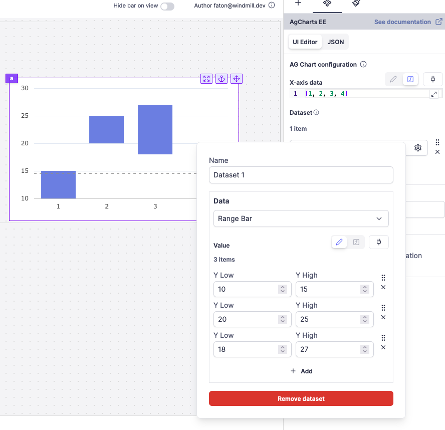

import DocCard from '@site/src/components/DocCard';

# Ag charts

The Ag charts component allows you to display a chart using the [Ag charts](https://charts.ag-grid.com/) library.


<br />

The following section details Ag charts component's specific settings. For more details on the App editor, check the [dedicated documentation](../0_app_editor/index.mdx) or the App editor [Quickstart](../../getting_started/7_apps_quickstart/index.mdx):

<div className="grid grid-cols-2 gap-6 mb-4">
	<DocCard
		color="orange"
		title="App editor Documentation"
		description="The app editor is a low-code builder to create custom User Interfaces with a mix of drag-and-drop and code."
		href="/docs/apps/app_editor"
	/>
	<DocCard
		color="orange"
		title="Apps quickstart"
		description="Learn how to build your first app in a matter of minutes."
		href="/docs/getting_started/apps_quickstart"
	/>
</div>

The configuration is divided into two parts: X-axis data and an array of datasets. Each dataset hold the data for the Y-axis and the configuration for the plot (type, color, etc).

## Configuration

|    Name     | Type | Connectable | Templatable |   Default    | Description                                                                        |
| :---------: | :--: | :---------: | :---------: | :----------: | ---------------------------------------------------------------------------------- |
| X-axis data | json |    true     |    false    | [1, 2, 3, 4] | Horizontal axis values or labels that are used to plot the data points on a chart. |

## Dataset

For each dataset, you can specify the data for the Y-axis and the configuration for the plot (type, color, etc). If you want to have an eval for every data point, you can switch to JSON mode. There can be several datasets.

| Name |                         Type                         | Connectable | Templatable |  Default  | Description               |
| :--: | :--------------------------------------------------: | :---------: | :---------: | :-------: | ------------------------- |
| Name |                        string                        |    false    |    false    | Dataset 1 | The name of your dataset. |
| Data | 'Bar', 'Line' , 'Scatter' , 'Area' ,'Range Bar' (EE) |    false    |    false    |   'Bar'   | The type of chart.        |

Depending on the type of chart, you can configure the following properties:

### Bar, line, scatter, area

| Name  |   Type   | Connectable | Templatable |  Default   | Description            |
| :---: | :------: | :---------: | :---------: | :--------: | ---------------------- |
| value | number[] |    false    |    false    | [25,25,50] | The values of the bar. |

### Range Bar (EE)

| Name  |    Type    | Connectable | Templatable |            Default             | Description            |
| :---: | :--------: | :---------: | :---------: | :----------------------------: | ---------------------- |
| value | number[][] |    false    |    false    | [[25, 50], [25, 50], [50, 75]] | The values of the bar. |



## Dynamically Configure AgGrid

You can use scripts and [connect them](../2_connecting_components/index.mdx) to the dataset, settings or Column Definitions of your AgGrid component to dynamically configure it.

For example, you can control the cellStyle, or whether it's editable.

```py
def main():
    return [
        {
            "field": "id",
            "flex": 1,
            "cellStyle": {"color": "blue", "background-color": "lightblue"},
        },
        {"field": "name", "editable": True, "flex": 1},
        {"field": "age", "flex": 1},
    ]
```

For example, you can control the cellStyle, whether it's editable. Here the first column has a lightblue bg, and the second one is editable.

<video
	className="border-2 rounded-lg object-cover w-full h-full dark:border-gray-800"
	controls
	id="modal-layout"
	src="/videos/dynamic_aggrid.mp4"
	alt="Dynamic AgGrid"
/>

## AgCharts EE

You have to provide a valid license key to use AgCharts EE (Enterprise Edition). You can find more information about AgCharts EE [here](https://charts.ag-grid.com/javascript/licensing/).
