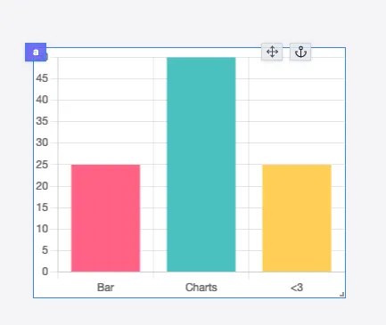

import DocCard from '@site/src/components/DocCard';

# Bar/Line Chart

The Bar Chart component allows you to display a Bar Chart using the [Chart.js](https://www.chartjs.org/) library. It can also be used to display a Line Chart.

The following section details Bar/Line Chart component's specific settings. For more details on the App Editor, check the [dedicated documentation](../0_app_editor/index.mdx) or the App Editor [Quickstart](../../getting_started/7_apps_quickstart/index.mdx):

    <DocCard
        color="orange"
        title="App Editor Documentation"
        description="The app editor is a low-code builder to create apps with components, create interactions with runnables, and configure the app settings."
        href="/docs/apps/app_editor"
    />
    <DocCard
        color="orange"
        title="Apps Quickstart"
        description="Learn how to build your first app in a matter of minutes."
        href="/docs/getting_started/apps_quickstart"
    />

## Bar/Line Chart Input

|  Type  | Connectable | Templatable | Default | Description         |
| :----: | :---------: | :---------: | :-----: | ------------------- |
| Object |    true     |    false    |         | The bar chart data. |

## Bar/Line Chart configuration

| Name  |  Type   | Connectable | Templatable | Default | Description                  |
| ----- | :-----: | :---------: | :---------: | :-----: | ---------------------------- |
| Theme | string  |    false    |    false    | Theme1  | The chart theme.             |
| Line  | boolean |    false    |    false    |  false  | Whether to use a line style. |

## Outputs

| Name    |  Type   | Description                                   |
| ------- | :-----: | --------------------------------------------- |
| result  | Object  | The bar chart data.                           |
| loading | boolean | The loading state of the bar chart component. |
