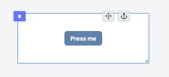

import DocCard from '@site/src/components/DocCard';

# Button

The component triggers a runnable when clicked. If the runnable has parameters, they need to be configured in the component configuration.
The runnable parameters are defined:

- **Static**: the parameter is defined in the component configuration.
- **Connected**: the parameter is connected to an output.

The following section details Button component's specific settings. For more details on the App Editor, check the [dedicated documentation](../0_app_editor/index.mdx) or the App Editor [Quickstart](../../getting_started/7_apps_quickstart/index.mdx):

    <DocCard
        color="orange"
        title="App Editor Documentation"
        description="The app editor is a low-code builder to create custom User Interfaces with components linked to runnables (scripts & flows)."
        href="/docs/apps/app_editor"
    />
    <DocCard
        color="orange"
        title="Apps Quickstart"
        description="Learn how to build your first app in a matter of minutes."
        href="/docs/getting_started/apps_quickstart"
    />

## Button configuration

| Name                |                Type                 | Connectable | Templatable |  Default  | Description                                                |
| ------------------- | :---------------------------------: | :---------: | :---------: | :-------: | ---------------------------------------------------------- |
| label               |               string                |    true     |    false    | Press me  | The button label.                                          |
| color               | blue, red, dark, light, green, gray |    false    |    false    |   blue    | The button color.                                          |
| size                |         xs, sm, md , lg, xl         |    false    |    false    |    sm     | The button size.                                           |
| Fill container      |               boolean               |    false    |    false    |   false   | Whether the button should fill the container.              |
| disabled            |               boolean               |    false    |    false    |   false   | Whether the button should be disabled.                     |
| Before Icon         |               string                |    false    |    false    | Undefined | The icon to display before the label.                      |
| After Icon          |               string                |    false    |    false    | Undefined | The icon to display after the label.                       |
| Trigger on App load |               boolean               |    false    |    false    |   false   | Whether the button script should be triggered on app load. |

Special parameters:

## Button On Success

The button component has a special parameter called `On Success`. This parameter is used to trigger one of the following actions:

- **Do nothing**: the button does nothing after the runnable is executed.
- **Go to an URL**: the button redirects the user to the specified URL after the runnable is executed.
- **Set the tab of a Tabs component**: the button sets the tab of a Tabs component after the runnable is executed.
- **Display a toast**: the button displays a toast after the runnable is executed.

### **Go to an URL configuration:**

| Name    |  Type   | Connectable | Templatable |    Default    | Description                                    |
| ------- | :-----: | :---------: | :---------: | :-----------: | ---------------------------------------------- |
| URL     | string  |    true     |    false    | /apps/get/foo | The URL to redirect the user to.               |
| New Tab | boolean |    false    |    false    |     true      | Whether the URL should be opened in a new tab. |

### **Set the tab of a Tabs component configuration:**

| Name    |               Type                | Connectable | Templatable | Default | Description                                                                             |
| ------- | :-------------------------------: | :---------: | :---------: | :-----: | --------------------------------------------------------------------------------------- |
| Set Tab | Array`<{id: string, index:number}>` |    false    |    false    |   []    | The tabs to set. The id is the id of the Tabs component and the index is the tab index. |

### **Display a toast configuration:**

| Name    |  Type  | Connectable | Templatable |   Default   | Description                          |
| ------- | :----: | :---------: | :---------: | :---------: | ------------------------------------ |
| Message | string |    true     |    false    | Hello there | The message to display in the toast. |

## Outputs

| Name    |  Type   | Description                      |
| ------- | :-----: | -------------------------------- |
| result  |   any   | The result of the runnable.      |
| loading | boolean | The loading state of the button. |
