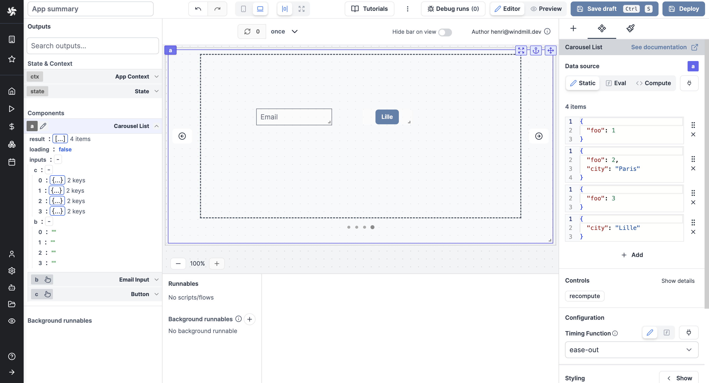

import DocCard from '@site/src/components/DocCard';

# Carousel List

The Carousel List component enables duplication of cards or rows with consistent structure in a carousel, allowing for containment of other components. By default, editing or moving a component will apply changes to all cards or rows, while still allowing customization and exceptions for unique values per component.

<video
	className="border-2 rounded-xl object-cover w-full h-full dark:border-gray-800"
	autoPlay
	controls
	src="/videos/carousel_component.mp4"
	alt="carousel list component"
/>
 

To add a component to a card, you can either click on `Insert` while you select the container, or you can move an existing component by copy/pasting it.

Editing or moving a component will apply changes to all cards or rows.

To customize the settings of components within each time, you can use `iter.index` and `iter.value`.

- `iter.index` will retrieve the index number of each card (0, 1, 2 etc.).

- `iter.value.key` will retrieve the value of each key defined in the `items` section.

List components also support having inputs set inside them. Retrieve the values of each in the `inputs` field of the List component in the [outputs](../2_outputs.mdx) menu.

<video
	className="border-2 rounded-xl object-cover w-full h-full dark:border-gray-800"
	autoPlay
	controls
	src="/videos/list_inputs.mp4"
	alt="List inputs"
/>
 

The following section details Carousel List component's specific settings. For more details on the App Editor, check the [dedicated documentation](../0_app_editor/index.mdx) or the App Editor [Quickstart](../../getting_started/7_apps_quickstart/index.mdx):

	<DocCard
		color="orange"
		title="App Editor Documentation"
		description="The app editor is a low-code builder to create custom User Interfaces with a mix of drag-and-drop and code."
		href="/docs/apps/app_editor"
	/>
	<DocCard
		color="orange"
		title="Apps Quickstart"
		description="Learn how to build your first app in a matter of minutes."
		href="/docs/getting_started/apps_quickstart"
	/>

## Carousel List configuration

| Name             |                              Type                               | Connectable | Templatable | Default  | Description                                                                                                                                         |
| ---------------- | :-------------------------------------------------------------: | :---------: | :---------: | :------: | --------------------------------------------------------------------------------------------------------------------------------------------------- |
| Items            |                              array                              |    true     |    false    | 3 items  | The Carousel List items in JSON.                                                                                                                    |
| Timing Fonctions | select ("linear", "ease", "ease-in", "ease-out", "ease-in-out") |    true     |    false    | "linear" | Sets how an animation progresses through the duration of each cycle, see https://developer.mozilla.org/en-US/docs/Web/CSS/animation-timing-function |

## Outputs

| Name    |  Type   | Description                         |
| ------- | :-----: | ----------------------------------- |
| result  |   any   | The result of the list component.   |
| loading | boolean | The loading state of the component. |
| inputs  |   any   | The inputs of the component.        |
