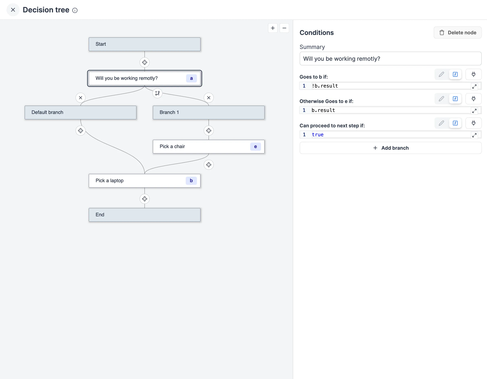
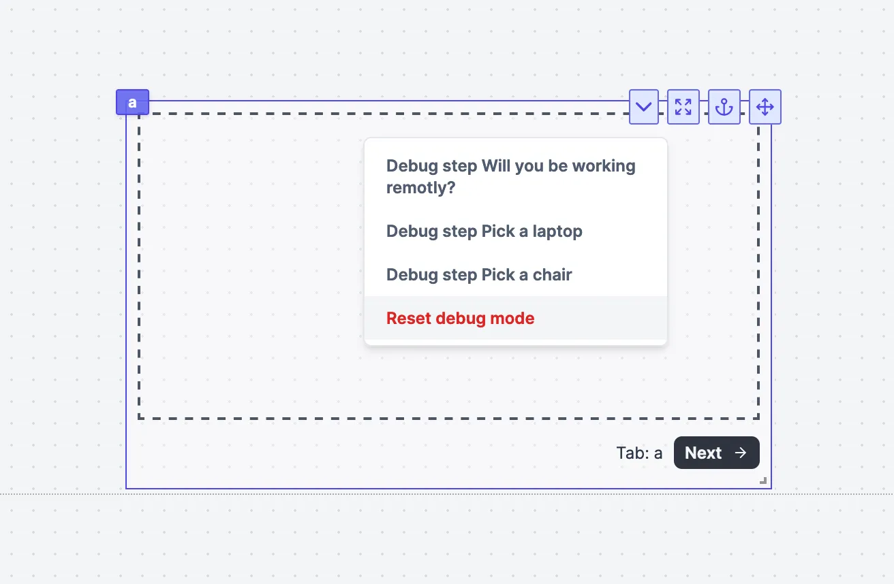
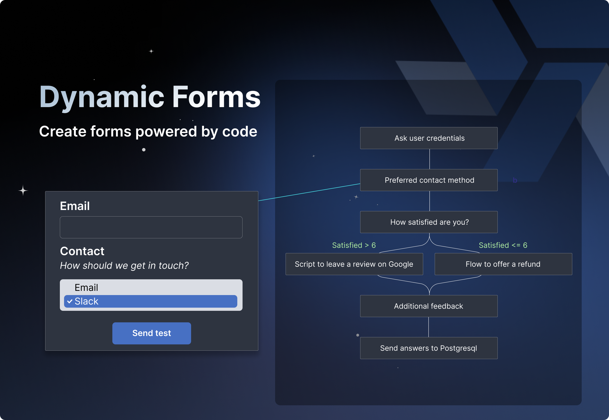

import DocCard from '@site/src/components/DocCard';

# Decision Tree

This component allows you to create a decision tree. The decision tree is controlled by a flow-like structure. Each node in the tree represents a decision point and can lead to one or more subsequent nodes based on specified conditions.

## Flow actions

You can directly interact with the flow using the following actions:

- **Add a node**: Add a new node to the flow.
- **Delete**: Delete the flow.
- **Add a branch**: Add a new branch to the flow.
- **Delete a branch**: Delete a branch from the flow. It deletes the node and all its children.

<video
	className="border-2 rounded-xl object-cover w-full h-full dark:border-gray-800"
	controls
	src="/videos/dt-interactions.mp4"
/>

## Node settings

Each node has the following settings:

- **Summary**: The summary of the node.
- **ID**: The ID of the node.
- **Conditions**: The conditions that select the next node. The conditions are evaluated in the order they are specified. The first condition that evaluates to true is used to select the next node. When we have only one condition, the condition is always true and the node is always selected.
- **Allowed**: Whether or not we can go to the next node. If false, the next button is disabled.

## Node actions

Each node has the following actions:

- **Add a branch**: Add a new branch to the node.
- **Delete**: Delete the node.

## Component actions

The component start with a root node. The root node is the first node of the decision tree. It is the only node that has no parent. The root node is always selected when the component is loaded.

The component has the following actions:

- **Next**: Go to the next node. Use the conditions of the current node to select the next node. Is disabled when the current node has no next node or when the current node is not allowed to go to the next node.
- **Previous**: Go to the previous node. Goes to the first parent node it can find.

The curent node is displayed in the component next to the actions.

## Component debug

Using the debug menu, you can jump to any node in the decision tree. This is useful to test the different branches of the decision tree.

## Example

In this example, we create a decision tree to make an onboarding process.

The app is available on the Hub:
[On boarding example](https://hub.windmill.dev/apps/20/decision-tree---on-boarding-example)

<video
	className="border-2 rounded-xl object-cover w-full h-full dark:border-gray-800"
	controls
	src="/videos/dt-onsite.mp4"
/>

<video
	className="border-2 rounded-xl object-cover w-full h-full dark:border-gray-800"
	controls
	src="/videos/dt-remote.mp4"
/>

## Advanced tutorial

Advanced tutorial at:

	<DocCard
		title="Blog - Create a Dynamic Form Empowered by Code"
		description="Create your own TypeForm-like dynamic form and embed scripts & flows"
		href="/blog/dynamic-form"
	/>

For more details on the App Editor, check the [dedicated documentation](../0_app_editor/index.mdx) or the App Editor [Quickstart](../../getting_started/7_apps_quickstart/index.mdx):

	<DocCard
		color="orange"
		title="App Editor Documentation"
		description="The app editor is a low-code builder to create custom User Interfaces with a mix of drag-and-drop and code."
		href="/docs/apps/app_editor"
	/>
	<DocCard
		color="orange"
		title="Apps Quickstart"
		description="Learn how to build your first app in a matter of minutes."
		href="/docs/getting_started/apps_quickstart"
	/>

