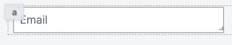

import DocCard from '@site/src/components/DocCard';

# Email Input

The email input component allows you to get an email from the user.

The following section details Email Input component's specific settings. For more details on the App editor, check the [dedicated documentation](../0_app_editor/index.mdx) or the App editor [Quickstart](../../getting_started/7_apps_quickstart/index.mdx):

	<DocCard
		color="orange"
		title="App editor Documentation"
		description="The app editor is a low-code builder to create custom User Interfaces with a mix of drag-and-drop and code."
		href="/docs/apps/app_editor"
	/>
	<DocCard
		color="orange"
		title="Apps quickstart"
		description="Learn how to build your first app in a matter of minutes."
		href="/docs/getting_started/apps_quickstart"
	/>

## Email Input configuration

| Name          |  Type   | Connectable | Templatable |  Default  | Description                                |
| ------------- | :-----: | :---------: | :---------: | :-------: | ------------------------------------------ |
| Placeholder   | string  |    false    |    false    |   Email   | The email input placeholder.               |
| Default value | string  |    true     |    false    |   Email   | The email input default value.             |
| Before Icon   | string  |    false    |    false    | Undefined | The icon to display before the label.      |
| After Icon    | string  |    false    |    false    | Undefined | The icon to display after the label.       |
| Disabled      | boolean |    false    |    false    |   false   | Whether the text input should be disabled. |

## Outputs

| Name   |  Type  | Description            |
| ------ | :----: | ---------------------- |
| Result | string | The email input value. |
