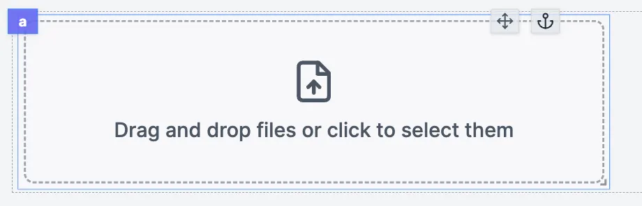
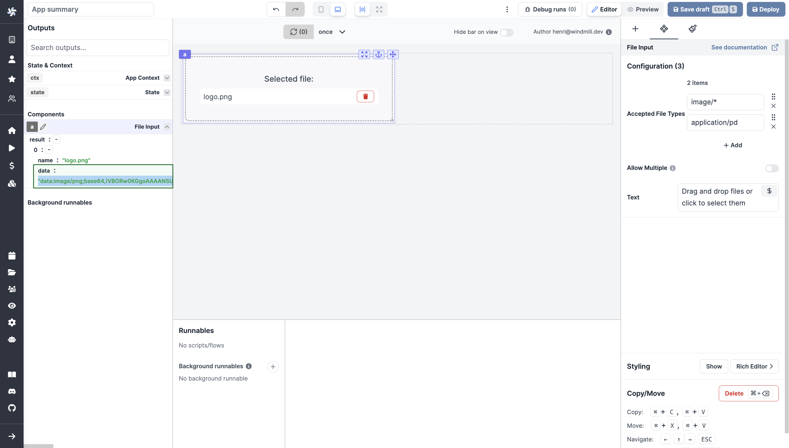

import DocCard from '@site/src/components/DocCard';

# File Input

The file input allows users to drop files into the app.

Files uploaded are converted and returned as a data URL scheme with a [Base64 encoded string](../../core_concepts/18_files_binary_data/index.mdx).

The following section details File Input component's specific settings. For more details on the App Editor, check the [dedicated documentation](../0_app_editor/index.mdx) or the App Editor [Quickstart](../../getting_started/7_apps_quickstart/index.mdx):

    <DocCard
        color="orange"
        title="App Editor Documentation"
        description="The app editor is a low-code builder to create apps with components, create interactions with runnables (scripts & flows), and configure the app settings."
        href="/docs/apps/app_editor"
    />
    <DocCard
        color="orange"
        title="Apps Quickstart"
        description="Learn how to build your first app in a matter of minutes."
        href="/docs/getting_started/apps_quickstart"
    />

## File Input configuration

| Name                |  Type   | Connectable | Templatable |                   Default                   | Description                                                    |
| ------------------- | :-----: | :---------: | :---------: | :-----------------------------------------: | -------------------------------------------------------------- |
| Accepted File Types |  array  |    false    |    false    |       "image/\*" ; "application/pdf"        | The types of files you accept to be submitted.                 |
| Allow Multiple      | boolean |    false    |    false    |                    false                    | If allowed, the user will be able to select more than one file |
| Text                | string  |    false    |    false    | Drag and drop files or click to select them | The text displayed on the file input.                          |

## Outputs

| Name   |  Type  | Description                  |
| ------ | :----: | ---------------------------- |
| result | string | The name of the loaded file. |
