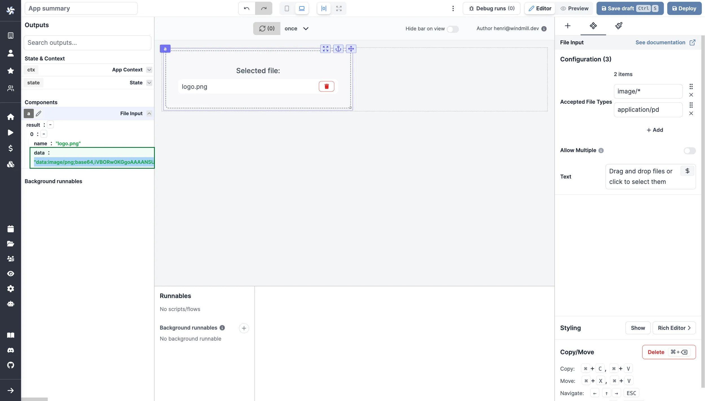

import DocCard from '@site/src/components/DocCard';

# File Input

The file input allows users to drop files into the app.

Files uploaded are converted and returned as a data URL scheme with a [Base64 encoded string](../../core_concepts/18_files_binary_data/index.mdx).

The following section details File Input component's specific settings. For more details on the App editor, check the [dedicated documentation](../0_app_editor/index.mdx) or the App editor [Quickstart](../../getting_started/7_apps_quickstart/index.mdx):

	<DocCard
		color="orange"
		title="App editor Documentation"
		description="The app editor is a low-code builder to create custom User Interfaces with a mix of drag-and-drop and code."
		href="/docs/apps/app_editor"
	/>
	<DocCard
		color="orange"
		title="Apps quickstart"
		description="Learn how to build your first app in a matter of minutes."
		href="/docs/getting_started/apps_quickstart"
	/>

## File Input configuration

| Name                |  Type   | Connectable | Templatable |                   Default                   | Description                                                    |
| ------------------- | :-----: | :---------: | :---------: | :-----------------------------------------: | -------------------------------------------------------------- |
| Accepted File Types |  array  |    false    |    false    |       "image/\*" ; "application/pdf"        | The types of files you accept to be submitted.                 |
| Allow Multiple      | boolean |    false    |    false    |                    false                    | If allowed, the user will be able to select more than one file |
| Text                | string  |    false    |    false    | Drag and drop files or click to select them | The text displayed on the file input.                          |
| Include Mime Type   | boolean |    false    |    false    |                    false                    | If enabled, the mime type of the file will be included.        |
| Submitted File Text | string  |    false    |    false    |                Selected file                | The text displayed when a file is submitted.                   |
| Disabled            | boolean |    false    |    false    |                    false                    | The state of the file input.                                   |

## Outputs

| Name   | Type  | Description                                                                                                                |
| ------ | :---: | -------------------------------------------------------------------------------------------------------------------------- |
| result | array | An array of objects with a `name` and `data` key.    `data` is the base64-encoded contents of the uploaded file(s). |

## Event handler

The file component has the following event handler:

- `onFileChange`: Trigger one or more runnables when the user uploads a file.
