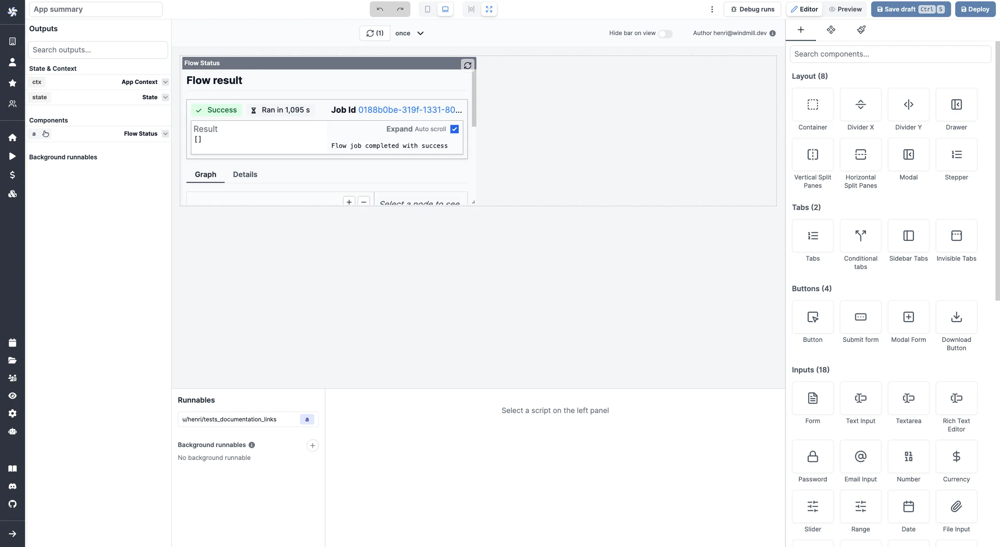

import DocCard from '@site/src/components/DocCard';

# Flow Status

The Flow Status component allows you to display the status of a flow.

The following section details Flow Status component's specific settings. For more details on the App Editor, check the [dedicated documentation](../0_app_editor/index.mdx) or the App Editor [Quickstart](../../getting_started/7_apps_quickstart/index.mdx):

    <DocCard
        color="orange"
        title="App Editor Documentation"
        description="The app editor is a low-code builder to create custom User Interfaces with components linked to runnables (scripts & flows)."
        href="/docs/apps/app_editor"
    />
    <DocCard
        color="orange"
        title="Apps Quickstart"
        description="Learn how to build your first app in a matter of minutes."
        href="/docs/getting_started/apps_quickstart"
    />

## Flow Status configuration

| Name        | Type | Connectable | Templatable | Default | Description                 |
| ----------- | :--: | :---------: | :---------: | :-----: | --------------------------- |
| Data Source |      |    true     |             |         | The flow to display status. |

## Outputs

| Name    |  Type   | Description                         |
| ------- | :-----: | ----------------------------------- |
| result  |         | The result of the runnable.         |
| loading | boolean | The loading state of the component. |
