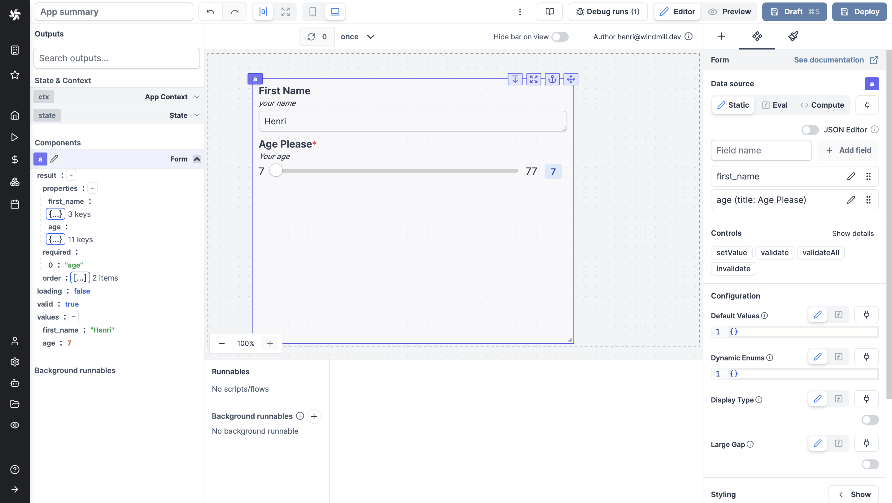
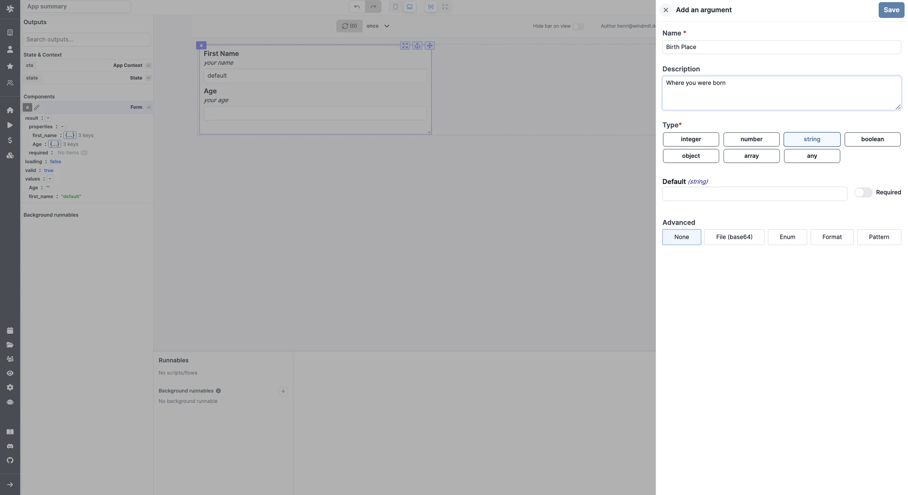

import DocCard from '@site/src/components/DocCard';

# Form

The Form component allows you to create a form and get answers from the user.

The following section details Form component's specific settings. For more details on the App editor, check the [dedicated documentation](../0_app_editor/index.mdx) or the App editor [Quickstart](../../getting_started/7_apps_quickstart/index.mdx):

	<DocCard
		color="orange"
		title="App editor Documentation"
		description="The app editor is a low-code builder to create custom User Interfaces with a mix of drag-and-drop and code."
		href="/docs/apps/app_editor"
	/>
	<DocCard
		color="orange"
		title="Apps quickstart"
		description="Learn how to build your first app in a matter of minutes."
		href="/docs/getting_started/apps_quickstart"
	/>

## Data source

Fields are called property, they can be added as eval or [connected to other components](../2_connecting_components/index.mdx). They can be seen and filled as JSON.

<video
	className="border-2 rounded-lg object-cover w-full h-full dark:border-gray-800"
	controls
	src="/videos/arguments_form.mp4"
/>

## Controls

This component can be controlled by [frontend scripts](../3_app-runnable-panel.mdx#frontend-scripts) using these functions:

**setValue**

The [setValue](../3_app-runnable-panel.mdx#setvalue) function is meant to set or force the value of a component. This can be convenient in cases where connection is not the easiest pattern. Note that it's a bad idea to mix dynamic default value and setValue together.

`setValue(id: string, value: any)`

**validate**

Make a specific field of a form in a Validate state.

`validate(id: string, key: string)`

**validateAll**

Make all fields of a form in a Validate state.

`validateAll(id: string, key: string)`

**invalidate**

Invalidate a specific field of a form

`invalidate(id: string, key: string, error: string)`

	<DocCard
		color="orange"
		title="Runnable editor"
		description="Learn how to create and configure Apps runnables."
		href="/docs/apps/app-runnable-panel"
	/>

## Form configuration

| Name           |  Type   | Connectable | Templatable | Default | Description                                                                                                                |
| -------------- | :-----: | :---------: | :---------: | :-----: | -------------------------------------------------------------------------------------------------------------------------- |
| Display Type   | boolean |    true     |    false    |  false  | This will display the type and/or the format on the field next to the label.                                               |
| Large Gap      | boolean |    true     |    false    |  false  | This will add a large gap between the field elements.                                                                      |
| Default values | object  |    true     |    false    |   {}    | This enables setting default form values dynamically using an object: keys are field names, and values are the defaults.   |
| Default enums  | object  |    true     |    false    |   {}    | This enables setting form enum values dynamically using an object: keys are field names, and values are arrays of strings. |

Each argument can be configured (name, description, type, default value, advanced parameters).

## Outputs

| Name       |         Type          | Description                                     |
| ---------- | :-------------------: | ----------------------------------------------- |
| properties |        string         | Type, description and default of each argument. |
| loading    |        boolean        | The loading state of the text component.        |
| valid      |        boolean        |                                                 |
| values     | same as each argument | Value of each answer by the user.               |
