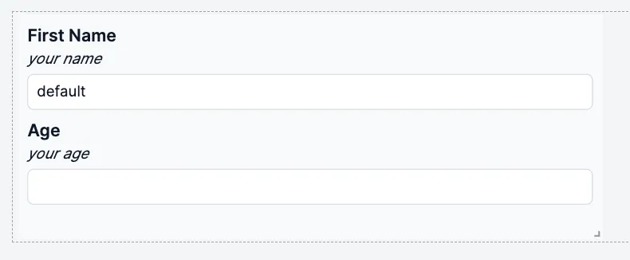

import DocCard from '@site/src/components/DocCard';

# Form Input

The form input component allows you to create a form and get answers from the user.

The following section details Form Input component's specific settings. For more details on the App Editor, check the [dedicated documentation](../0_app_editor/index.mdx) or the App Editor [Quickstart](../../getting_started/7_apps_quickstart/index.mdx):

    <DocCard
        color="orange"
        title="App Editor Documentation"
        description="The app editor is a low-code builder to create apps with components, create interactions with runnables (scripts & flows), and configure the app settings."
        href="/docs/apps/app_editor"
    />
    <DocCard
        color="orange"
        title="Apps Quickstart"
        description="Learn how to build your first app in a matter of minutes."
        href="/docs/getting_started/apps_quickstart"
    />

## Form Input configuration

| Name         |  Type   | Connectable | Templatable | Default | Description                                                                  |
| ------------ | :-----: | :---------: | :---------: | :-----: | ---------------------------------------------------------------------------- |
| Display Type | boolean |    false    |    false    |  false  | This will display the type and/or the format on the field next to the label. |
| Large Gap    | boolean |    false    |    false    |  false  | This will add a large gap between the field elements.                        |

Each argument can be configured (name, description, type, default value, advanced parameters).

## Outputs

| Name       |         Type          | Description                                     |
| ---------- | :-------------------: | ----------------------------------------------- |
| properties |        string         | Type, description and default of each argument. |
| loading    |        boolean        | The loading state of the text component.        |
| valid      |        boolean        |                                                 |
| values     | same as each argument | Value of each answer by the user.               |
