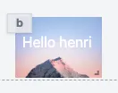

import DocCard from '@site/src/components/DocCard';

# HTML

The HTML component allows you to display HTML content.



The following section details HTML component's specific settings. For more details on the App Editor, check the [dedicated documentation](../0_app_editor/index.mdx) or the App Editor [Quickstart](../../getting_started/7_apps_quickstart/index.mdx):

<div className="grid grid-cols-2 gap-6 mb-4">
	<DocCard
		color="orange"
		title="App Editor Documentation"
		description="The app editor is a low-code builder to create custom User Interfaces with a mix of drag-and-drop and code."
		href="/docs/apps/app_editor"
	/>
	<DocCard
		color="orange"
		title="Apps Quickstart"
		description="Learn how to build your first app in a matter of minutes."
		href="/docs/getting_started/apps_quickstart"
	/>
</div>

## Data source

|  Type  | Connectable | Templatable |                                          Default                                          | Description                |
| :----: | :---------: | :---------: | :---------------------------------------------------------------------------------------: | -------------------------- |
| string |    true     |    true     | `<h1 class="absolute top-4 left-2 text-white">Hello ${ctx.username}</h1>` | The HTML content to render |

## Controls

This component can be controlled by [frontend scripts](../3_app-runnable-panel.mdx#frontend-scripts) using these functions:

| Name   |        Parameters        | Description          | Example       |
| ------ | :----------------------: | -------------------- | ------------- |
| [recompute](../3_app-runnable-panel.mdx#recompute) | id: string | Recompute a component. | recompute('a'); |

## Outputs

| Name    |  Type   | Description                              |
| ------- | :-----: | ---------------------------------------- |
| result  | string  | The HTML.                                |
| loading | boolean | The loading state of the HTML component. |

## Calling Frontend runnables

You can call frontend runnable from your HTML component. To do so, you can use the following syntax:

```html
<button onclick="window.parent.postMessage('Hello');">Say Hello</button>
```

You can now catch the message in your frontend runnable:

```js
window.addEventListener(
	'message',
	(event) => {
		if (event.data === 'hello') {
			alert('hello');
			// You also interact with the app state here for example
		}
	},
	false
);
```
