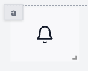

import DocCard from '@site/src/components/DocCard';

# Icon

The Icon API allows you to display an icon chosen in a library of icons.

The following section details Icon component's specific settings. For more details on the App editor, check the [dedicated documentation](../0_app_editor/index.mdx) or the App editor [Quickstart](../../getting_started/7_apps_quickstart/index.mdx):

	<DocCard
		color="orange"
		title="App editor Documentation"
		description="The app editor is a low-code builder to create custom User Interfaces with a mix of drag-and-drop and code."
		href="/docs/apps/app_editor"
	/>
	<DocCard
		color="orange"
		title="Apps quickstart"
		description="Learn how to build your first app in a matter of minutes."
		href="/docs/getting_started/apps_quickstart"
	/>

## Icon configuration

| Name         |  Type  | Connectable | Templatable |   Default    | Description                   |
| ------------ | :----: | :---------: | :---------: | :----------: | ----------------------------- |
| Icon         | string |    true     |    false    |    Smile     | The actual icon.              |
| Color        | string |    true     |    false    | currentColor | The color of the icon.        |
| Size         | number |    false    |    false    |      24      | The size of the icon.         |
| Stroke Width | number |    false    |    false    |      2       | The width of the icon stroke. |
