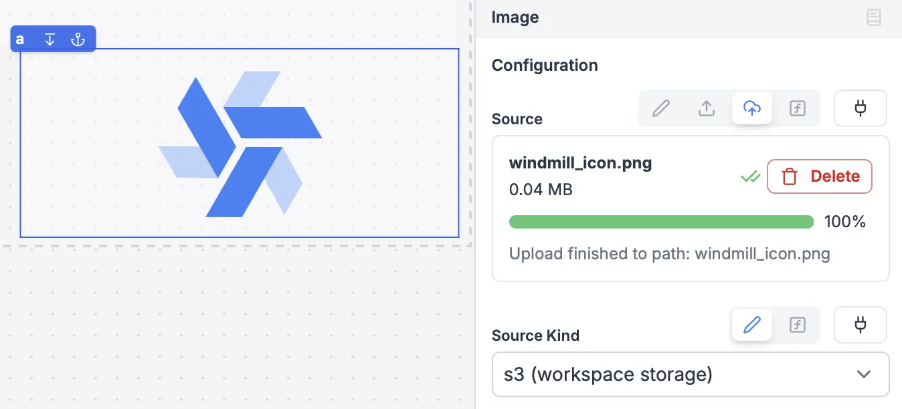

import DocCard from '@site/src/components/DocCard';

# Image

The Image component allows you to upload and display an image. There are two options for the image upload: upload as base64 embedded image recommended for small images and upload to s3, which is recommended for larger images or if you have multiple images.

The following section details Image component's specific settings. For more details on the App editor, check the [dedicated documentation](../0_app_editor/index.mdx) or the App editor [Quickstart](../../getting_started/7_apps_quickstart/index.mdx):

	<DocCard
		color="orange"
		title="App editor Documentation"
		description="The app editor is a low-code builder to create custom User Interfaces with a mix of drag-and-drop and code."
		href="/docs/apps/app_editor"
	/>
	<DocCard
		color="orange"
		title="Apps quickstart"
		description="Learn how to build your first app in a matter of minutes."
		href="/docs/getting_started/apps_quickstart"
	/>

## Image configuration

| Name      |             Type             | Connectable | Templatable |  Default  | Description                                                        |
| --------- | :--------------------------: | :---------: | :---------: | :-------: | ------------------------------------------------------------------ |
| Source    |            string            |    true     |    false    | /logo.svg | The image.                                                         |
| Source Kind   | string: url, base64, s3  |    true     |    false    | url       | Source kind, one of bas64 (jpg,png,svg), url, or s3 url (workspace storage) |
| Image Fit | string: contain, cover, fill |    false    |    false    |  contain  | How the image will fit the component box.                          |
| Alt text  |            string            |    false    |    false    |     /     | This text will appear if the image can't be loaded for any reason. |

## Outputs

| Name    |  Type   | Description                               |
| ------- | :-----: | ----------------------------------------- |
| loading | boolean | The loading state of the Image component. |
