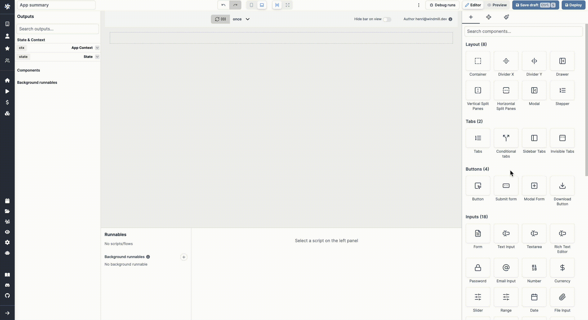

import DocCard from '@site/src/components/DocCard';

# Invisible tabs

The Invisible tabs component is basically a Tabs component whose `Tabs Kind` is "Invisible", meaning the tabs labels are not visible by the user.

The following section details Invisible tabs component's specific settings. For more details on the App editor, check the [dedicated documentation](../0_app_editor/index.mdx) or the App editor [Quickstart](../../getting_started/7_apps_quickstart/index.mdx):

	<DocCard
		color="orange"
		title="App editor Documentation"
		description="The app editor is a low-code builder to create custom User Interfaces with a mix of drag-and-drop and code."
		href="/docs/apps/app_editor"
	/>
	<DocCard
		color="orange"
		title="Apps quickstart"
		description="Learn how to build your first app in a matter of minutes."
		href="/docs/getting_started/apps_quickstart"
	/>

## Controls

This component can be controlled by [frontend scripts](../3_app-runnable-panel.mdx#frontend-scripts) using these functions:

| Name   |        Parameters        | Description          | Example       |
| ------ | :----------------------: | -------------------- | ------------- |
| [setTab](../3_app-runnable-panel.mdx#settab) | id: string, index:number | Set the current tab. | setTab('a',1) |

## Outputs

| Name             |  Type  | Description                         |
| ---------------- | :----: | ----------------------------------- |
| selectedTabIndex | number | The index of the selected condition |

## Event handler

The stepper component has the following event handlers

- `onTabChange`: Trigger one of more runnables when the user changes the tab.
