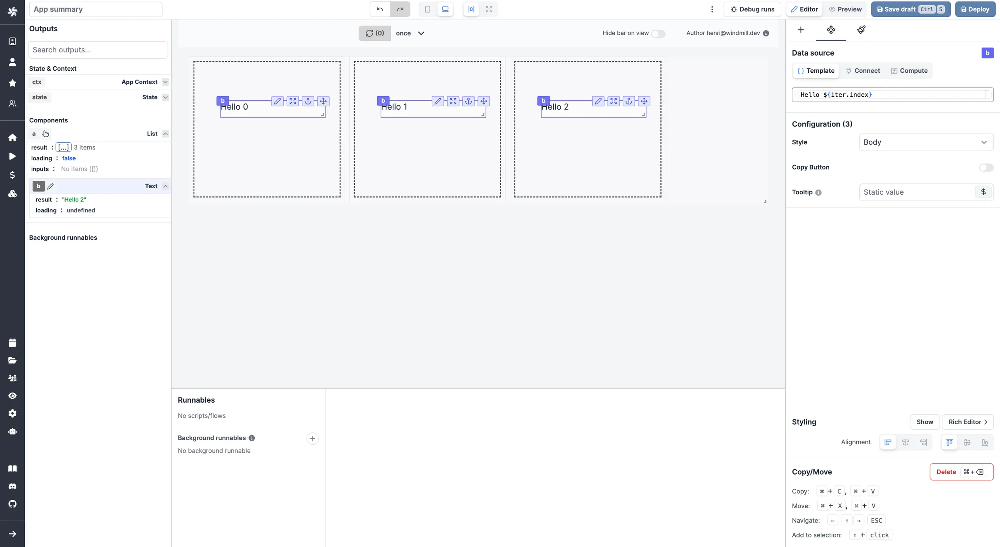

import DocCard from '@site/src/components/DocCard';

# List

The List component enables duplication of cards or rows with consistent structure, allowing for containment of other components. By default, editing or moving a component will apply changes to all cards or rows, while still allowing customization and exceptions for unique values per component.

<video
	className="border-2 rounded-lg object-cover w-full h-full dark:border-gray-800"
	autoPlay
	controls
	src="/videos/list_component.mp4"
	alt="list component"
/>
<br />

To add a component to a list, you can either click on `Insert` while you select the container, or you can move an existing component by copy/pasting it.

Editing or moving a component will apply changes to all cards or rows.

To customize the settings of components within each time, you can use `iter.index` and `iter.value`.

- `iter.index` will retrieve the index number of each card (0, 1, 2 etc.).



- `iter.value.key` will retrieve the value of each key defined in the `items` section.

<video
	className="border-2 rounded-lg object-cover w-full h-full dark:border-gray-800"
	autoPlay
	controls
	src="/videos/iter.value.mp4"
	alt="iter.value"
/>
<br />

List components also support having inputs set inside them. Retrieve the values of each in the `inputs` field of the List component in the [outputs](../2_outputs.mdx) menu.

<video
	className="border-2 rounded-lg object-cover w-full h-full dark:border-gray-800"
	autoPlay
	controls
	src="/videos/list_inputs.mp4"
	alt="List inputs"
/>
<br />

The following section details List component's specific settings. For more details on the App Editor, check the [dedicated documentation](../0_app_editor/index.mdx) or the App Editor [Quickstart](../../getting_started/7_apps_quickstart/index.mdx):

<div className="grid grid-cols-2 gap-6 mb-4">
	<DocCard
		color="orange"
		title="App Editor Documentation"
		description="The app editor is a low-code builder to create custom User Interfaces with a mix of drag-and-drop and code."
		href="/docs/apps/app_editor"
	/>
	<DocCard
		color="orange"
		title="Apps Quickstart"
		description="Learn how to build your first app in a matter of minutes."
		href="/docs/getting_started/apps_quickstart"
	/>
</div>

## Controls

This component can be controlled by [frontend scripts](../3_app-runnable-panel.mdx#frontend-scripts) using these functions:

**recompute**

Use the `recompute` function to recompute a component.

Syntax:

```js
recompute(id: string)
```

Parameters:

`id` string
The id of the component to recompute.

Example:

```js
recompute('a');
```

<div className="grid grid-cols-2 gap-6 mb-4">
	<DocCard
		color="orange"
		title="Runnable Editor"
		description="Learn how to create and configure Apps runnables."
		href="/docs/apps/app-runnable-panel"
	/>
</div>

## List configuration

| Name            |  Type   | Connectable | Templatable |        Default        | Description                                                                                                                                                                                                                                                                                                       |
| --------------- | :-----: | :---------: | :---------: | :-------------------: | ----------------------------------------------------------------------------------------------------------------------------------------------------------------------------------------------------------------------------------------------------------------------------------------------------------------- |
| items           |  array  |    true     |    false    |        3 items        | The list items.                                                                                                                                                                                                                                                                                                   |
| item keys       | string  |    true     |    false    |    `"foo": 1` ...     | The keys of each card.                                                                                                                                                                                                                                                                                            |
| Width           | string  |    false    |    false    |        "Card"         | Whether items should be "Card" of "Full Row".                                                                                                                                                                                                                                                                     |
| Min Width Px    | number  |    true     |    true     |          300          | The minimum width in pixels. Only applies when "Width" is set to Card                                                                                                                                                                                                                                             |
| Height Px       | number  |    true     |    true     |          280          | The height in pixels.                                                                                                                                                                                                                                                                                             |
| Pagination      | string  |    false    |    false    | "Managed by runnable" | Pagination can be managed using two methods: By the component: Based on a specified page size, the component divides the array into several pages. By the runnable: The component shows all items, leaving the task of pagination to the runnable. The current page number is available in the component outputs. |
| Page count      | number  |    false    |    false    |           1           | The number of pages. Only applies when pagination is managed by the runnable.                                                                                                                                                                                                                                     |
| Page size       | number  |    false    |    false    |           3           | The number of items per page. Only applies when pagination is managed by component.                                                                                                                                                                                                                               |
| Display borders | boolean |    false    |    false    |         true          | Whether to display borders around the list items.                                                                                                                                                                                                                                                                 |

## Outputs

| Name    |  Type   | Description                         |
| ------- | :-----: | ----------------------------------- |
| result  |   any   | The result of the list component.   |
| loading | boolean | The loading state of the component. |
| inputs  |   any   | The inputs of the component.        |
| page    | number  | The current page number.            |
