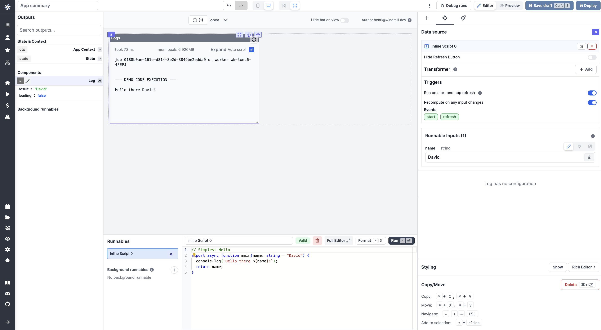

import DocCard from '@site/src/components/DocCard';

# Log Display

The Log Display component allows you to display the logs of a Runnable by providing its [Job](../../core_concepts/20_jobs/index.mdx) id.

The following section details Log Display component's specific settings. For more details on the App Editor, check the [dedicated documentation](../0_app_editor/index.mdx) or the App Editor [Quickstart](../../getting_started/7_apps_quickstart/index.mdx):

	<DocCard
		color="orange"
		title="App Editor Documentation"
		description="The app editor is a low-code builder to create custom User Interfaces with a mix of drag-and-drop and code."
		href="/docs/apps/app_editor"
	/>
	<DocCard
		color="orange"
		title="Apps Quickstart"
		description="Learn how to build your first app in a matter of minutes."
		href="/docs/getting_started/apps_quickstart"
	/>

## Log Display configuration

| Name        | Type | Connectable | Templatable | Default | Description                 |
| ----------- | :--: | :---------: | :---------: | :-----: | --------------------------- |
| Job Id |  string  |    true     |      false       |         | The [job id](../../core_concepts/20_jobs/index.mdx) of the run to display logs. |

## Outputs

| Name    |  Type   | Description                         |
| ------- | :-----: | ----------------------------------- |
| result  |     string    | The result of the runnable.   |
| loading | boolean | The loading state of the component. |
| Job Id |  string  | The [job id](../../core_concepts/20_jobs/index.mdx) of the run to display logs. |