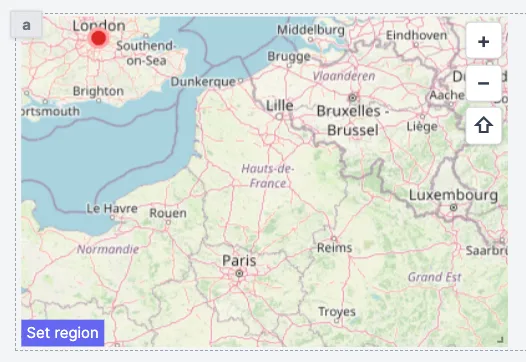

import DocCard from '@site/src/components/DocCard';

# Map

The Map component allows you to display an interactive map.

The following section details Map component's specific settings. For more details on the App editor, check the [dedicated documentation](../0_app_editor/index.mdx) or the App editor [Quickstart](../../getting_started/7_apps_quickstart/index.mdx):

	<DocCard
		color="orange"
		title="App editor Documentation"
		description="The app editor is a low-code builder to create custom User Interfaces with a mix of drag-and-drop and code."
		href="/docs/apps/app_editor"
	/>
	<DocCard
		color="orange"
		title="Apps quickstart"
		description="Learn how to build your first app in a matter of minutes."
		href="/docs/getting_started/apps_quickstart"
	/>

## Map configuration

| Name      |  Type   | Connectable | Templatable | Default | Description                              |
| --------- | :-----: | :---------: | :---------: | :-----: | ---------------------------------------- |
| Longitude | number  |    true     |    false    |   15    | The longitude of the center of the map.  |
| Latitude  | number  |    true     |    false    |   50    | The latitude of the center of the map.   |
| Zoom      | number  |    true     |    false    |    3    | The zoom of the map.                     |
| Markers   | object  |    true     |    false    |         | The map data.                            |
| Lock      | boolean |    false    |    false    |  false  | Lock the map to prevent user interaction |

## Outputs

| Name                   |  Type  | Description                                                 |
| ---------------------- | :----: | ----------------------------------------------------------- |
| Map region             | string | The region where the displayed map is located.              |
| topLeft lat & long     | number | Latitude & longitude of the top left corner of the map.     |
| bottomRight lat & long | number | Latitude & longitude of the bottom right corner of the map. |
