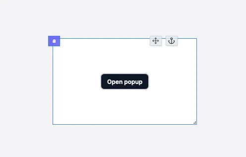

import DocCard from '@site/src/components/DocCard';

# Modal Form

The form modal component allows you to create a form. It has a submit button that triggers a runnable when clicked. The form is displayed in a modal, which can be opened by clicking on a button.

The runnable parameters are defined:

- **Static**: the parameter is defined in the component configuration.
- **User input**: the parameter is defined by the user input.
- **Connected**: the parameter is connected to an output.

Only user inputs are displayed in the form in the modal.

The following section details Modal Form component's specific settings. For more details on the App Editor, check the [dedicated documentation](../0_app_editor/index.mdx) or the App Editor [Quickstart](../../getting_started/7_apps_quickstart/index.mdx):

    <DocCard
        color="orange"
        title="App Editor Documentation"
        description="The app editor is a low-code builder to create apps with components, create interactions with runnables (scripts & flows), and configure the app settings."
        href="/docs/apps/app_editor"
    />
    <DocCard
        color="orange"
        title="Apps Quickstart"
        description="Learn how to build your first app in a matter of minutes."
        href="/docs/getting_started/apps_quickstart"
    />

## Form Modal configuration

| Name  |                Type                 | Connectable | Templatable |  Default   | Description       |
| ----- | :---------------------------------: | :---------: | :---------: | :--------: | ----------------- |
| label |               string                |    true     |    false    | Open popup | The button label. |
| color | blue, red, dark, light, green, gray |    false    |    false    |    dark    | The button color. |
| size  |         xs, sm, md , lg, xl         |    false    |    false    |     sm     | The button size.  |

:::info
The button label is used as the modal title.
:::

:::info
The form modal component has a special parameter called `On Success`. See the button component for more information.
:::

## Outputs

| Name    |  Type   | Description                      |
| ------- | :-----: | -------------------------------- |
| result  |   any   | The result of the runnable.      |
| loading | boolean | The loading state of the button. |
