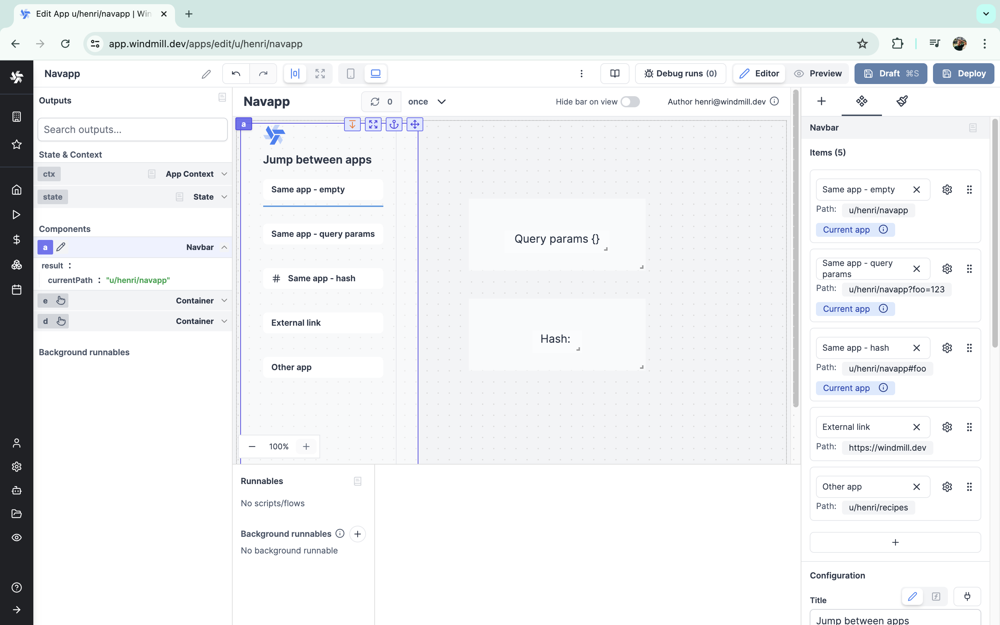
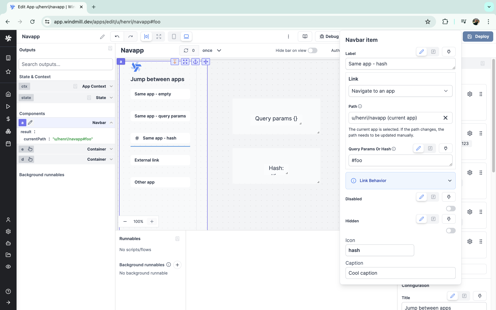
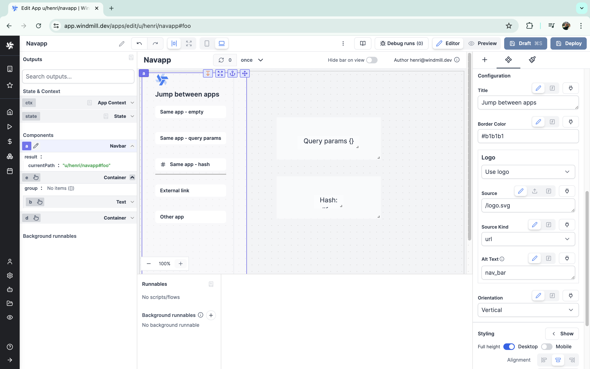

import DocCard from '@site/src/components/DocCard';

# Navbar

The navbar component facilitates control over an app by changing its `ctx.query`, enabling:
1. Changing the behavior of the app by manipulating the query arguments and hash of the URL.
2. Opening an external URL in a new tab.
3. Opening another Windmill app, which allows for creating embedded apps where the user navigates between several of your Windmill apps.

<iframe
	style={{ aspectRatio: '16/9' }}
	src="https://www.youtube.com/embed/-COM6XozpIc"
	title="Navbar component video"
	frameBorder="0"
	allow="accelerometer; autoplay; clipboard-write; encrypted-media; gyroscope; picture-in-picture; web-share"
	allowFullScreen
	className="border-2 rounded-lg object-cover w-full dark:border-gray-800"
></iframe>

 

The following section details Navbar's specific settings. For more details on the App editor, check the [dedicated documentation](../0_app_editor/index.mdx) or the App editor [Quickstart](../../getting_started/7_apps_quickstart/index.mdx):

	<DocCard
		color="orange"
		title="App editor Documentation"
		description="The app editor is a low-code builder to create custom User Interfaces with a mix of drag-and-drop and code."
		href="/docs/apps/app_editor"
	/>
	<DocCard
		color="orange"
		title="Apps quickstart"
		description="Learn how to build your first app in a matter of minutes."
		href="/docs/getting_started/apps_quickstart"
	/>

## Items

The buttons displayed in your navbar components are configured as items. It is possible to add as many items as desired. Most configurations of each item can be manipulated [dynamically](../2_connecting_components/index.mdx).

The configuration for each item is:

| Name        |  Type  | Connectable | Templatable |    Default    | Description                                 |
| ----------- | :----: | :---------: | :---------: | :-----------: | ------------------------------------------- |
| Label       | string |    true     |    false    | "No label" | The label of the item, displayed on the button.|
| Link | select |    false     |    false    | Navigate to an app  | "Navigate to an app" or  "Navigate to an external URL".|
| Path | string |    false     |    false    | `Path of the current app`  | If "Navigate to an app", path to the said app.|
| Query Params or Hash | string |    true     |    false    | `Empty`  | Query parameters or hash to append to the URL. For example, `?key=value` or `#hash`.|
| Disabled    |  boolean  |  true  |  false  |    false    | Whether the item should be disabled.   |
| Hidden    |  boolean  |  true  |  false  |    false    | Whether the item should be hidden.   |
| Icon       | string |    false     |    false    | `Empty` | The optional icon to display on the left of the item.|
| Caption       | string |    false     |    false    | `Empty` | The optional tooltip to display when item is hovered.|

If you select "Navigate to an app", there are two cases:
1. You selected the current app itself: Clicking on the link will highlight the item, and set the app in the output. Note that adding query params or an hash lets you distinguish between different items. Also note that query params and hash can be retrieved from the [contexts](../2_outputs.mdx#app-context): `ctx.query` and `ctx.hash`.
2. You selected another app: Clicking on the link navigates to the selected app without reloading the page. In the editor, it will open in a new tab.

If you select "Navigate to an external URL", clicking on the link will navigate to the selected link in a new tab.

## Navbar configuration

Beyond its items, the navbar component itself can have its own configurations.

| Name        |  Type  | Connectable | Templatable |    Default    | Description                                 |
| ----------- | :----: | :---------: | :---------: | :-----------: | ------------------------------------------- |
| Title       | string |    true     |    false    | Title | The title to display on the top left of the navbar. |
| Border Color| string |    true     |    false    | #555 | The color of the underline of the selected item.     |
| Logo | select |    false     |    false    | No logo  | "No logo" or "Use logo" on the top left of the component.|
| Source |  string  | true | false  | /logo.svg | The logo to display.   |
| Source Kind | select |    true     |    false    | url  | "url" / "png encoded as base64" / "jpeg encoded as base64" / "svg encoded as base64"|
| Alt Text |  string  | true | false  | /logo.svg | This text will appear if the image can't be loaded for any reason.   |
| Orientation | select |    true     |    false    | Horizontal  | Orientation of list of items ("Horizontal" or "Vertical").|

## Outputs

| Name   |  Type  | Description        |
| ------ | :----: | ------------------ |
| currentPath | string | The path of the selected item. |

## Embedded apps

The navbar component is a powerful tool for creating apps nested within each other. Thanks to the ability to link another app to an item, the user can jump from one application in your workspace to another (provided they have [access](../../core_concepts/16_roles_and_permissions/index.mdx) to the app in question). If the navbar component looks visually identical from one app to another, it is possible to make the experience seamless.

For an application with multiple frames, and in a less complex way, you can refer to [tabs](./tabs.mdx) or the [stepper](./stepper.mdx) component.

<iframe
	style={{ aspectRatio: '16/9' }}
	src="https://www.youtube.com/embed/9cdqYYhWtyo"
	title="Embedding apps video"
	frameBorder="0"
	allow="accelerometer; autoplay; clipboard-write; encrypted-media; gyroscope; picture-in-picture; web-share"
	allowFullScreen
	className="border-2 rounded-lg object-cover w-full dark:border-gray-800"
></iframe>