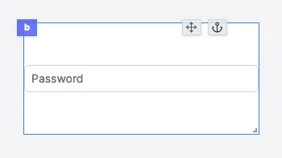

import DocCard from '@site/src/components/DocCard';

# Password input

The password input component allows you to get a password from the user.

The following section details Password input component's specific settings. For more details on the App editor, check the [dedicated documentation](../0_app_editor/index.mdx) or the App editor [Quickstart](../../getting_started/7_apps_quickstart/index.mdx):

	<DocCard
		color="orange"
		title="App editor Documentation"
		description="The app editor is a low-code builder to create custom User Interfaces with a mix of drag-and-drop and code."
		href="/docs/apps/app_editor"
	/>
	<DocCard
		color="orange"
		title="Apps quickstart"
		description="Learn how to build your first app in a matter of minutes."
		href="/docs/getting_started/apps_quickstart"
	/>

## Password input configuration

| Name        |  Type   | Connectable | Templatable |  Default  | Description                                |
| ----------- | :-----: | :---------: | :---------: | :-------: | ------------------------------------------ |
| Placeholder | string  |    false    |    false    | Password  | The password input placeholder.            |
| Before Icon | string  |    false    |    false    | Undefined | The icon to display before the label.      |
| After Icon  | string  |    false    |    false    | Undefined | The icon to display after the label.       |
| Disabled    | boolean |    false    |    false    |   false   | Whether the text input should be disabled. |

## Outputs

| Name   |  Type  | Description               |
| ------ | :----: | ------------------------- |
| Result | string | The password input value. |
